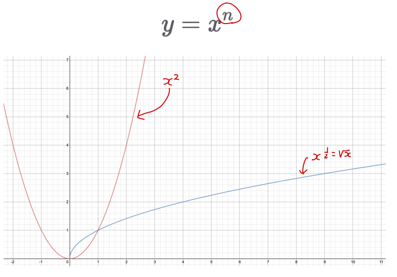
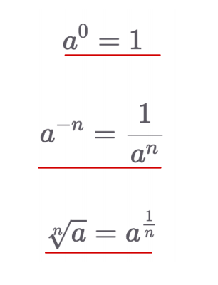
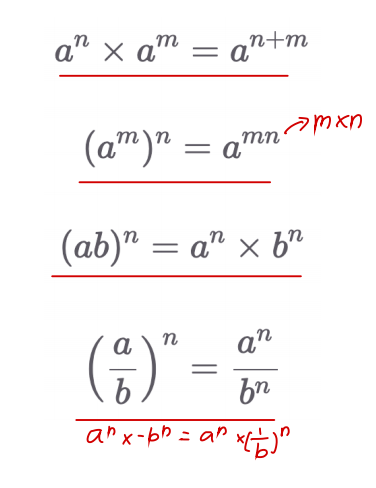
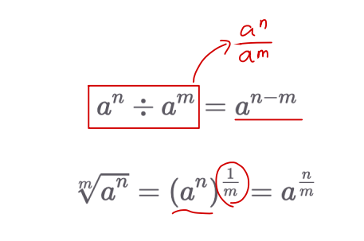
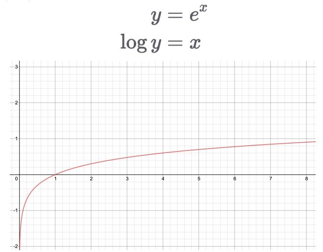
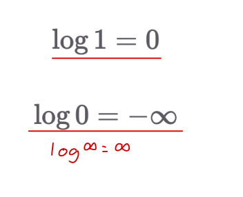
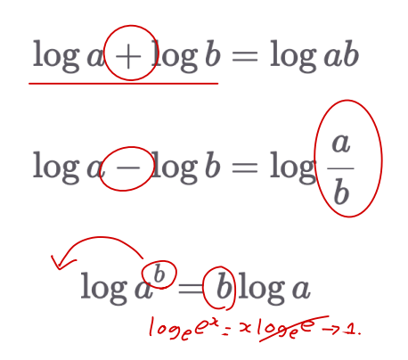
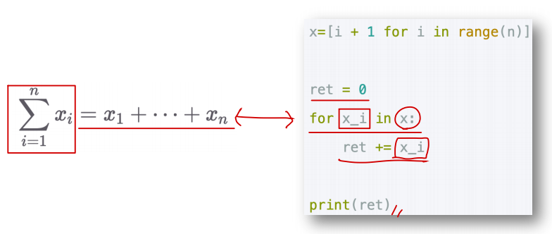
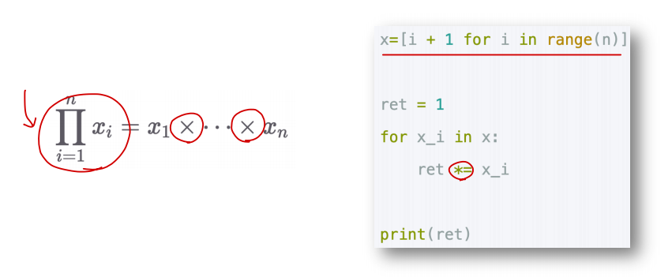
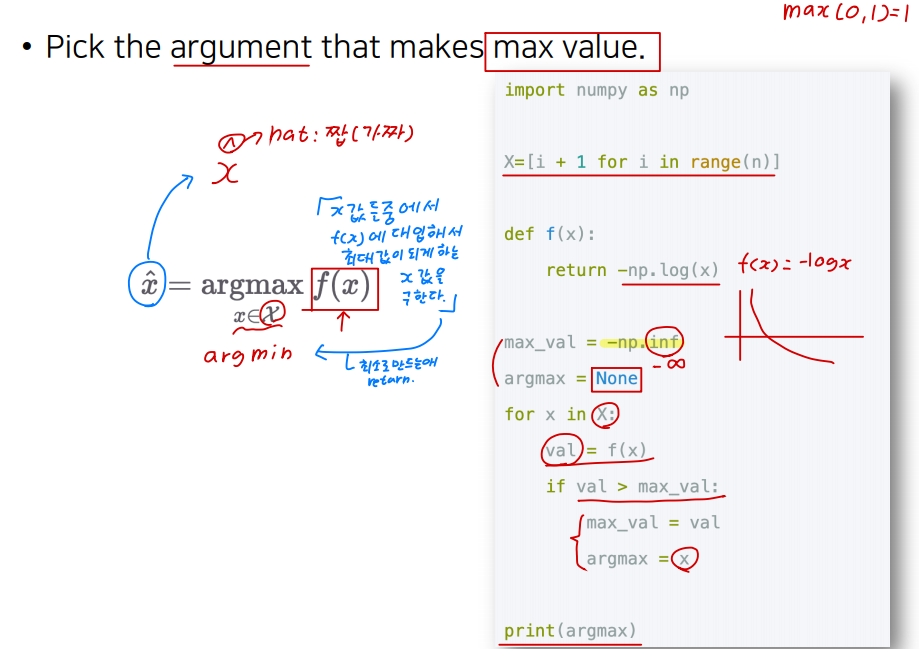

# Ch 01. Deep Learning Overview

## Part.4 Appendix: Basic Math

### 지수와 로그

* 지수함수

  

* 지수 기본 법칙

  

* 지수 연산 법칙

  

* 법칙과 응용

  

* 로그 함수

* 지수와 로그의 관계

  

* 로그 기본 법칙

  

* 로그 연산 법칙

  

### Summation & Product

- Sum

  

- Product

  

### Argmax

- Pick the argument that makes max value.

