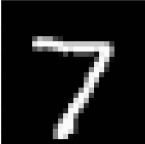

# Ch 02. PyTorch Tutorial

## Part.3 Dataset

- Our Objective
  - 주어진 데이터에 대해서 결과를 내는 가상의 함수를 모사하는 **함수**를 만드는 것
    - ex) 주어진 숫자 그림을 보고 숫자 맞추기

* In order to do this:

  * 가상의 함수(ground-truth)를 통해 데이터 쌍(x,y)을 수집해 데이터셋을 만들고, 우리의 함수 (ex.신경망)가 데이터를 통해 가상의 함수를 모방하도록 한다.

    

  * 이때, x,y는 각각 n차원과 m차원의 벡터로 표현될 수 있다.

    

* #### Example: Tabular Dataset

  * 여러 column으로 이루어진 테이블로 구성된 데이터셋 (ex.엑셀 파일 - CSV)
    * 한 row과 한 개의 sample을 의미함
    * Column 갯수가 벡터의 차원을 의미

