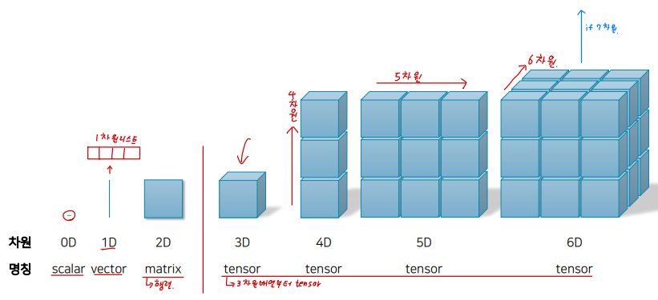
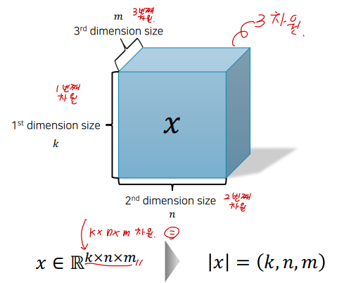
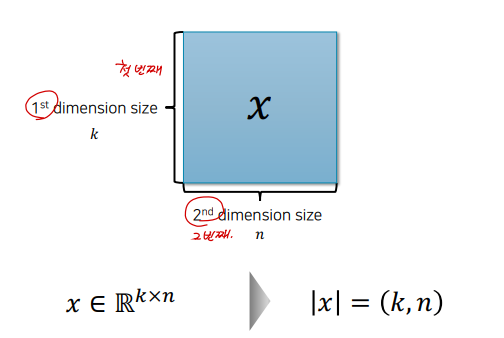
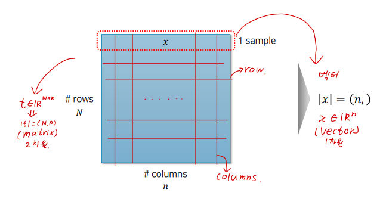
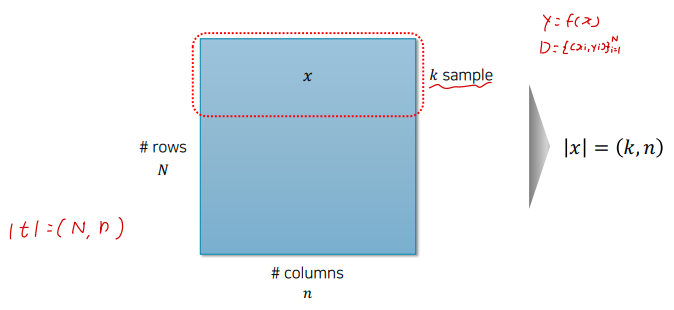
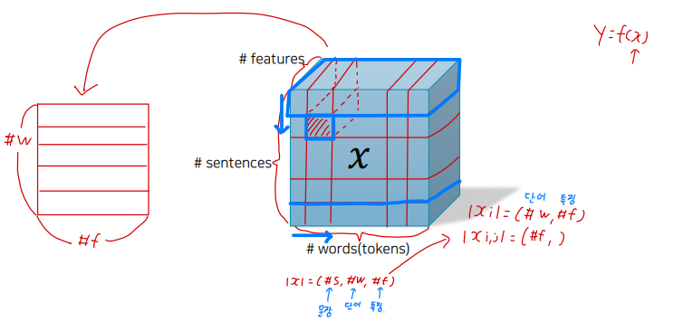
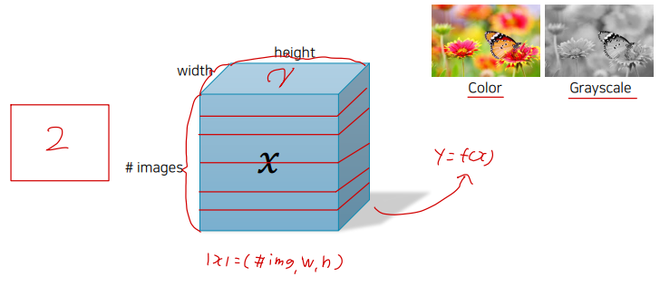
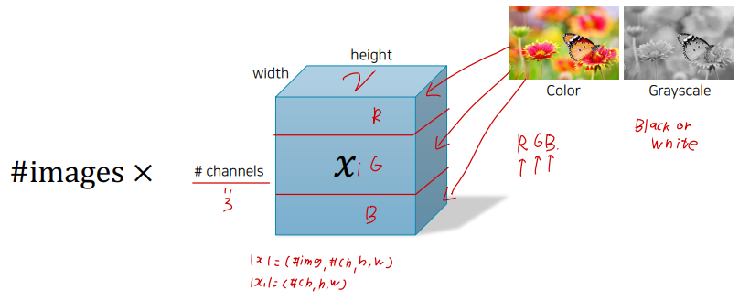

# Ch 02. PyTorch Tutorial

## Part.4 Tensor

- Tensor?
  - 텐서란 매우 수학적인 개념으로 데이터의 배열(리스트)이라고 볼 수 있다. 텐서의 차원(Rank)는 간단히 말해서 몇 차원 배열인가를 의미합니다.
    - 0차원은 Scaler, 1차원은 Vector, 2차원은 Matrix, 3차원부터는 Tensor라고 한다.

- Tensor Shape (3차원)

  

- Matrix Shape (2차원)

- Typical Tensor Shape (전형적인 텐서):  표로 나타낸 Dataset
  - 행렬의 개수 N(행) * n(열)

- Mini-batch: Consider Parallel Operations (병렬 방식)

- Typical Tensor Shape: Natural Language Processing (자연어 처리 과정)

- Typical Tensor Shape: Computer Vision (Grayscale-흑백)

- Typical Tensor Shape: Computer Vision (Color-컬러)

