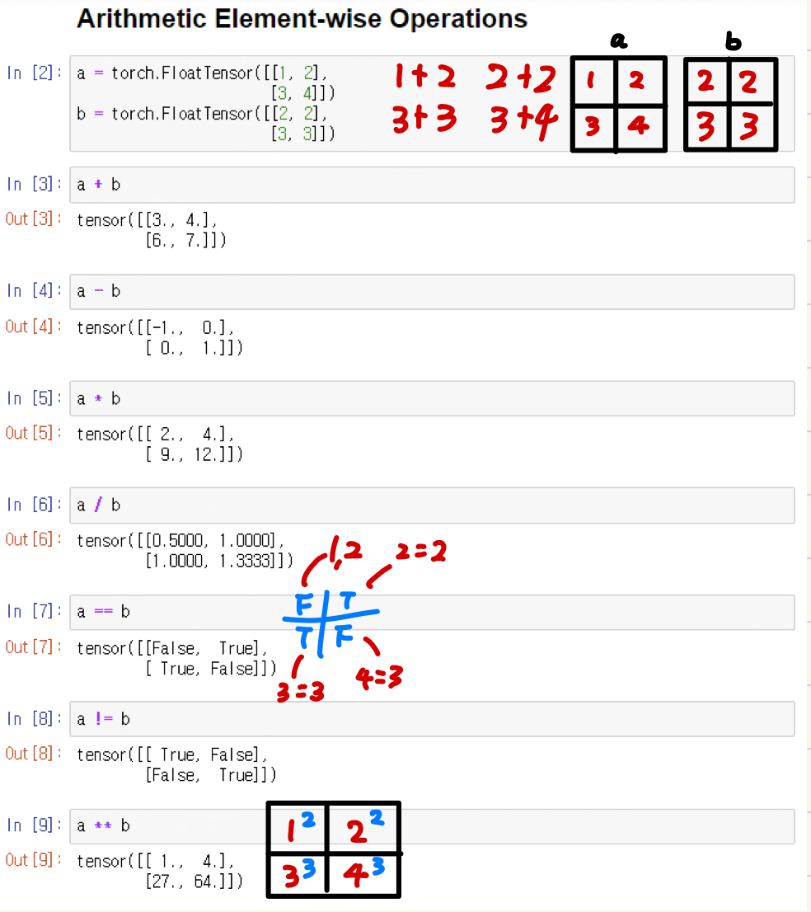
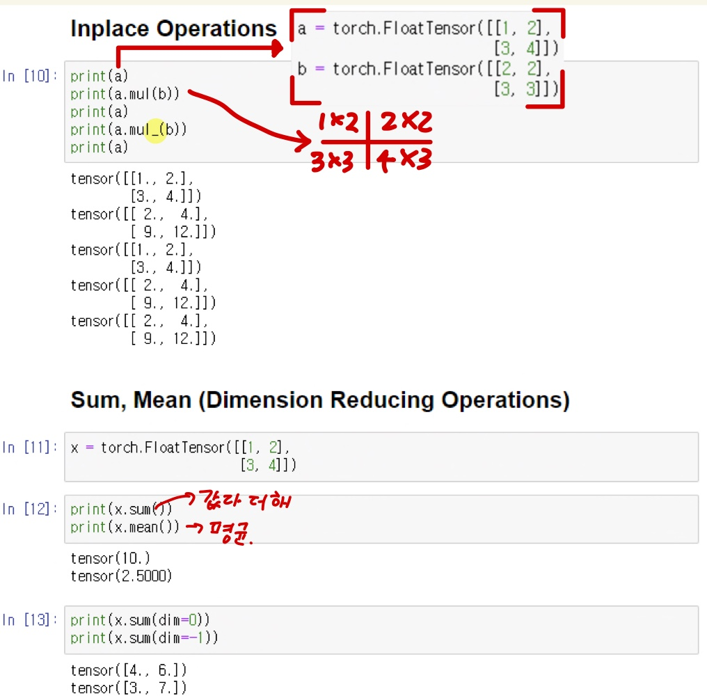
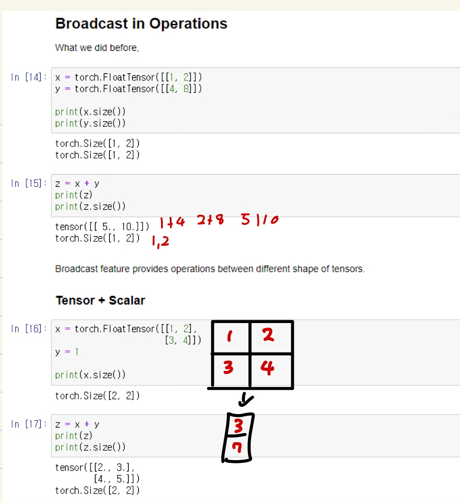
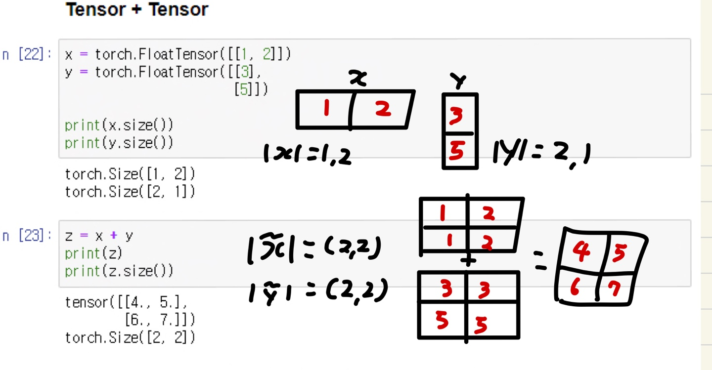
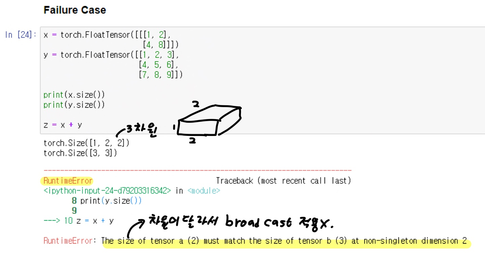

# Ch 02. PyTorch Tutorial

## Part.5 실습 텐서 기본 연산

- PyTorch Tensor Operations

- In [1] : 

  ```python
  import torch
  ```


### Arithmetic Element-wise Operations (산술 요소별 연산)

* 기본 연산을 나타낸다.
  * ex) a + b = (a1 + b1) (a2 + b2) (a3 + b3) (a4 + b4)
  * ex) a * b = (a1 * b1) (a2 * b2) (a3 * b3) (a4 * b4)



* Inplace Operations
* Sum(덧셈), Mean(평균화)




* Broadcast in Operations

  * Broadcast 기능은 다양한 형태(모양)의 Tensor를 제공한다.

* Tensor + Scaler 

  * z = x + y (1+1, 2+1, 3+1, 4+1) = z (2, 3, 4, 5)

  


* Tensor + Tensor

'

* Failure Case (실패한 케이스-예시)



* 여기서 왜 실패 했느냐? 
  * 서로 더하려는 텐서의 차원이 달라서 Broadcast 적용 불가. 즉, 계산을 할수 없다는 것이다.
