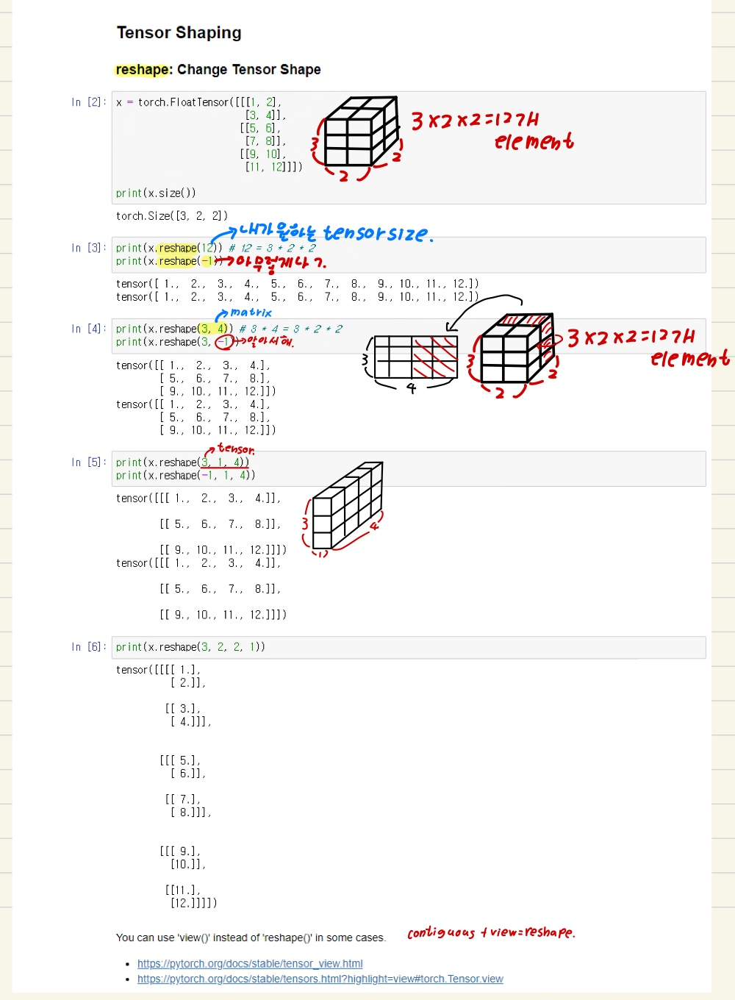
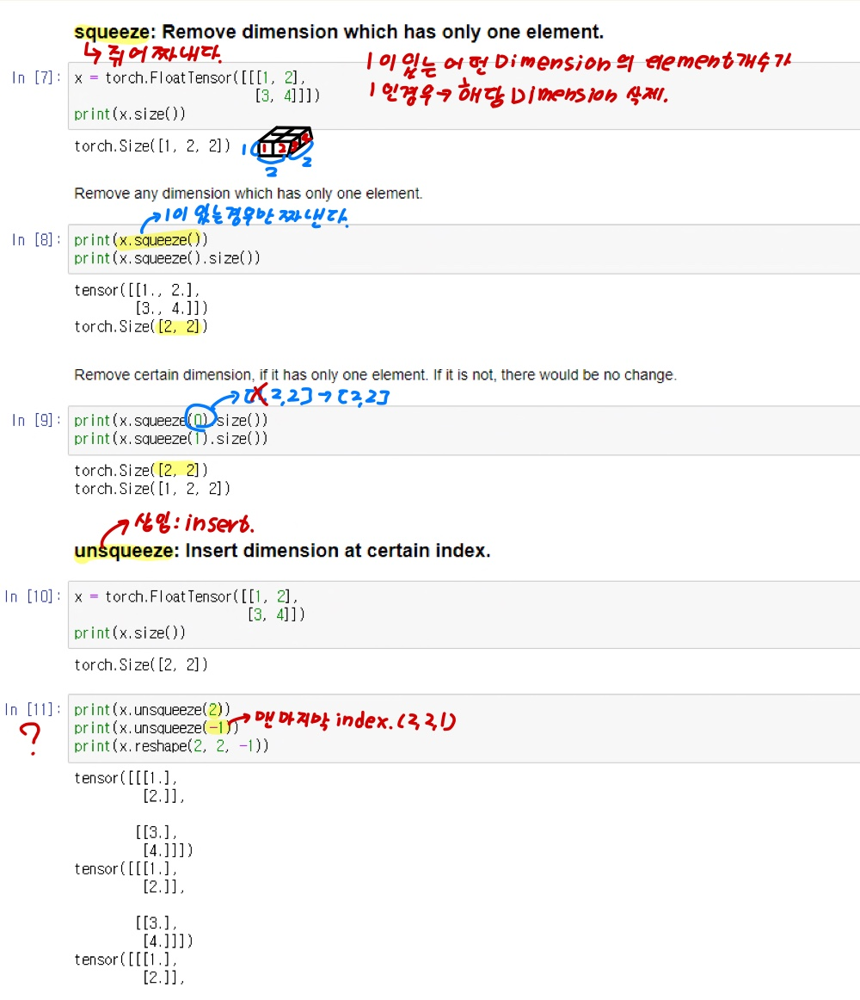

# Ch 02. PyTorch Tutorial

## Part.7 실습 텐서 형태 변환

- PyTorch Tensor Manipulations

- In [1] : 

  ```python
  import torch
  ```


### Tensor Shaping

##### reshape: Change Tensor Shape



#### Squeeze: Remove dimension which has only one element (Dimension 삭제)

* if. 1이 존재하는 Dimension의 element 개수가 1인 경우? 
  * 해당 Dimension은 삭제된다.

#### UnSqueeze: Remove dimension which has only one element (Dimension 삽입)


