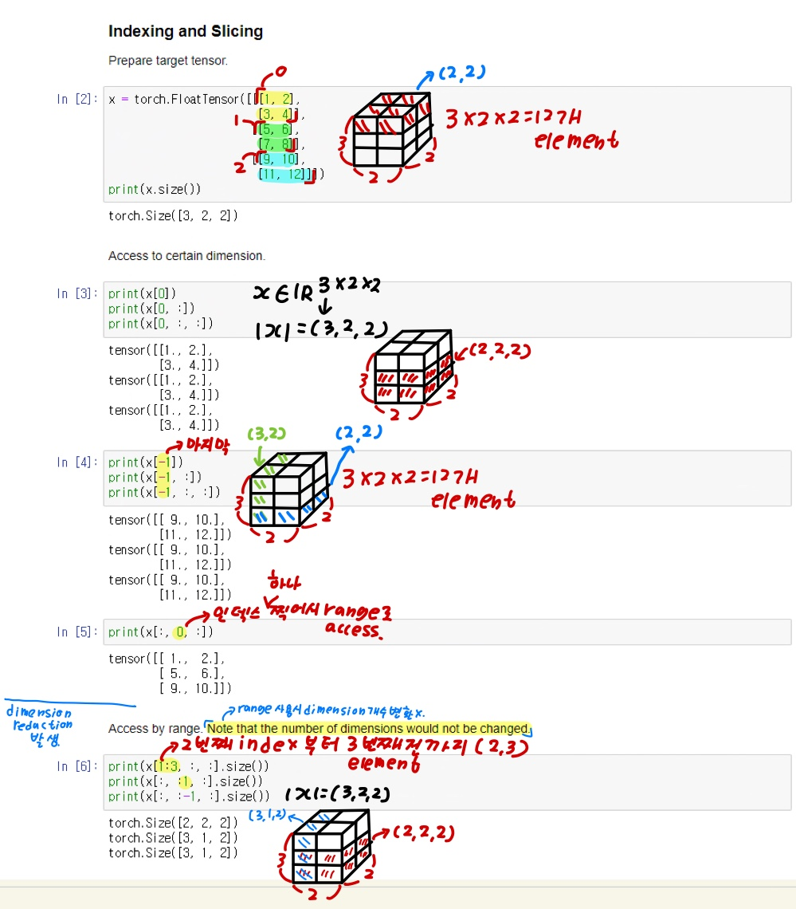
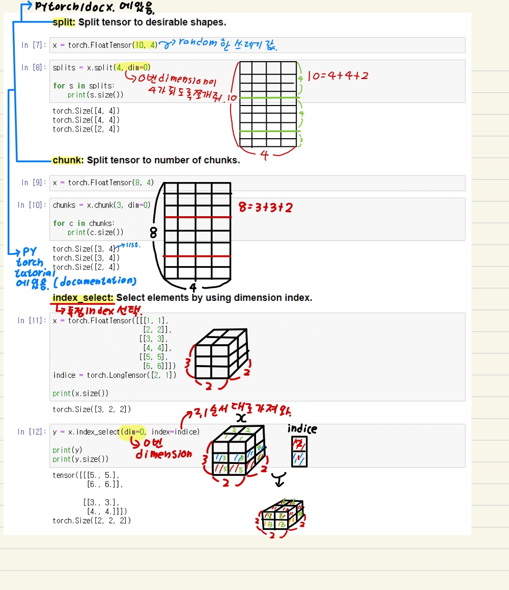
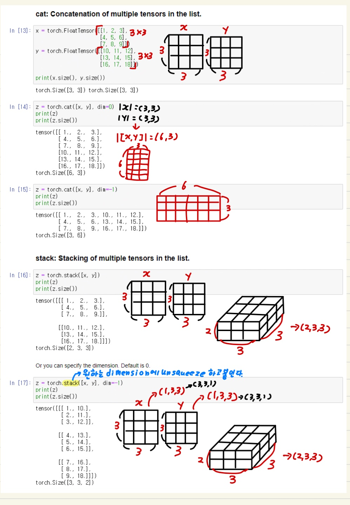
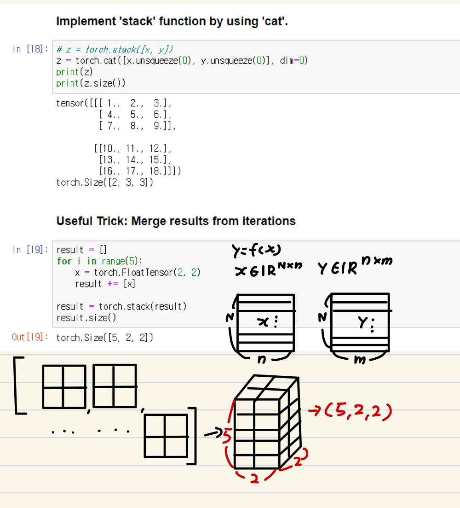

# Ch 02. PyTorch Tutorial

## Part.7 실습 텐서 자르기&붙이기

- PyTorch Tensor Manipulations

- In [1] : 

  ```python
  import torch
  ```


### Slicing and Concatenation

##### Indexing & Slicing





##### split: Tensor를 바람직한 모양으로 분할 한다.

##### chunk: Tensor를 덩어리(chunks)의 개수만큼 나눈다.

##### Index_select: 차원 인덱스를 사용하여 특정 index를 선택한다.





Cat: 리스트 안에 있는 여러개의 Tensor들을 모은다.

Stack: 리스트 안에 있는 여러개의 Tensor들을 쌓는다.




활용 예시. Cat안에 Stack 기능을 구현 한다.



