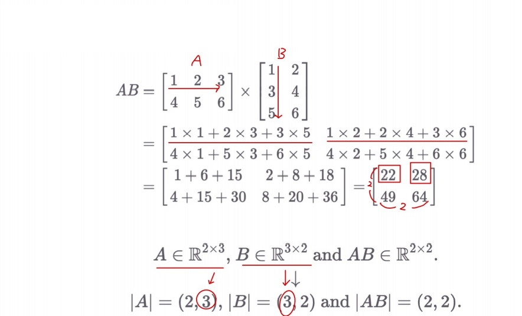
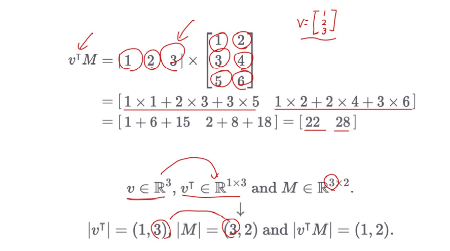
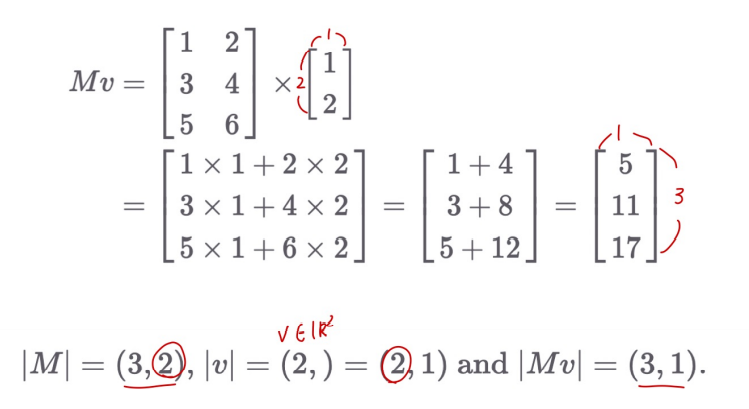
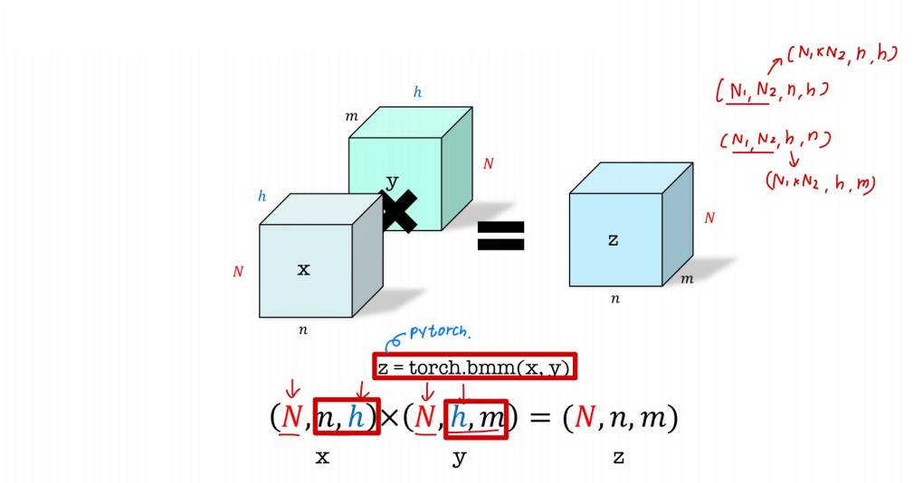

# Ch 03. 신경망의 기본 구성요소 살펴보기

## Part.1 행렬곱

#### Matrix Multiplication

* 행렬 곱
* Inner Product, Dot Product

#### Vector Matrix Multiplication 

* 벡터와 행렬의 곱셈

#### Batch Matrix Multiplication (BMM)

* 같은 갯수의 행렬 쌍들에 대해서 **병렬**로 행렬 곱 실행
  * torch.bmm: 여기서 torchs는 PyTorch를 의미한다.
  * x * y = z
    * x = (N1 * N2, n, h), y = (N1 * N2, h, m) 

