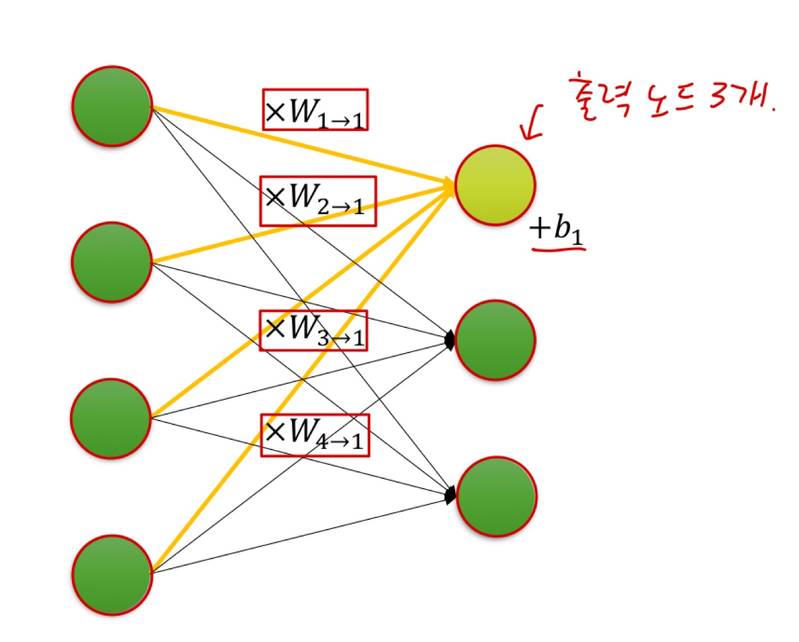

# Ch 03. 신경망의 기본 구성요소 살펴보기

## Part.3 Linear Layer

#### Linear Layer

* 신경망의 가장 기본 구성 요소
* Fully-connected (FC) Layer 라고 불리기도 함
* 내부 파라미터에 따른 선형 변환을 수행하는 함수

#### Linear Layer 작동 방식

* 각 입력 노드들에 weight(가중치)를 곱하고 모두 합친뒤, bias(편향)을 더한다.

