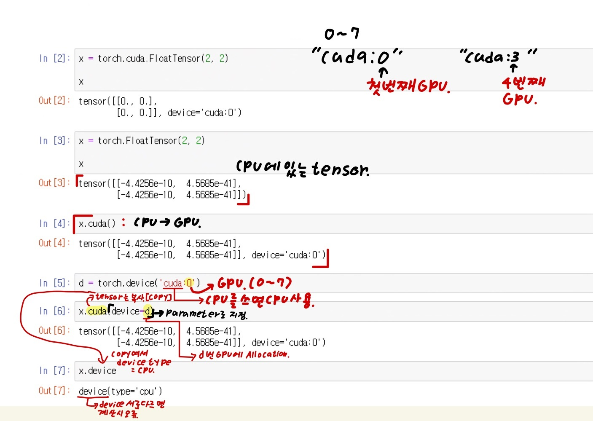
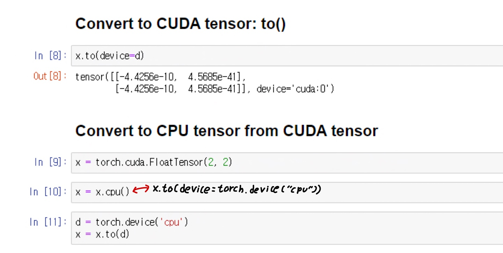
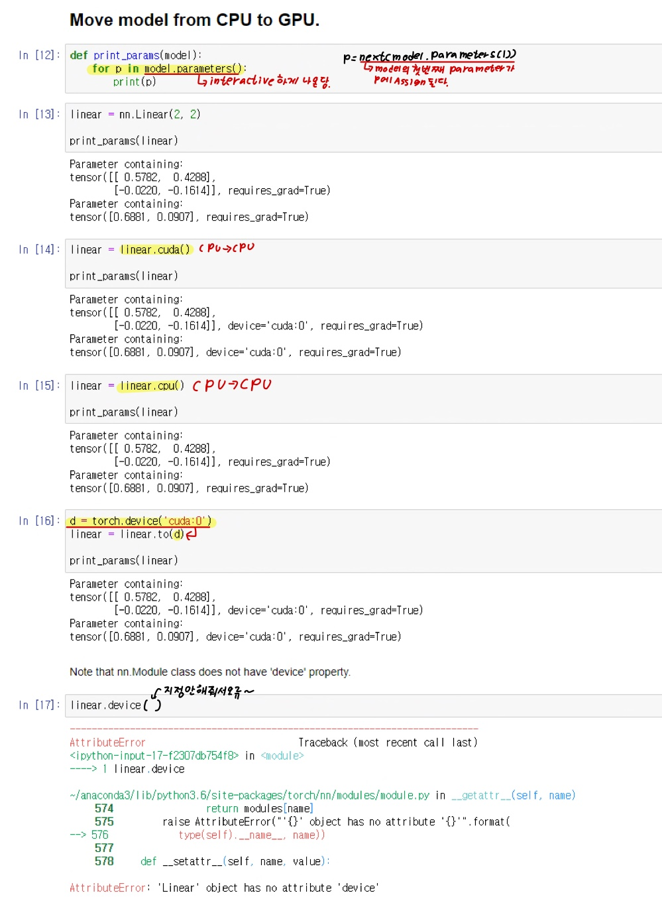
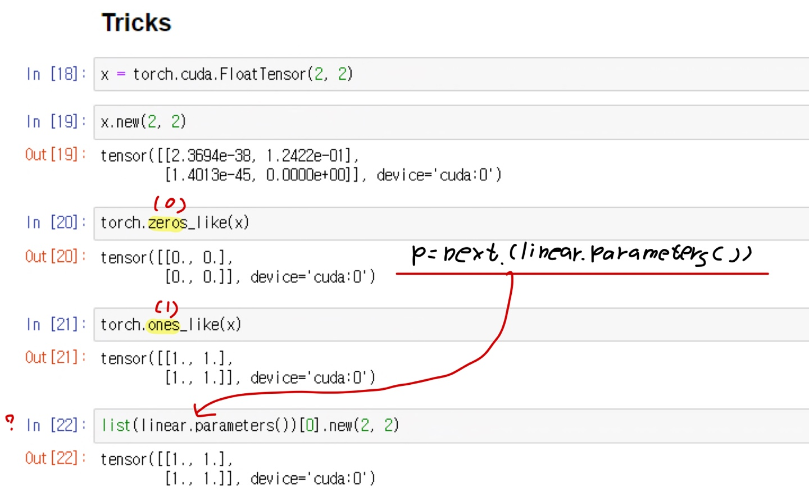

# Ch 03. 신경망의 기본 구성요소 살펴보기

## Part.5 실습 GPU 사용하기

#### How to use GPU

* In [1] :

```python
import torch
import torch.nn as nn
```

#### Convert to CUDA tensor: cuda()

* cuda '0~7': GPU 개수 총 8개
* 그리고 여기에 있는 tensor는 CPU안에 있는 Tensor를 의미
* x.cuda[device=d]
  * 여기서 cuda는 tensor를 복사 한다는 의미이고, 그리고 device = d는 d번 gpu에 allocation(할당).
  * 그리고 만약 device가 서로 다르면 계산시 오류가 날 수 있다.






* for p in model.parameters( ):
  * model이 interactive 하게 출력될수 있다.
  * 그리고 p = next(model.parameters(1))은 model의 첫번째 parameter가 p에 Assign 된다.
* linear.device()가 오류가 난 이유: 괄호안에 parameter 지정을 안해줘서 오류 발생





