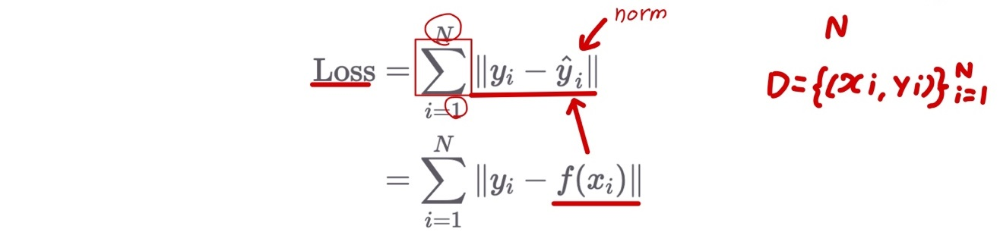
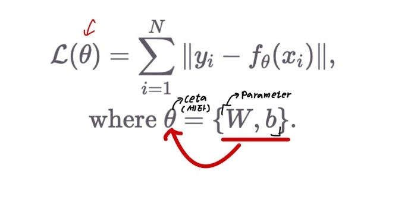
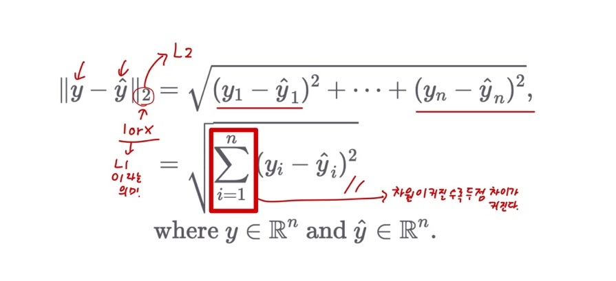
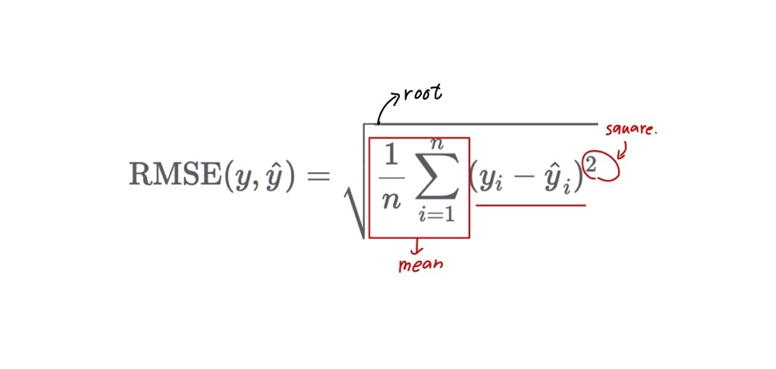
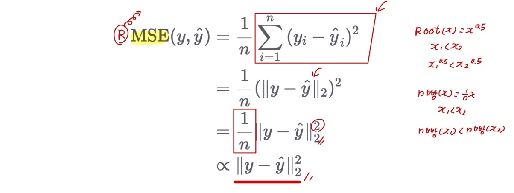

# Ch 04. 신경망이 잘 학습하는지 판단하기

## Part.1 Loss Function

#### Again, Our Objective is?

* 데이터를 넣었을때 출력을 반환하는 가상의 함수를 모사하는것
* Linear Layer 함수를 통해 원하는 함수를 모사해보자
  * Linear Layer 함수가 얼마나 원하는 만큼 동착하는지 측정하고 싶다.
  * 잘 동작하는지 **점수**로 나타내고 싶다.

#### Loss

* Loss(손실 값): 원하는 출력값(target, y)과 실제 출력값(output, y^)의 차이의 합

* 그러므로 우리는 **Loss가 작을수록 가상의 함수를 잘 모사 하고 있다**고 할 수 있다.
* Loss가 작은 Linear Layer를 선택하면 됨

#### Loss Function

* Linear Layer의 파라미터를 봐꿀때마다 Loss를 계산
* Loss Function
  * 입력: **Linear Layer의 파라미터**
  * 출력: **Loss**

#### Euclidean Distance

- 두 점 사이의 거리
  - 여기서 L1은 절대값이다.

#### RMSE (Root Mean Square Error) = Normalize.

* Euclidean distance와 비슷한 개념(두점 사이의 거리)

#### MSE (Mean Square Error)

- Root와 상수를 뺐지만, 크기 차이로 인한 순서 결과는 변경 X

#### Conclusion

* 우리는 목표로 하는 함수를 모사하기 위해.
  * 학습용 입력 데이터들을 Linear Layer에 넣어 출력 값들을 구하고,
  * 출력 값(y^)과 목표 값(y)들의 차이 합(Loss)을 최소화 해야한다.
* 결국, Linear Layer 파라미터를 바꾸면서 Loss를 최소화 해야한다.
