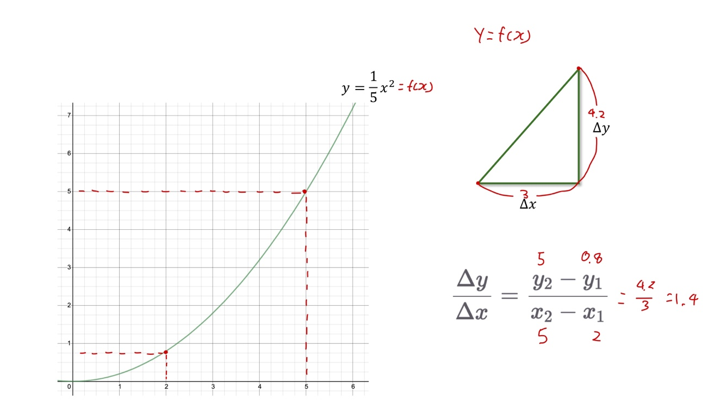
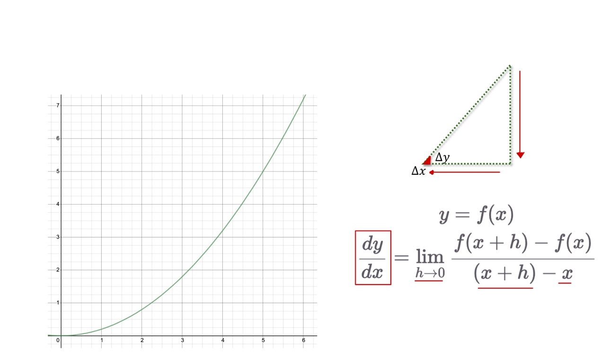
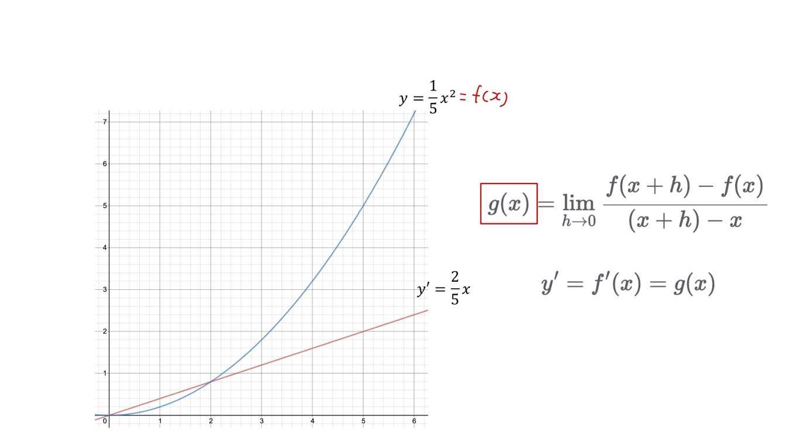
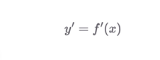
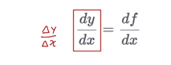
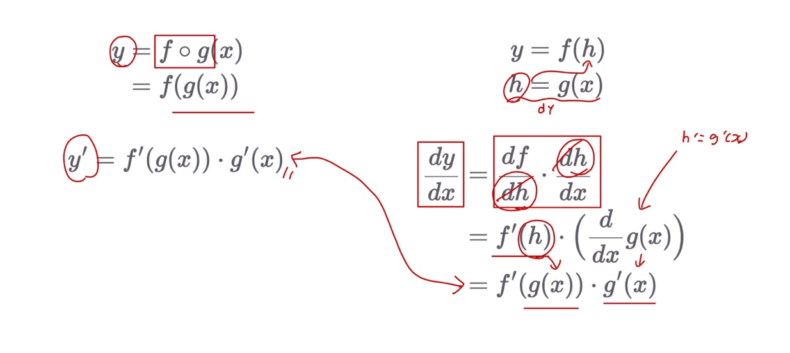
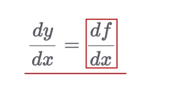

# Ch 05. 기초 최적화 방법 Gradient Descent

## Part.1 Appendix 미분

* 기울기
  * 함수의 두 입력 값에 대한 출력 값의 변화량의 비율

* 극한(무한소)과 미분

  * 두점이 한없이 가까워질때. **접선의 기울기**

  

* 도함수
  * 미분 게수를 함수로 일반화
    * 각 지점 x에서 접선의 기울기를 출력

* 뉴턴 VS 라이프니츠
  * 뉴턴 미분법: 변수가 하나일때 편리하다.
  * 
  * 라이프니츠 미분법: 변수가 두 개 이상일때 편리	
  * 
* 합성 함수 미분 by 라이프니츠 미분

#### Wram-UP

* 라이프니츠 미분 표현에 대해 익숙해지는 것이 목표
  * 직접 미분을 계산할 일은 없다.
  * 수식의 의미만 이해할 수 있을 정도면 된다.

- 함수 f를 x로 미분
  - x값에 따른 함수 f의 기울기

