# Ch 05. 기초 최적화 방법 Gradient Descent

## Part.2 Appendix 편미분

#### 다변수 함수

* 여러 개의 변수를 입력으로 받는 함수

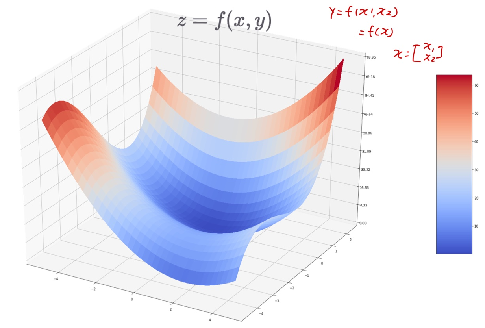

#### 편미분

* 다변수 x와 y를 입력으로 받는 함수 f를 x로 미분한 경우, 하나의 변수

  (아래 예시에서는 x) 만 남겨놓고 나머지를 상수 취급하는 미분 방법

  * x = f(x,y), x^n -> nx^n-1

* 함수 f를 x변수(or 축)으로 미분

  * 편 미분 기호 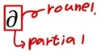

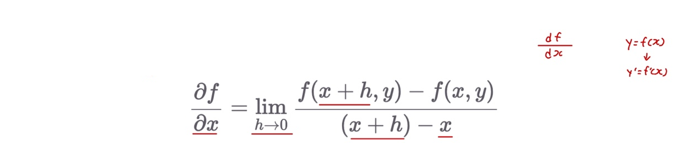

* y값에 대해 뚝 잘랐을때, x축에 대한 기울기

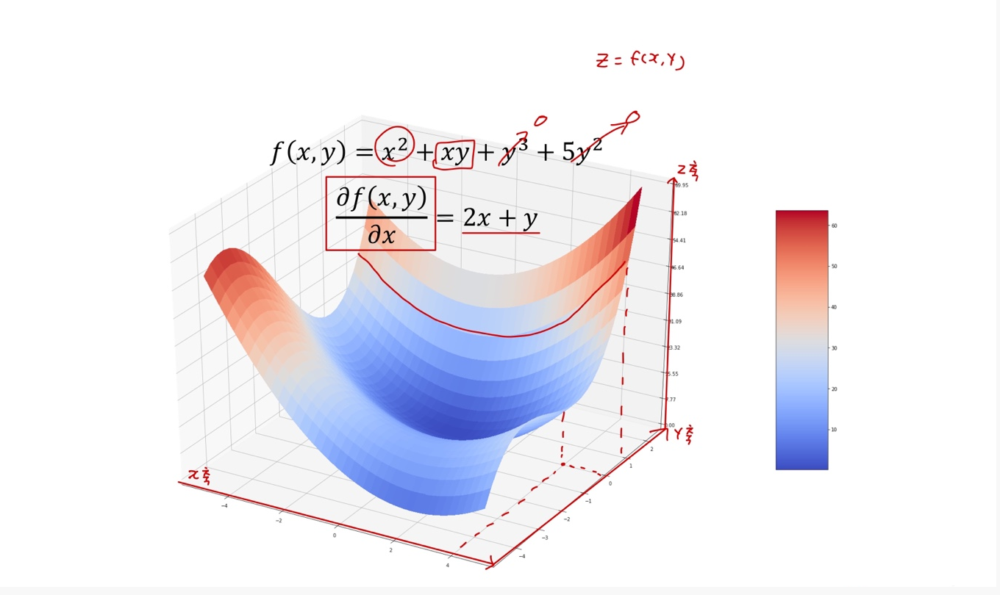

#### 함수의 입출력 형태

* 함수의 입력이 벡터인 경우
* 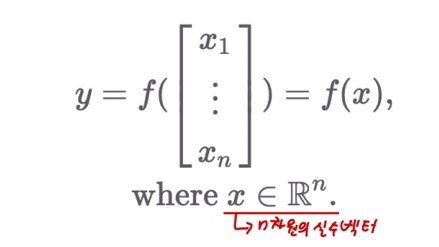
* 함수의 입력이 행렬인 경우

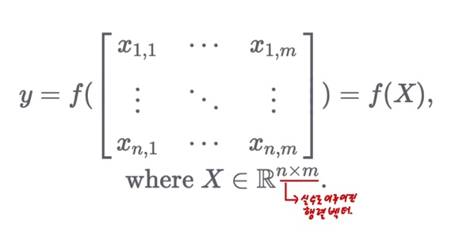

* 함수의 출력이 벡터인 경우

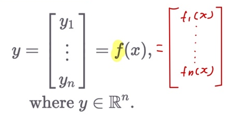

* 함수의 출력이 행렬인 경우

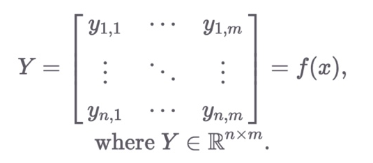

#### 함수의 입출력 형태

* 입력과 출력이 벡터인 함수

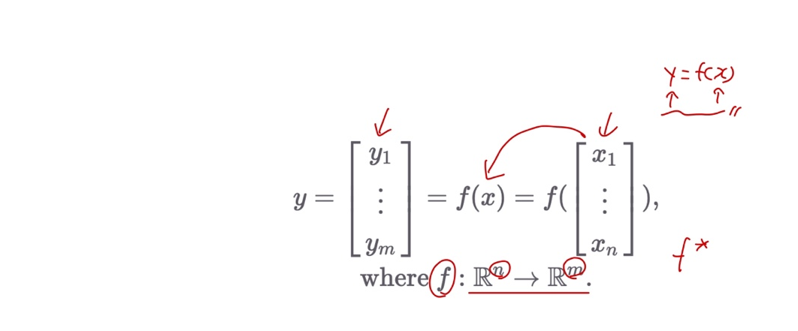

#### 스칼라를 벡터로, 스칼라를 행렬로 미분

* 미분 결과는 gradient 벡터가 되어 방향과 크기를 모두 나타냄

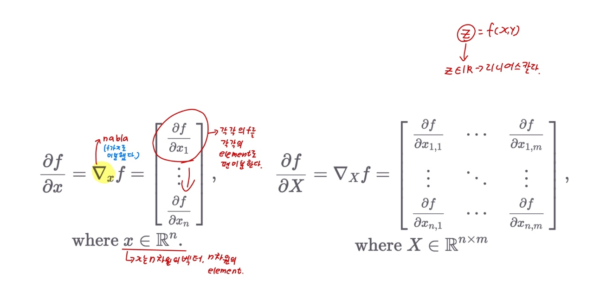

#### Gradient

* 상미분과 달리 미분 결과가 벡터

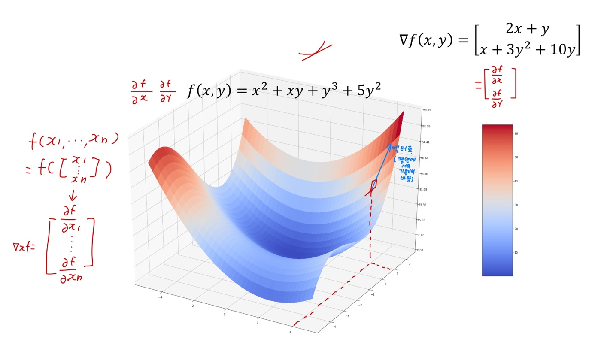

#### 벡터를 스칼라로, 벡터를 벡터로 미분

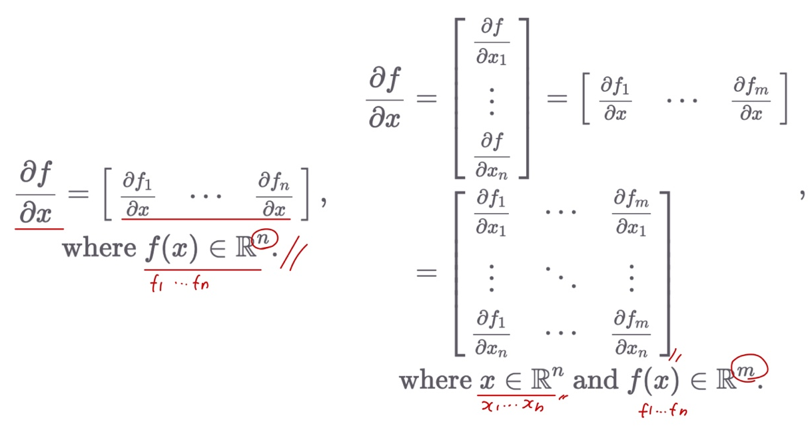

What we learn this?

* Loss 함수 결과값 스칼라를 파라미터 행렬()로 미분해야 한다면?
* DNN의 중간 결과물 벡터(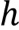)를 파라미터 행렬()로 미분해야 한다면?

