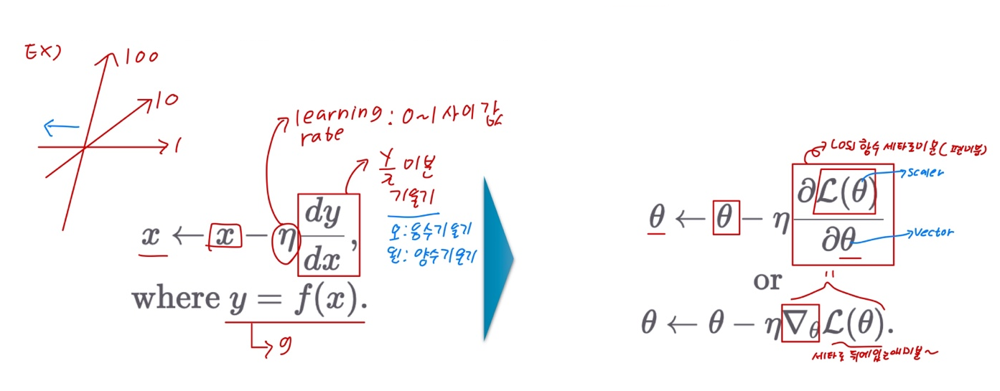

# Ch 05. 기초 최적화 방법 Gradient Descent

## Part.3 Gradinant Descent

#### Again, Our Objective is

* 주어진 데이터에 대하여 출력 값을 똑같이 내는 함수를 찾고 싶다.
* Loss 값을 최소로 하는 Loss Function의 입력값()을 찾자. 근데 How..?

#### Gradient Descent 1D Case

* x로 미분하여 기울기를 활용하여 좀 더 낮은 곳으로 점차 나아가자

#### Gradient Descent Equation

* x로 미분하여 기울기를 활용하여 좀 더 낮은 곳으로 점차 나아가자

#### Global and Local Minima

* 가장 loss가 낮은 곳이 아닌 골짜기에 빠질 가능성이 있음

#### Loss Minimization using Gradient Descent

* 1D 케이스를 높은 차원의 파라미터()로 확장하자

#### Number of Parameters in Linear Layer

* 1D 케이스를 높은 차원의 파라미터()로 확장하자
* 파라미터 수: n x m + m

#### Local Minima in Practice

* 실제 딥러닝의 경우에 파라미터의 크기가 **수백만 단위**
* 수백만 차원의 loss 함수 surface에서 global minima를 찾는 문제
* 수많은 차원에서 동시에 local minima를 위한 조건이 만족되기는 어려움
* 따라서 local minima에 대한 걱정을 크게 할 필요 없음
