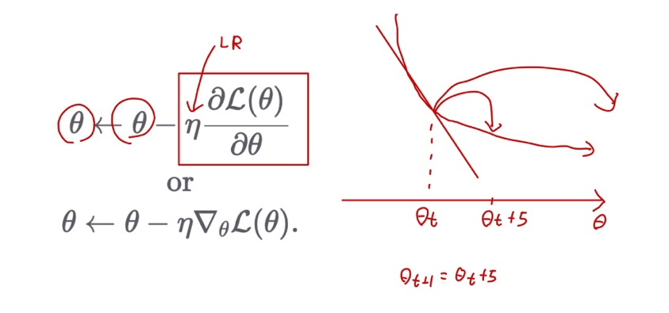
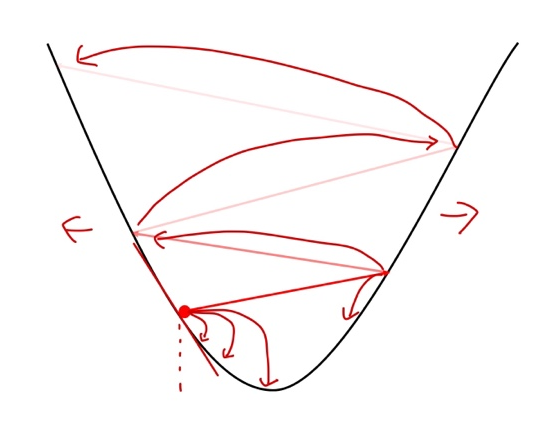
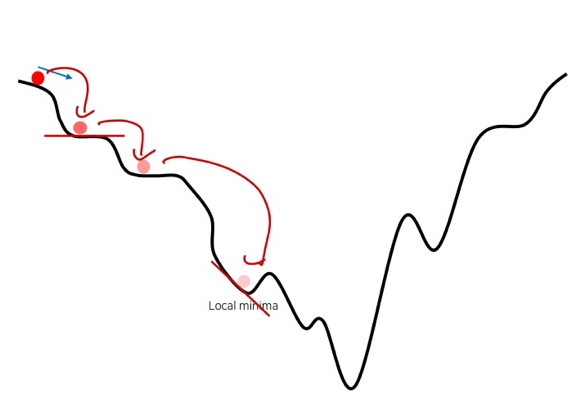

# Ch 05. 기초 최적화 방법 Gradient Descent

## Part.4 Learning rate에 따른 특성

#### Learning Rate in Gradient Descent

* 파라미터가 업데이트 될 때, gradient의 크기에 영향을 받게 됨

  * 이때, learning rate가 step-size를 정해주게 된다.
  * if. learning rate 가 크면? gradient 많이 이동한다.
  * if. learning rate 가 작으면? gradient가 커도 learning rate가 작아지니까 조금 이동한다.

  

* Equation

#### Learning rate에 따른 최적화

* Large LR: 너무 큰 loss가 발산할 수 있음

* Small LR: 너무 작은 LR은 수렴이 너무 늦음
  * 자칫 local minima에 빠질 수 있음

#### Learning rate는 중요한 하이퍼파라미터*

* 실험을 통해 최적화 하는 것이 필요
* 초보자들은 처음에 어떤 값을 정해야 할 지 난감
  * 고민할 바에 그냥 아주 작은 값(eg. **1e-4**)으로 엄청 오래 돌려도 괜찮다.
* 나중에 Adam Optimizer를 통해 learning rate에 대한 고민을 없앨 수 있음

[^하이퍼파라미터]: 모델 성능에 영향을 끼치지만, 데이터를 통해 학습 할 수 없는 파라미터

