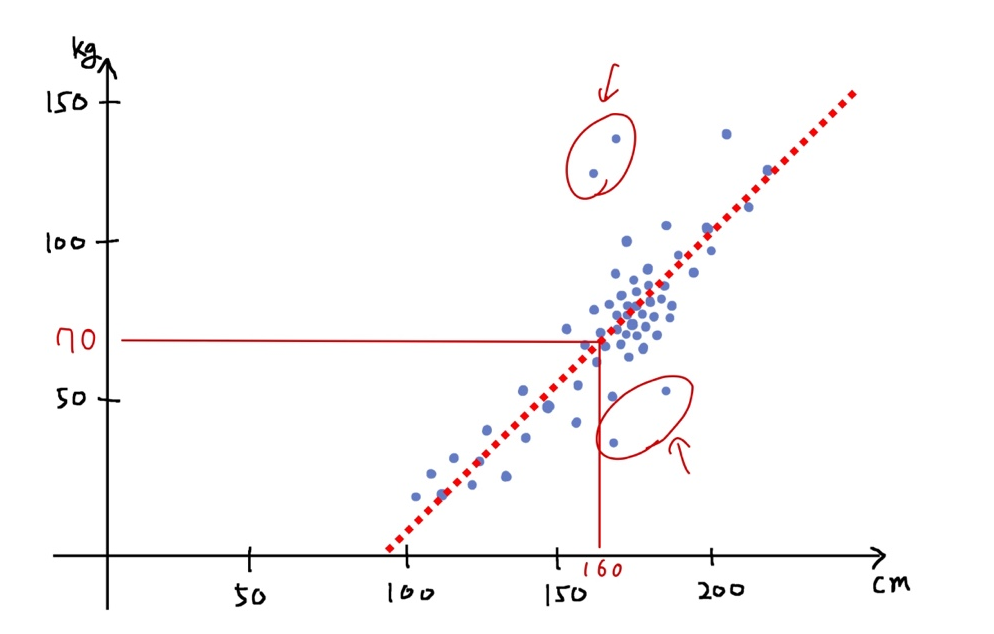
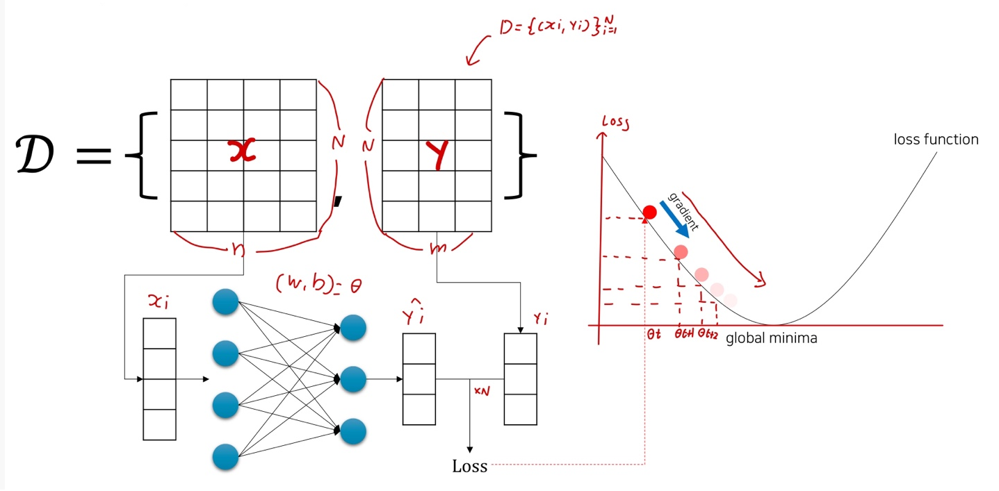

# Ch 06. 선형희귀(Linear Regression)

## Part.1 Linear Regression by Gradient Descent

#### Motivations

* Remember, Our objective is
  * 주어진 데이터에 대해 결과를 반환하는 함수를 모사하자.

* 세상에는 선형 동작하는 함수들이 많음
  * e.g 키 vs 몸무게, 나이 vs 연봉, 무게 vs 가격, 연식 vs 가격

#### Examples

* 선형 데이터를 분석하여, 입력(x)이 주어졌을 때 알맞은 출력(y)을 뱉어내자.

#### Parameter Optimization using Gradient Descent

* input_size: n
* output_size: m

