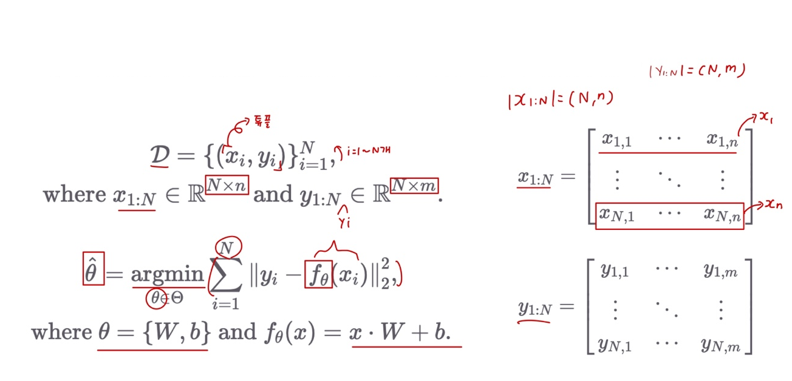
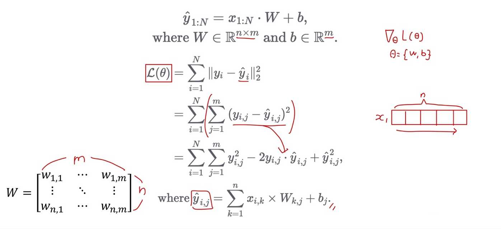
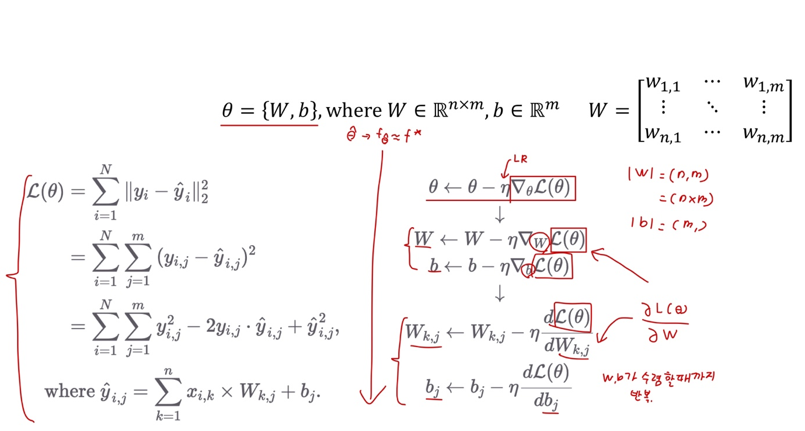

# Ch 06. 선형희귀(Linear Regression)

## Part.2 수식 Linear Regression

#### Objective

* 데이터셋()이 주어졌을때, loss를 최소로 하는 파라미터()를 찾자.

#### Loss Minimization using Gradient Descent

* Loss 함수를 파라미터(W, b)로 미분하여, 기울기 값을 활용해보자

#### Loss Minimization using Gradient Descent - Detail

Loss 함수를 파라미터()로 미분하여, 기울기 값을 활용해보자

