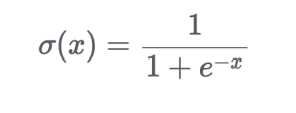
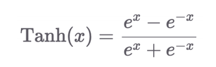
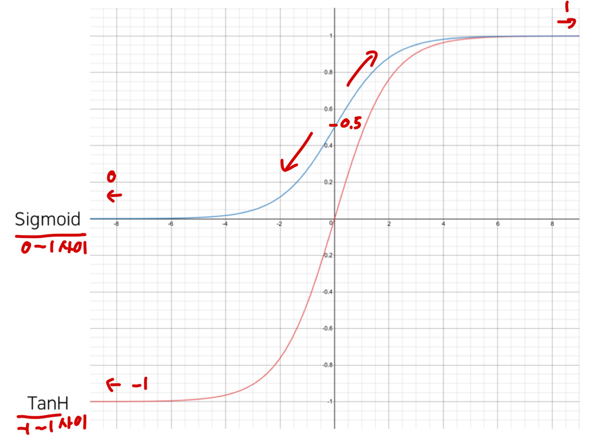

# Ch 07. 로지스틱 희귀(Logistic Regression)

## Part.1 Activation(활성함수) Function Sigmoid 

여기선 Sigmoid 함수와 TanH함수를 볼수 있다. 

* Sigmoid: 대표적인 Logistic 함수이며, 모든 실수 값을 0보다 크고 1보다 작은 미분 가능한 수로 변환하는 특징을 갖는다. 출력 범위는 0~1사이.

* TanH: Sigmoid의 대체제로 사용될 수 있는 활성화 함수 입니다.  출력 범위는 -1 ~ 1 사이.

* Sigmoid 함수와 TanH의 함수를 그래프화 한것이다.

