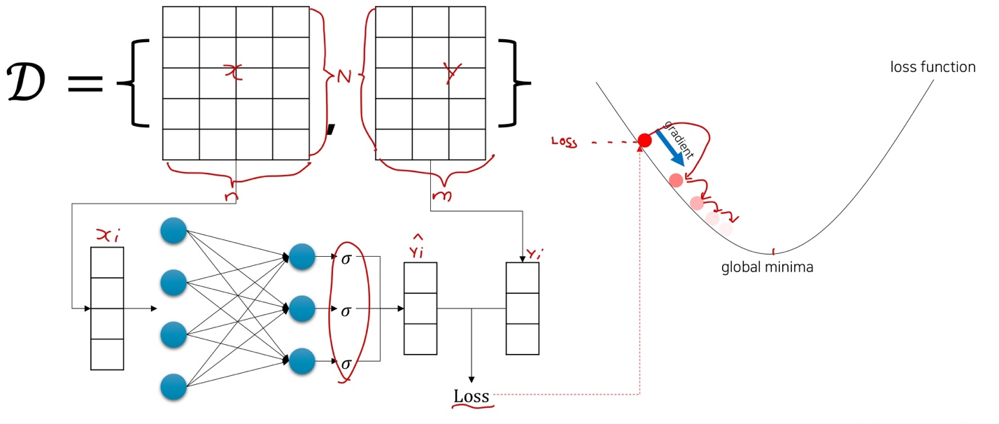
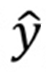

# Ch 07. 로지스틱 희귀(Logistic Regression)

## Part.3 Logistic Regression

#### Motivations

* Remember, out objective is
  * 주어진 데이터에 대해 결과를 반환하는 함수를 모사하자.
* 참 (True) / 거짓 (False)  으로 결과가 나뉘는 함수들도 존재한다.
  * ex) 이 사람은 남자인가? True(남자) / False(여자)

#### Structure

* Linear Regression과 비슷한 구조아니, 마지막에 Signoid 함수를 통과시킴
* Signoid 함수를 사용하기 때문에 1(True)과 0(False) 사이의 값을 반환
  * 각 항목에 대하여 0.5 이상이면 True
  * 각 항목에 대하여 0.5 이하이면 False

* 출력 벡터 각 차원별로 하나의 문제

#### Parameter Optimization using Gradient Descent

* Input_size: n
* output_size: m

#### Summary

* 이름은 Regression 이지만 사실은 **이진 분류(Binary Classification)** 문제
  * Regression: Target value: real-value vector (ex. height, weight, monthly income)
  * Classification: Target value: categorical (discrete), value (ex. class,world,symbol)

* 기존의 선형회귀(Linear Regression)과 달리, Linear Layer의 결과물에 sigmoid 함수를 활용 하여 출력값 을 계산
  * Sigmoid함수의 출력값은 0~1 사이 임으로, 확률값 (0.6 -> 60%)  으로 생각해 볼수 있다.
