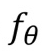
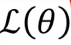
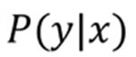
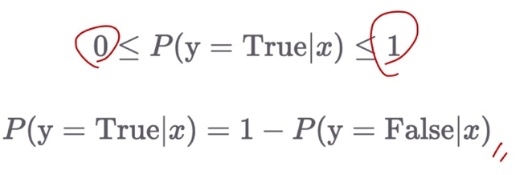
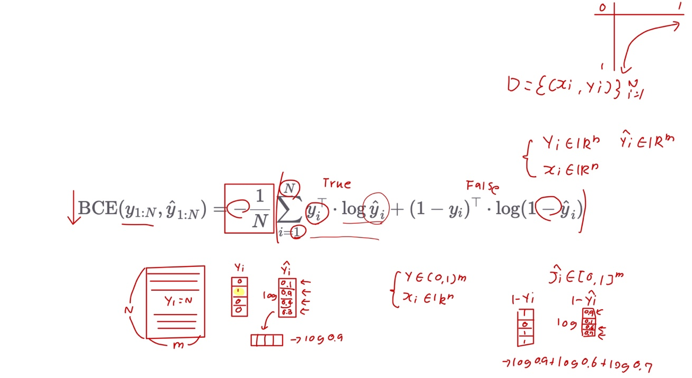

# Ch 07. 로지스틱 희귀(Logistic Regression)

## Part.4 Loss Function: Binary Cross Entropy

#### Our Objective:

* 세상에 존재하는 알 수 없는 함수 f* 를 근사하는 함수  를 찾고 싶다.
* 따라서 함수 의 동작을 정의하는 파라미터 를 잘 조절 해야 한다.
* 손실함수 는 파라미터 에 따른 함수 의 동작의 오류의 크기를 반환한다.
* 따라서 손실함수를 최소화 하는 파라미터 를 찾으면 된다.

#### Binary Classification? (이진분류?)

* ex) 이사람은 COVID-19 바이러스에 걸렸는가?
  * 입력: 키, 몸무게, 혈압, 혈중산소농도, 염증수치
  * 출력: True / False
* 확률 문제로 봐꿔 생각해보자
  * remake: 이사람이 COVID-19 바이러스에 걸렸을 확률은?

#### Because we use Sigmoid

* Sigmoid의 출력값은 0에서 1
* 따라서 확률값 으로 생각해볼 수 있음
* 실제 정답이 1이라면, 모델은 확률값이 최대한 커지도록 학습될것

#### Binary Cross Entropy (BCE) Loss Function

* N개의 vector들이 주어졌을때의 수식

* yi의 값에 따라 수식의 왼쪽 term과 오른쪽 term이 on / off

#### Summary

* Regression의 경우에는 보통 손실함수 MSELoss를 활용하여 파라미터를 최적화

* Classification의 경우에는 **BCELoss를 활용하여 파라미터를 최적화**하며, Accuracy를 통해 우리는 모델의 성능을 평가할 수 있다.
  * BCELoss의 경우에는 확률/통계, 정보 이론과 밀접한 관련이 있음
