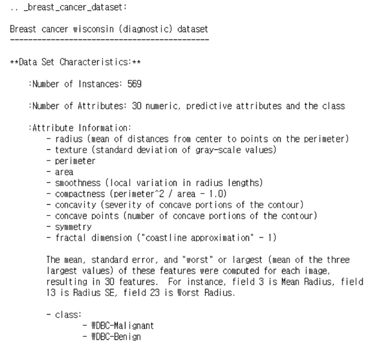

# Ch 07. 로지스틱 희귀(Logistic Regression)

## Part.6 Logistic Regression 실습

#### Logistic Regression

#### Load Dataset from sklearn

In [1] :

```python
import pandas as pd
import seaborn as sns
import matplotlib.pyplot as plt
```

In [2] :

```python
from sklearn.datasets import load_breast_cancer
cancer = load.breast_cancer()

print(cancer.DESCR)
```





In [3] : 

```python
df = pd.DataFrame(cancer.data, colums=cancer.feature_names)
df['class'] = cancer.target

df.tail()
```


Out [3] :


#### Pair Plot with mean features 

In [4] :

```python
sns.pairplot(df[['class'] + list(df.columns[:10])])
plt.show()
```


#### Pair Plot with std features 

In [5] :

```python
# 아래로 내려 갈수록 값은 0에 가까워지고, 위로 올라갈수록 1에 가까워진다.
sns.pairplot(df[['class'] + list(df.columns[10:20])])
plt.show()
```


#### Pair plot with worst features

In [6] :

```python
sns.pairplot(df[['class'] + list(df.columns[20:30])])
plt.show()
```


#### Select features

In [7] :

```python
cols = ["mean radius", "mean texture",
        "mean smoothness", "mean compactness", "mean concave points",
        "worst radius", "worst texture",
        "worst smoothness", "worst compactness", "worst concave points",
        "class"]
```


In [8] :

```python
for c in cols[:-1]:
    sns.histplot(df, x=c, hue=cols[-1], bins=50, stat='probability')
    plt.show()
```


#### Train Model with PyTorch

#### 

In [9] : 

```python
import torch
import torch.nn as nn
import torch.nn.functional as F
import torch.optim as optim
```


