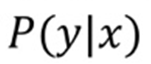

# Ch 07. 로지스틱 희귀(Logistic Regression)

## Part.7 Warm-up

#### We talked about

* 세상에 실존하는 알  수  없는 함수를 근사하고자 함 
  * 데이터를  살펴본 결과  주로  선형  관계에  있음을 확인할 수 있다면
* Linear layer를 활용하여 그 함수를 근사하고자함
  * Linear Regression: 선형 관계를 근사할 수 있음 (MSE)
  * Logistic Regression: 선형 데이터에서 이진 분류를 수행할 수 있음 (BCE)
* 각 task에 알맞은 손실 함수를 활용하여 파라미터를 최적화

#### Regression vs Classification

##### Regression (희귀)

* Target											
  * real-value vector.
  * ex. monthly income
* MSE Loss
* Linear layer in the last.
  * it returns real-value vector

##### Classification (분류)

* Target
  * Categorical value from finite set
  * ex. Word, Class, Symbol
* BCE
* Sigmoid in the last
  * it returns probability

#### Add Sigmoid function at last

* 이진 분류를 풀 수 있는 모델을 만들 수 있음
  * 형태의 출력을 얻을 수 있게 됨
  * 추론할 때, 출력이 0.5 이상이면 True, 0.5 미만이면 False를 반환하는것

#### But in real World,

* 세상에는 선형 관계로는 해석할 수 없는 비선형 데이터들이 넘쳐남
  * ex. 이미지, 텍스트, 음성 등
* 이들을 학습할 수 있는 비선형 모델이 필요함

