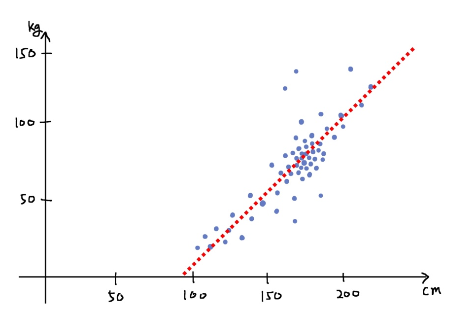
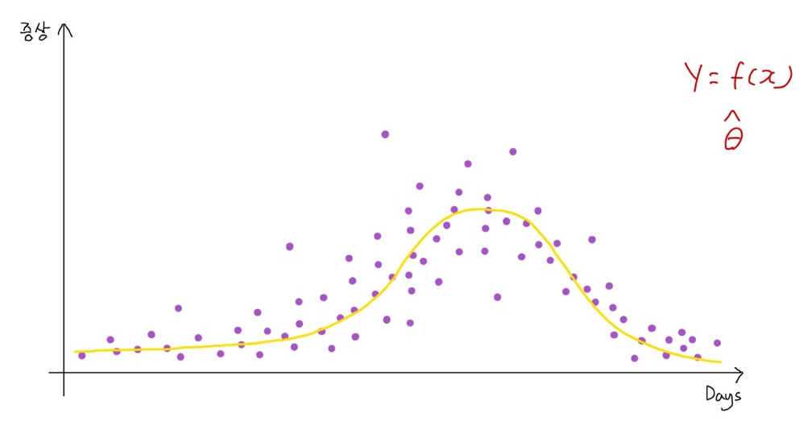
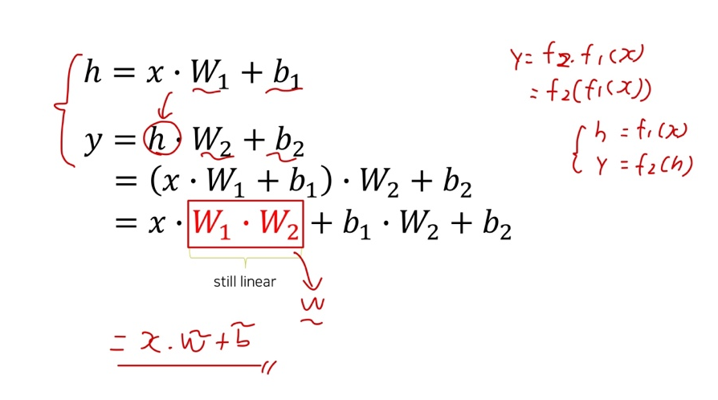
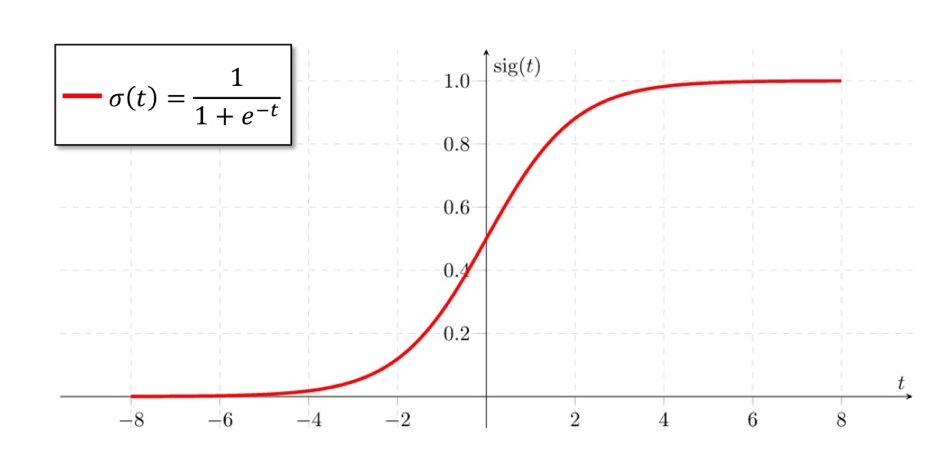
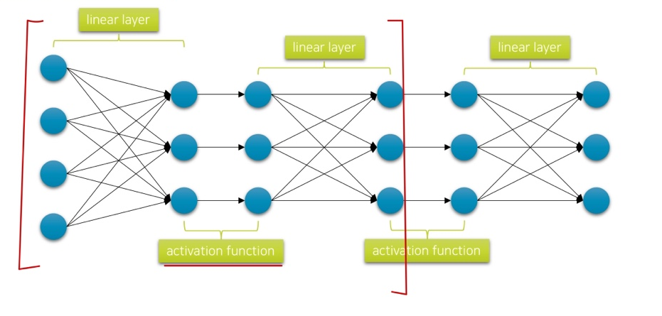
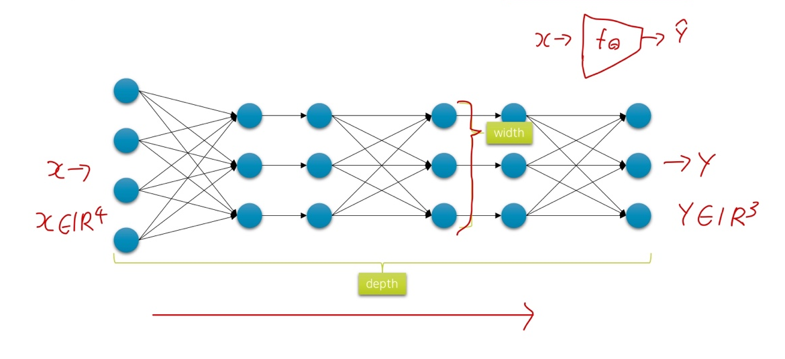

# Ch 08. 딥러닝 입문 (희귀)

## Part.1  Deep Neural Networks

#### Linear & Logistic Regression

* 데이터의 선형 관계를 분석 및 예측

#### Motivations

* 차원이 높고 복잡한 데이터들은 주로 비선형 관계를 

#### Linear + Linear

* 만약 linear layer를 깊게 쌓으면 안될까?

#### In Logistic Regression,

* 마지막 Sigmoid 함수를 통해

  * 매우 작은 값은 0에 수렴하고,

  * 매우 큰 값은 1에 수렴하도록 하였음 

    -> 비선형 함수

#### Adding Non-linearity 

* 이번에는 레이어 사이에 비선형 활성 함수를 넣어 깊게 쌓자
  * 꼭 sigmoid일 필요는 없다.

#### Network Capacity

* 깊이(depth)와 너비(width)를 넢게 할수록 신경망의 표현력은 좋아진다.
  * 복잡한 형태의 함수를 배울 수 있는 능력이 생긴다.

#### Summary

* 많은 문제들이 굉장히 높고 복잡한 차원의 데이터를 다룸
  * ex. 이미지, 텍스트, 음성
* 기존의 선형 데이터 분석 기법으로는 한계가 명확함
  * Linear layer를 깊게 쌓아도 여전히 linear 모델임
* Non-linear 함수를 레이어 사이에 넣어주어 비선형 모델을 만들 수 있음
  * 네트워크 깊이와 너비에 따라 capacity가 달라짐
* 네트워크의 파라미터들을 gradient descent를 통해 학습하면, target 함수를 모사 (approximate)할 수 있음
