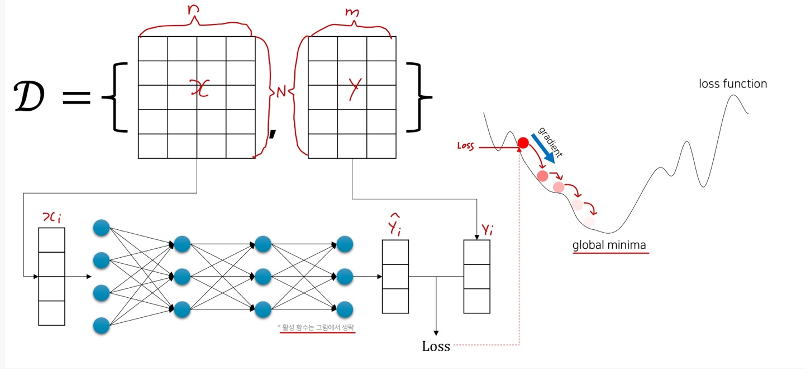

# Ch 08. 딥러닝 입문 (희귀)

## Part.2  Back propagation

#### Again, Our Objective is

* 주어진 데이터에 대해서 출력 값을 똑같이 내는 함수를 찾고 싶다.
  * 비선형 함수를 통해 더 잘 모사해보자

* Loss 값을 최소로 하는 Loss Function의 입력 값을 찾자.
* Gradient Descent를 통해 현재 에서 더 나은 로 나아가자. (t는 iteration의 횟수)

#### Gradient Descent for Deep Neural Network

* Same as Linear / Logistic Regression, except DNN has more parameters.

#### Without Backpropagation...

* Loss 값을 학습 파라미터로 미분 해줘야 한다.

#### Chain Rule

* 미분을 다른 변수의 미분의 곱으로 표현할 수 있음

#### Using Chain Rule

* 심충 신경망은 합성함수로 표현될 수 있음.

#### Backpropagation with Chain Rule

* 필요한 기존 미분 값을 재활용

#### Summary

* Gradient Descent를 통해 loss를 최소화하는 신경망 파라미터를 찾을수 있다.
  * 하지만 loss를 각 레이어의 파라미터로 **그냥 미분하는 것은 매우 비효율적**
  * 따라서 Back propagation을 통해 **반복되는 미분 과정을 효율적**으로 만들 수 있다.
* PyTorch, Tensorflow등의 프레임워크는 AutoGrad와 같은 기능등을 통해 feed-forward 작업에 대해 자동으로 미분을 수행함
  * 즉, 사용자가 직접 미분을 계산할 일은 없음.
  * 옛날엔 feed-forward 수식에 대해 손으로 미분을 수행하고, 그것을 C++로 구현하였음
