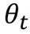
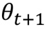
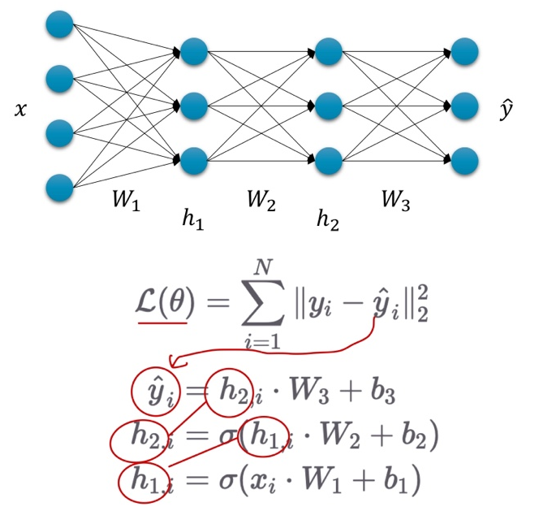
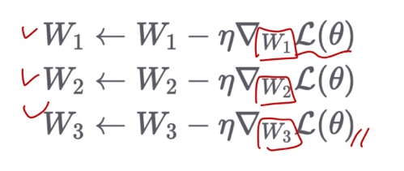
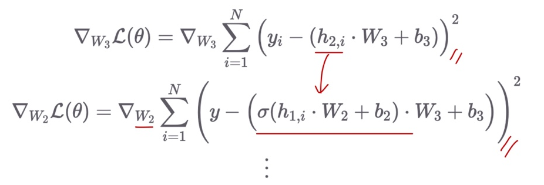
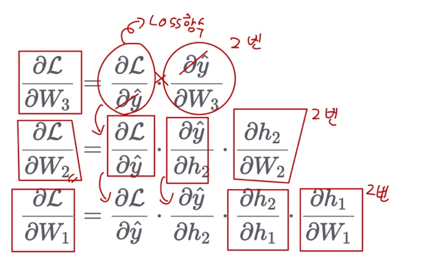

# Ch 08. 딥러닝 입문 (희귀)

## Part.3 수식 Back propagation

#### Recall Objective : 

* 주어진 데이터에 대해서 출력 값을 똑같이 내는 함수를 찾고 싶다.
  * 비선형 함수를 통해 더 잘 모사해보자.

* Loss 값을 최소로 하는 Loss Function의 입력값()을 찾자. 

* Gradient Descent를 통해 현재 에서 더 나은 로 나아가자. (t는 iteration의 횟수)
* 그런데 layer가 많아서 미분이 힘들다...

#### Without Backpropagation

* Loss 값을 학습 파라미터마다 미분 해줘야 한다.

#### Backpropagation with Chain Rule

* 매번 처음부터 새로 계산할 필요 없이, 필요한 부분을 재활용

#### Summary

* Chain rule을 통해, (합성 함수를 전개한) 복잡한 수식에 대한 미분을 각 sub-함수 별 미분의 곱으로 표현 가능함.
  * 따라서 각 함수 별 미분을 한 후 결과 값을 곱해주면 끝.
* 물론 실제 PyTorch에선 이러한 미분 과정을 사용자가 직접 수행하지 않음
  * Backward()함수 호출을 통해 자동으로 미분 결과를 얻을 수 있음.
