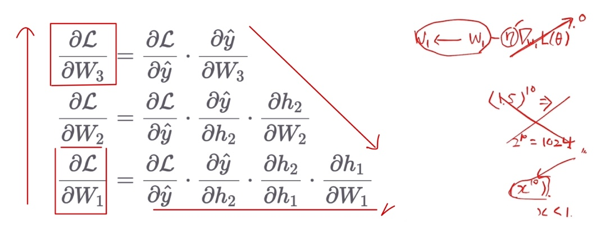
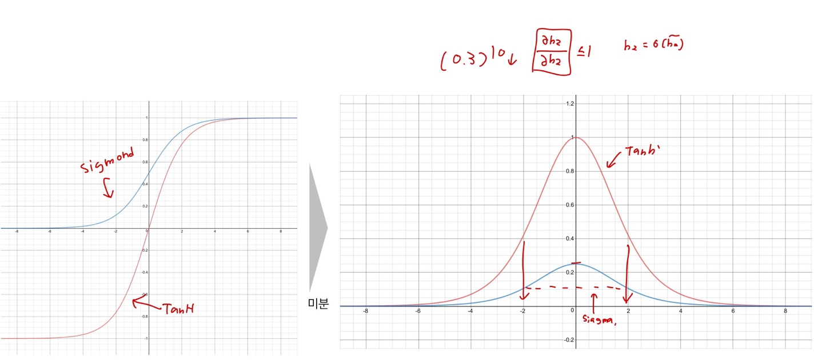
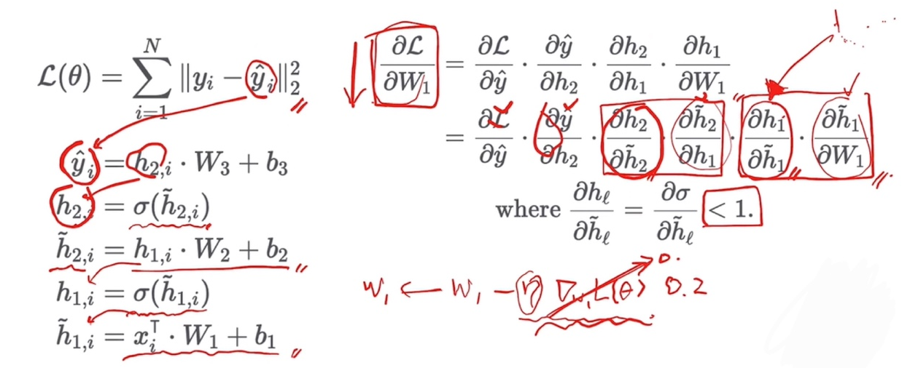

# Ch 08. 딥러닝 입문 (희귀)

## Part.4 Gradient Vanishing

#### Backpropagation with Chain Rule

* Gradient 들의 곱셈으로 이루어져 있음

* 입력에 가까운 레이어의 파라미터일수록 곱셈이 늘어남
  * Gradient가 1보다 작을 경우, 좌변은 점점 작아질 것

#### Gradient of Sigmoid & TanH

* 모두 1보다 작거나 같다.

Gradient Vanishing because of Activation Functions

* 깊은 네트워크를 구성하게 되면 점점 gradient가 작아지는 현상
* 따라서 깊은 신경망을 학스바기 어렵게 됨
  * 앞쪽 레이어의 파라미터는 업데이트 되는 크기가 매우 작기 때문

