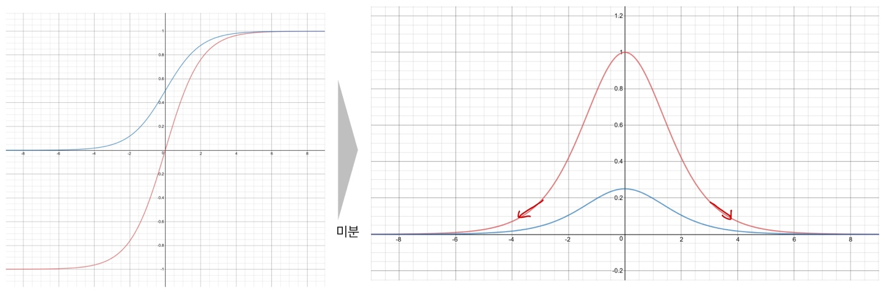
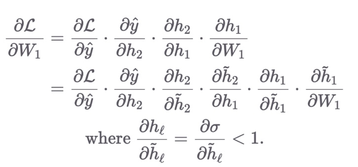
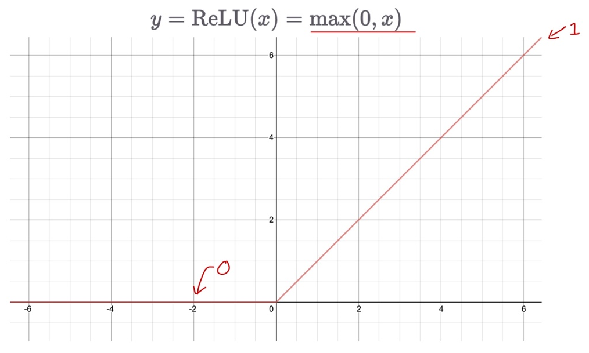
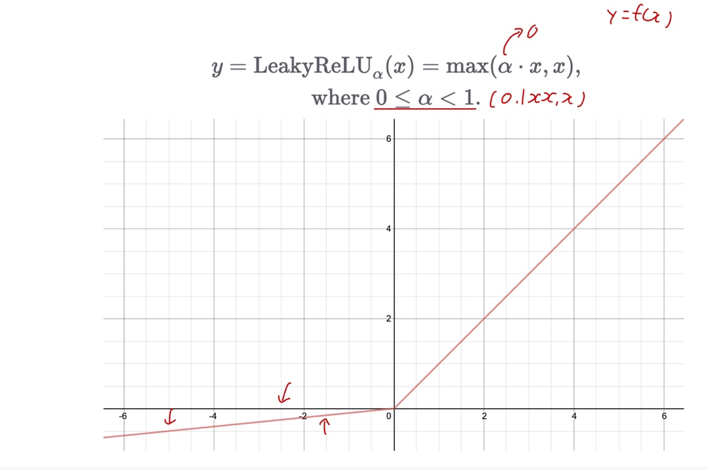

# Ch 08. 딥러닝 입문 (희귀)

## Part.5 ReLU

#### Gradient Vanishing by Sigmoid & TanH

* Chain rule로 펼쳤을때, 이 함수에 대하 미분 값은 항상 1보다 같거나 작다

* DNN이 깊어지게 되면 활상 함수의 사용 횟수가 증가 할 것
  * 따라서 입력에 가까운 파라미터에 대한 미분에선 1보다 작은 값이 반복적으로 곱해질것

#### ReLU (Rectifed Linear Unit)

* 두개의 linear 함수로 이루어져 있음

#### Learky ReLU

* 기울기를 조절할 수 있음

#### Summary

* 기존의 Sigmoid, TanH는 gradient vanishing 문제를 일으킴
  * 함수의 미분 값이 항상 1보다 작거나 같음
* ReLU를 통해 gradient vanishing 문제를 어느정도 해결할 수 있다.
* 양수 부분의 기울기는 항상 1이므로 학습 속도가 빠르다
  * 또한 linear에 가까운 특성으로 인해, 최적화가 더 쉽다.
* ReLU의 입력 값이 음수인 경우, 이전 레이어는 학습이 불가하다.
  * LeakyReLU를 통해 단점을 극복할 수 있다.
