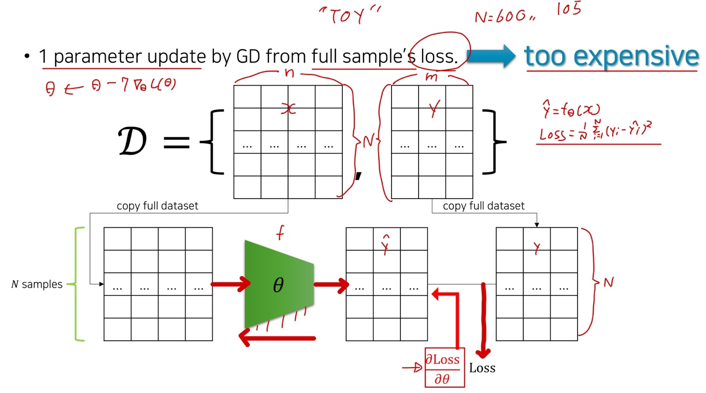
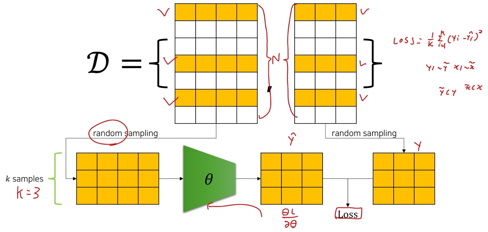
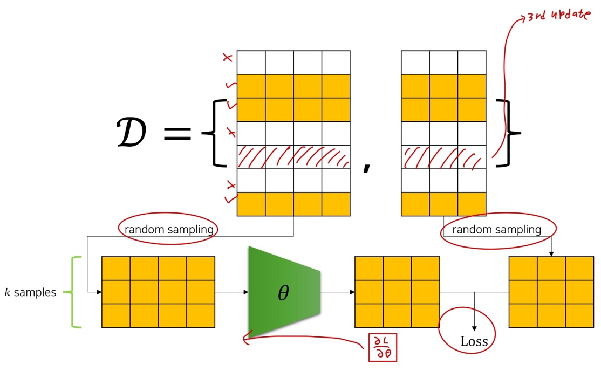

# Ch 09. Stochastic Gradient Descen

## Part.1 Stochastic Gradient Descent (SGD)

#### Currently, what we do

* 1 parameter update by GD (Gradient Descent) from full sample's loss

  전체 샘플 loss 값중에서 하나의 파라미터가 Gradient Descent에 의하여 업데이트 된다.

  * But, too expensive.

#### Stochastic Gradient Descent (SGD)

* 1st update from **random** k sample loss

k loss 샘플 중에서 첫번째껄 업데이트 해준다.

 

* 2nd update from another **random** k sample loss.

  k loss 샘플 중에서 두번째껄 업데이트 해준다.

#### Epoch & Iteration

* 1 Epoch

  * 모든 데이터셋의 샘플들이 forward & backward (전진 & 후진) 되는 시점
  * Epoch의 시작에 데이터셋을 random shuffling 해준 후, 미니 배치로 봐뀐다.

  

* 1 Iteration

  * 한개의 미니배치 샘플들이 forward & backward (전진 & 후진) 되는 시점

* 따라서 Epoch와 Iteration의 이중의 for loop이 만들어지게 됨

  * 파라미터 전체 업데이트 횟수: **#epochs X #Iterations**

#### SGD Summary

* 전체 샘들의 loss에 대한 gradient descent 가 아닌, 일부 샘플 (k = batch size)의 loss에 대한 gradient descent
* 1 epoch (전체 데이터셋을 활용한 학습)당 파라미터 update 횟수 증가
  * 대신 1 epoch의 소요 시간 증가
* batch_size가 작아질수록 gradient가 실제 gradient와 달라질 것
  * 어쩌면 이로 인해 local minima를 탈출 할 수도 있음
* 요즘 학계의 추세는 큰 batch_size를 가져가려함
  * GPU를 사용하면 병렬 연산으로 인해, 큰 배치 사이즈로 인한 비용이 줄어들기 때문
    * ex. 2048, 4096등..
  * 매우큰 배치사이즈의 경우에는 오히려 성능을 약화시킬 수도 있음
