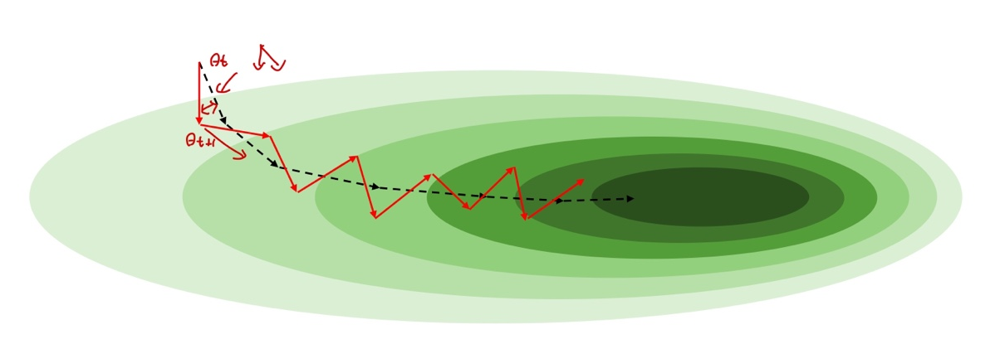
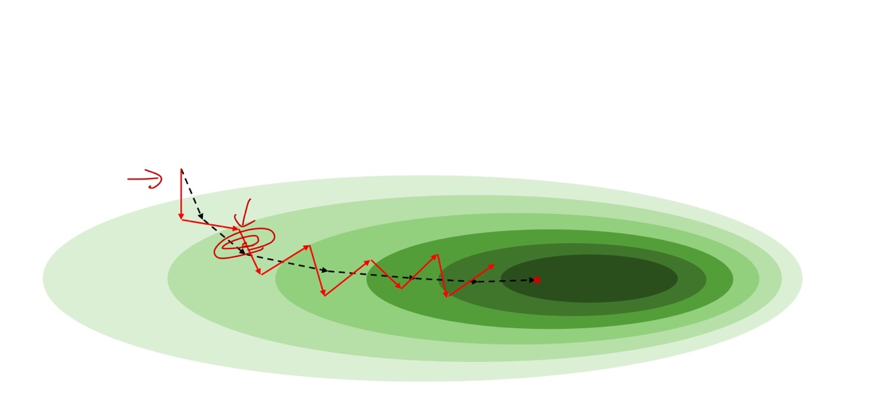

# Ch 09. Stochastic Gradient Descen

## Part.2 Intuiton SGD

#### Stochastic Gradient Descent vs Gradient Descent

* 각 미니배치의 gradient는 전체 데이터의 gradient와 다를것 (noisy)
  * 하지만 미니배치 gradient의 평균(기대값)은 전체 데이터의 gradient와 같을것
  * Batch size가 작을 수록 variance는 더욱 커질것

* Batch size가 작으면
  * local minima를 탈출할 수도 있음
* Batch size가 크면
  * 상대적으로 더 빠르게 수렴할 수 있음

