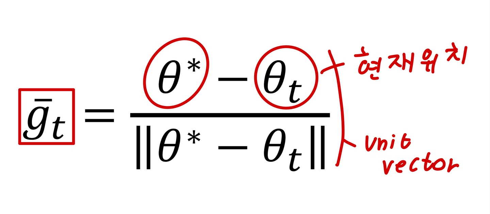
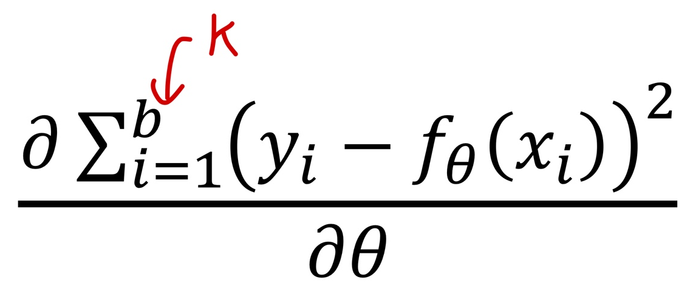
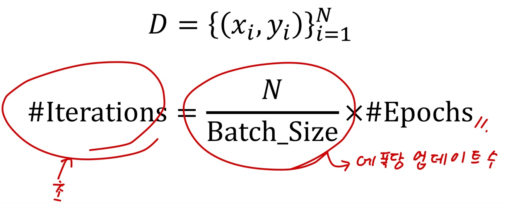

# Ch 09. Stochastic Gradient Descen

## Part.3 Batch Size에 따른 특성

#### If Batch Size equals to Dataset Size.

* 데이터셋의 크키가 매우 크다면, 데이터셋의 분포는 실제 모집단의 분포와 비슷해질 것
* 따라서 gradient의 방향은 실제 전체 데이터셋을 활용한 gradient의 방향과 비슷할 것

* 하지만 한번의 파라미터 업데이트를 위해 더 많은 계산이 필요함.

  ​	만약 작은 배치 사이즈의 gradient 방향이 full dataset의 gradient 방향과 거이 같다면?

#### If Batch Size is small.

* 랜덤 샘플들은 모집단에 비해 훨씬 편향되어 있을 것
  * 따라서 해당 샘플들을 맞추기 위한 gradient는 ground-truth gradient와 꽤 달라질 것
  * 기대값(평균)은 같을 것

* 따라서 local minima에 빠질지라도, 편향된 gradient로 인해 탈출할 수 있다.
* **하지만, 너무 작은 batch size는 gradient가 noisy해져, 수렴이 어려워 질수도 있음.**

#### Number of Iterations

* 파라미터 업데이트 횟수 :

* 배치 사이즈가 클 수록 파라미터 업데이트 횟수는 줄어든다.	
  * 즉, 모델이 학습할 기회가 줄어든다.
  * 대신 한번 학습 할 때, gradient의 방향은 상대적으로 정확할 수 있다.

#### Wrap-up

* 배치 사이즈에 따라 모델의 할습 속도에 영향을 끼친다.
  * 작은 배치 사이즈는 local minima를 탈출하게 도와줄 수도 있다.
  * 너무 작은 배치 사이즈는 수렴이 늦거나 최적화가 어려워질 수 있다.

* 따라서 적절한 배치 사이즈를 사용하는 것이 좋다.
  * 물론 GPU 메모리가 허용하는 내에서
  * 추천 배치 사이즈: 64, 128, 256 (2^n)
