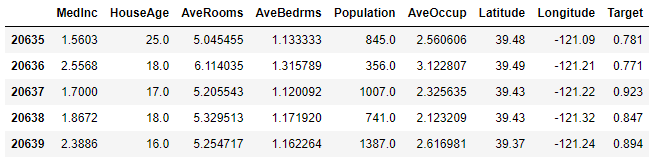
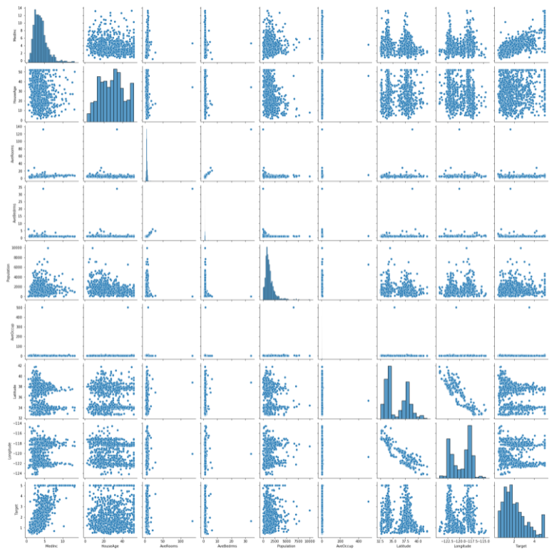
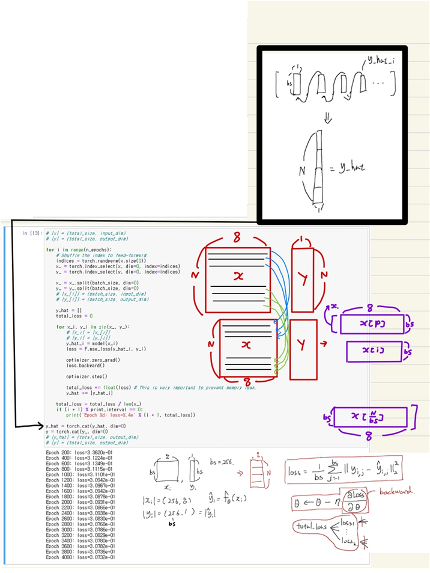
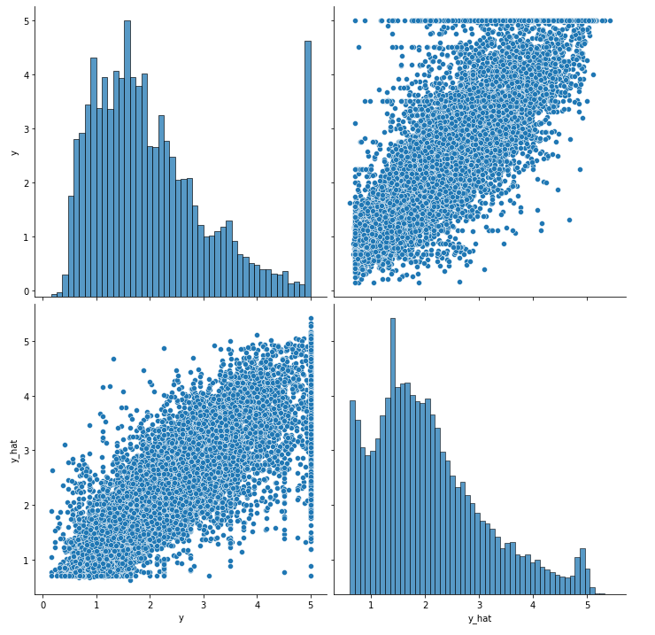

# Ch 09. Stochastic Gradient Descen

## Part.4 실습 SGD 적용하기

### Stochastic Gradient Descent (SGD)

#### Load Dataset from sklearn

* In [1] :

```python
import pandas as pd
import seaborn as sns
import matplotlib.pyplot as plt

from sklearn.preprocessing import StandardScaler
```


* In [2] :

```python
from sklearn.datasets import fetch_california_housing
california = fetch_california_housing()
```


* In [3] :

```python
df = pd.DataFrame(california.data, columns=california.feature_names)
df["Target"] = california.target
df.tail()
```


* Out [3] : 




* In [4] :

```
sns.pairplot(df.sample(1000))
plt.show()
```




* In [5] :

```python
scaler = StandardScaler()
scaler.fit(df.values[:, :-1])
df.values[:, :-1] = scaler.transform(df.values[:, :-1])
```

* In [6] : 

```python
sns.pairplot(df.sample(1000))
plt.show()
```


#### Train Model with PyTorch

* In [7] : 

```python
import torch
import torch.nn as nn
import torch.nn.functional as F
import torch.optim as optim
```


* In [8] :

```
data = torch.from_numpy(df.values).float()
data.shape
```

* Out [8] : torch.Size([20640, 9])


* In [9] :

```python
x = data[:, :-1]
y = data[:, -1:]

print(x.shape, y.shape)
```

torch.Size([20640, 8]) torch.Size([20640, 1])


* In [10] :

```python
n_epochs = 4000
batch_size = 256
print_interval = 200
learning_rate = 1e-2
```


## Build Models

* In [11] :

```python
model = nn.Sequential(
    nn.Linear(x.size(-1), 6),
    nn.LeakyReLU(),
    nn.Linear(6, 5),
    nn.LeakyReLU(),
    nn.Linear(5, 4),
    nn.LeakyReLU(),
    nn.Linear(4, 3),
    nn.LeakyReLU(),
    nn.Linear(3, y.size(-1)),
)

model
```


Sequential(
  (0): Linear(in_features=8, out_features=6, bias=True)
  (1): LeakyReLU(negative_slope=0.01)
  (2): Linear(in_features=6, out_features=5, bias=True)
  (3): LeakyReLU(negative_slope=0.01)
  (4): Linear(in_features=5, out_features=4, bias=True)
  (5): LeakyReLU(negative_slope=0.01)
  (6): Linear(in_features=4, out_features=3, bias=True)
  (7): LeakyReLU(negative_slope=0.01)
  (8): Linear(in_features=3, out_features=1, bias=True)
)


* In [12] :

```python
optimizer = optim.SGD(model.parameters(), lr=learning_rate)
```



## Let's see the result!

* In [14] :

```python
df = pd.DataFrame(torch.cat([y, y_hat], dim=1).detach().numpy(),
                  columns=["y", "y_hat"])

sns.pairplot(df, height=5)
plt.show()
```


