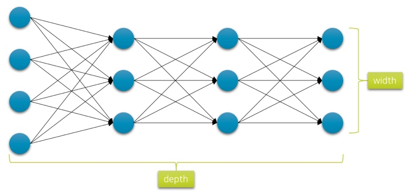
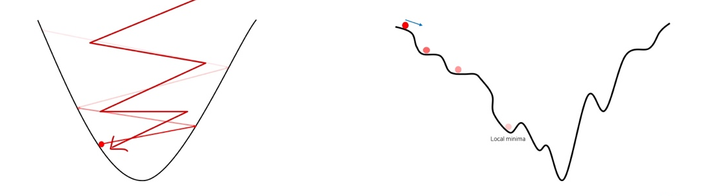
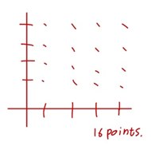

# Ch 10. 딥러닝 학습을 쉽게 하는 방법

### Part.1 Hyper-Parameters

#### What is Hyper-parameters?

* vs Model Parameters?
  * 모델 내부의 설정 값으로, 데이터에 위해서 값이 정해짐 - 학습에 의해서 변경
  * 사용자에 의해서 조정되지 않음
  * 딥러닝에서 Network Weight Parameter라고 불리우기도 함

* Hyper-Parameters?
  * 모델 외부의 설정 값으로, 사용자에 의해서 결정된다.
  * 이 또한 모델의 성능을 좌우할 수 있음
  * 데이터나 상황에 따라 최적의 값이 다르므로, 보통 Heuristic한 방법에 의해서 찾게됨

#### Network Depth & Width

*  네트워크의 Capacity를 결정하는 요소
  * 너무 깊으면 과적합(overfitting)*의 원인이 되며, 최적화가 어려움
  * 너무 얕으먼 복잡한 데이터의 관계 또는 함수를 배울 수 없음
* Tuning을 통해 최적의 architecture를 찾아야함

overflitting: 학습 데이터를 과도하게 학습하는 현상

#### Learning Rate

* Gradient Descent에서 기울기에 따른 파라미터의 업데이트 양을 조절
  * 너무 큰 learning rate는 loss값이 발산할 수 있음
  * 너무 작은 learning rate는 학습의 진전이 더디거나, 진행되지 않을 수 있음.
* 기존의 실습에서 learning rate를 조절해보면 다른 결과가 나오는 것을 알 수 있음
* Tuning을 통해 최적의 learning rate를 찾아야 함

#### Other Hyper-parameters

* 어떤 활성 함수를 사용할 것인가?
  * ReLU? LeakyReLU?
  * LeakyReLU의 각도는?
* 어떤 초기화 방법을 쓸 것인가?
  * Weight parameter의 초기화 방법에 따른 편차
* 몇 번의 epoch를 돌릴 것인가?
  * 미니배치의 크기는 어떻게 할 것인가?

#### Wrap-up

* Hyper -parameter는 데이터로부터 자동으로 학습할 수 없지만, 모델의 성능에 영향을 끼치는 파라미터를 가리킨다.
  * 따라서 **수동으로 튜닝**하거나 다양한 **실험을** 통해 최적 값을 찾아야함
    * ex) Grid-search, Bayesian Optimization등
  * 많은 실무 경험을 통해, 경험적으로 최적 값과 비슷한 값을 찾을 수도 있음
    * 특히 데이터셋과 모델이 큰 경우, 많은 튜닝이 어렵기 때문.

* 일부 파라미터는 문제 해결 여부가 달려 있을 수도 있음
  * 하지만 대개 많은 파라미터들은 약간의 성능 변화만 야기 하기도 함
  * 따라서 critical한 파리미터를 인지하고 **주로 튜닝** 하는것이 중요

* 많은 실험이 필요한 만큼, **많고 다양한 실험 결과를 잘 정리하는 요령**이 필요

