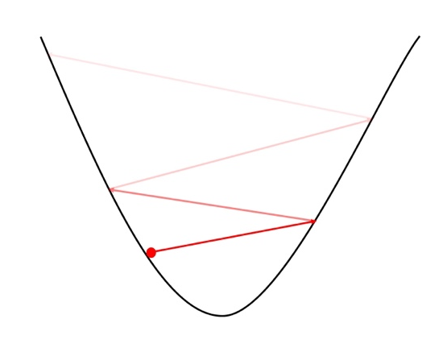

# Ch 10. 딥러닝 학습을 쉽게 하는 방법

### Part.3 Momentum & Adaptive LR

#### Review: Learning Rate in Gradient Descent

* 모사하고자 하는 함수의 동작 (y)과 현재 결과 값()의 차이 (loss)를 최소화
* 기울기에 따른 경사도 하강에서 파라미터 업데이트의 크기를 정하는 역할

#### Review: Learning rate에 따른 최적화

##### Large LR

* 너무 큰 LR는 loss가 발산할 수 있음

##### Small LR

* 너무 작은 LR는 수렴이 너무 늦음
* 자칫 local minima에 빠질수 있음

#### Learning Rate Scheduling

* 학습 초반에는 큰 LR, 후반에는 작은 LR으로 최적화

* Motivation
  * 학습 초반에는 너무 작은 learning rate는 진행이 더디게 되고,
  * 학습 후반의 너무 큰 learning rate는 더 좋은 loss를 얻지 못하게 됨

* 방법
  * 현재 epoch에서 loss가 과거 epoch의 loss보다 더 나아지지 않을 경우, 일정 비율 (보통 0.5)으로 decay.
  * 정해진 epoch가 지날 때마다 일정 비율로 decay

#### SGD with Momentum

* 관성을 활용하여 더 빨리 수렴하거나, local minima를 탈출할 수 있지 않을까?

#### Diffculty in Learning Rate Tuning

* 너무 크거나 작은 learning rate는 학습을 방해

* 따라서 데이터나 신경망의 구조가 바꿜 때매다 learning rate 튜닝이 필요
  * 튜닝 이후에도 최적의 learning rate인지 확신이 없음
* 궁극적으로 loss surface의 형태를 알 수 없기 때문
  * 다양한 loss surface에서 모두 잘 동작하는 universal한 방법을 찾고 싶다.

#### Adaptive Learning-rate?

* Update가 많았던 파라미터는 점차 작은 LR를 갖도록 함

#### Adam Optimizer [Kingma et al., 2014]

* 기존 Adaptive LR 방식에 momentum이 더해진 형태

#### Wrap-up

* Adam도 learning rate가 사실 hyper-parameter
* 요즘의 추세는 Adam과 SGD를 선호
  * Adaaptive LR Scheme에서는 Adam이 제일 인기
  * 일각에서는 SGD가 최종 성능이 뛰어나단 주장
  * Adam + SGD를 섞어 쓰기도

