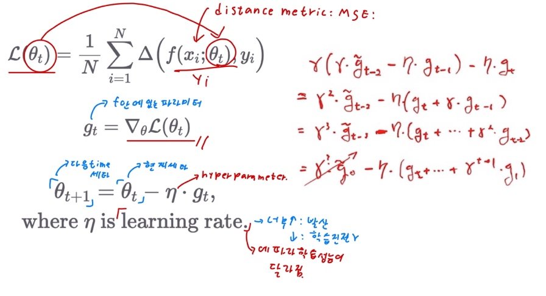
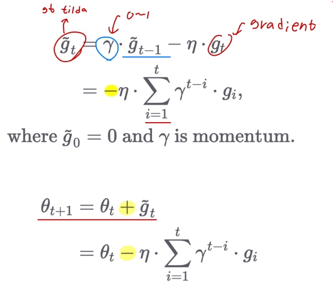
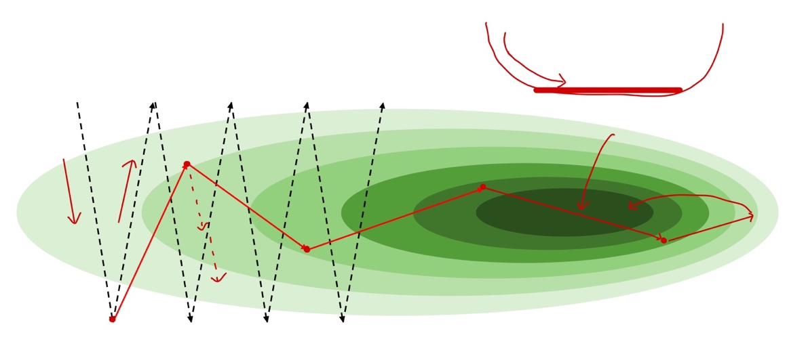
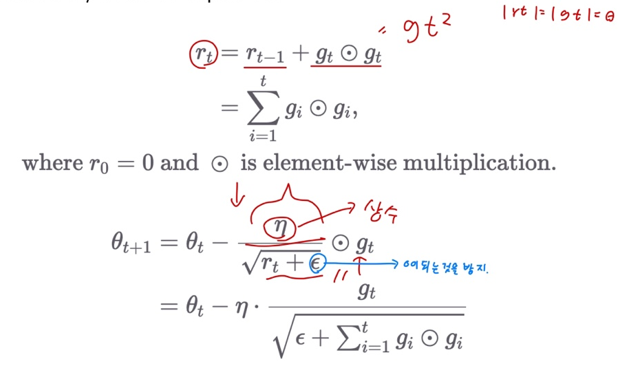
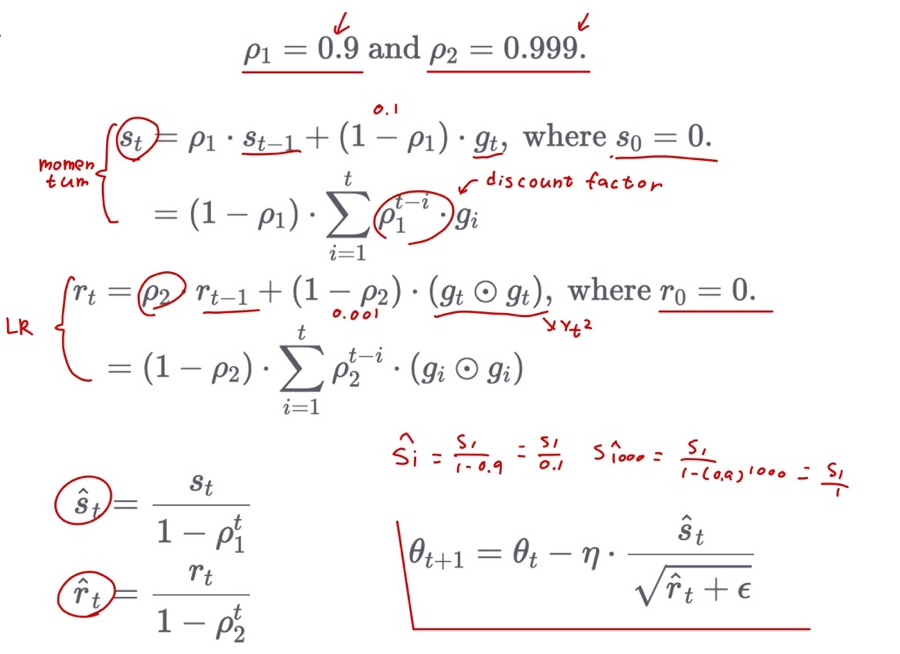
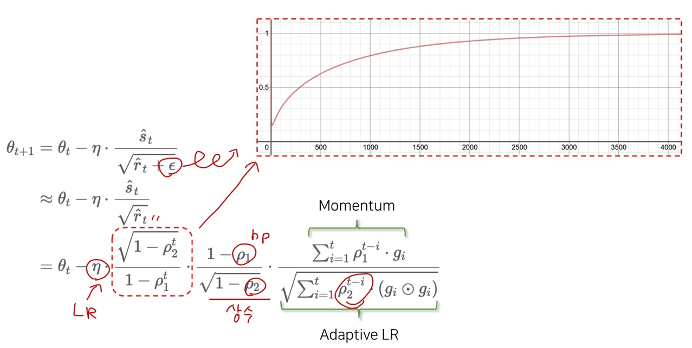

# Ch 10. 딥러닝 학습을 쉽게 하는 방법

### Part.4 수식 Adaptive LR Optimizer

#### Review: SGD

* Learning rate is a hyper-parameter that need to be tuned.
  * 만약 learning rate가 너무 크면 값이 1을 넘어서 발산이 될수도 있고
  * 만약  learning rate가 작으면 딥러닝 학습에 진전이 없을수도 있다.
  * 그래서 learning rate에 따라서 딥러닝 학습 성능이 달라진다.

#### Momentum

* Accumulate gradient from the beginning with discount factor
  * discount factor 값이 1에 가까우면, 안에있는 옛날값들이 많이 보존이 되었다는 뜻이고,
  * 0에 가까워지면 discount factor는 옛날값들을 많이 까먹었다는 것이다.

#### Momentum Example

* 깊은 계곡

#### Adaptive LR Motivation

* 학습 초반에는 큰 LR, 후반에는 작은 LR으로 최적화

* Motivation
  * 학습 초반의 너무 작은 learning rate는 진행이 더디게 되고,
  * 학습 후반의 너무 큰 learning rate는 더 좋은 loss를 얻지 못하게 됨.

* 방법

  1) 현재 epoch에서 loss가 **과거 epoch의 loss보다 더 나아지지 않을 경우**, 일정 비율 (보통 0.5) 으로 decay

  2) 정해진 epoch가 지날 때마다 일정 비율로 decay

#### Adaptive LR: AdaGrad

* Each parameter has **its own learning rate**, which is divided by sum of squares.

#### Adaptive LR + Momentum: Adam

* Two Hyper-params

#### Adam Explanation

#### Wrap-up

* Adam이 가장 hyper-parameter의 변화에 강인(robust)하다고 알려져 있으나, 상황에 따라 알맞은 optimizer를 찾아 활용하는 것이 중요
