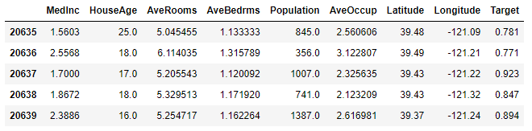
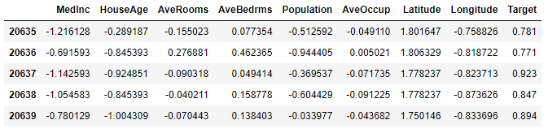
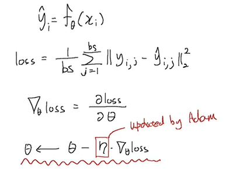
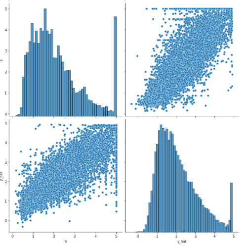

# Ch 10. 딥러닝 학습을 쉽게 하는 방법

### Part.5 실습 Adam Optimizer 적용하기

#### Load Dataset from sklearn


* In [1] :

```python
import pandas as pd
import seaborn as sns
import matplotlib.pyplot as plt

from sklearn.preprocessing import StandardScaler
```


* In [2] :

```python
from sklearn.datasets import fetch_california_housing
california = fetch_california_housing()
```


* In [3] :

```python
df = pd.DataFrame(california.data, columns=california.feature_names)
df["Target"] = california.target
df.tail()
```





* In [4] :

```python
scaler = StandardScaler()
scaler.fit(df.values[:, :-1])
df.values[:, :-1] = scaler.transform(df.values[:, :-1])

df.tail()
```





#### Train Model with PyTorch


* In [5] :

```python
import torch
import torch.nn as nn
import torch.nn.functional as F
import torch.optim as optim
```


* In [6] :


```python
data = torch.from_numpy(df.values).float()

data.shape
```

* Out [6] : torch.Size([20640, 9])


* In [7] :

```python
x = data[:, :-1]
y = data[:, -1:]

print(x.shape, y.shape)
```

torch.Size([20640, 8]) torch.Size([20640, 1])


* In [8] :

```python
n_epochs = 4000
batch_size = 256
print_interval = 200
#learning_rate = 1e-2
```


#### Build Model

* In [9] :

```python
model = nn.Sequential(
    nn.Linear(x.size(-1), 6),
    nn.LeakyReLU(),
    nn.Linear(6, 5),
    nn.LeakyReLU(),
    nn.Linear(5, 4),
    nn.LeakyReLU(),
    nn.Linear(4, 3),
    nn.LeakyReLU(),
    nn.Linear(3, y.size(-1)),
)

model
```


* Out [9] :

Sequential (
  (0): Linear(in_features=8, out_features=6, bias=True)
  (1): LeakyReLU(negative_slope=0.01)
  (2): Linear(in_features=6, out_features=5, bias=True)
  (3): LeakyReLU(negative_slope=0.01)
  (4): Linear(in_features=5, out_features=4, bias=True)
  (5): LeakyReLU(negative_slope=0.01)
  (6): Linear(in_features=4, out_features=3, bias=True)
  (7): LeakyReLU(negative_slope=0.01)
  (8): Linear(in_features=3, out_features=1, bias=True)
)


* In [10] :

```python
# # We don't need learning rate hyper-parameter.
optimizer = optim.Adam(model.parameters())
```


* In [11] :

```python
# |x| = (total_size, input_dim)
# |y| = (total_size, output_dim)

for i in range(n_epochs):
    # Shuffle the index to feed-forward.
    indices = torch.randperm(x.size(0))
    x_ = torch.index_select(x, dim=0, index=indices)
    y_ = torch.index_select(y, dim=0, index=indices)
    

x_ = x_.split(batch_size, dim=0)
y_ = y_.split(batch_size, dim=0)

# |x_[i]| = (batch_size, input_dim)

# |y_[i]| = (batch_size, output_dim)

y_hat = []
total_loss = 0

for x_i, y_i in zip(x_, y_):

    # |x_i| = |x_[i]|

    # |y_i| = |y_[i]|

​    y_hat_i = model(x_i)
​    loss = F.mse_loss(y_hat_i, y_i)

​    optimizer.zero_grad()
​    loss.backward()

​    optimizer.step()
​    
​    total_loss += float(loss) # This is very important to prevent memory leak.
​    y_hat += [y_hat_i]

total_loss = total_loss / len(x_)
if (i + 1) % print_interval == 0:
    print('Epoch %d: loss=%.4e' % (i + 1, total_loss))

y_hat = torch.cat(y_hat, dim=0)
y = torch.cat(y_, dim=0)

# |y_hat| = (total_size, output_dim)

|y| = (total_size, output_dim)
```

* Adam Optimizer 공식

##### 


```
Epoch 200: loss=3.1430e-01
Epoch 400: loss=3.0689e-01
Epoch 600: loss=3.0328e-01
Epoch 800: loss=3.0001e-01
Epoch 1000: loss=2.9695e-01
Epoch 1200: loss=2.9685e-01
Epoch 1400: loss=2.9601e-01
Epoch 1600: loss=2.9575e-01
Epoch 1800: loss=2.9495e-01
Epoch 2000: loss=2.9482e-01
Epoch 2200: loss=2.9314e-01
Epoch 2400: loss=2.9309e-01
Epoch 2600: loss=2.9253e-01
Epoch 2800: loss=2.9197e-01
Epoch 3000: loss=2.9228e-01
Epoch 3200: loss=2.9151e-01
Epoch 3400: loss=2.9211e-01
Epoch 3600: loss=2.9156e-01
Epoch 3800: loss=2.9199e-01
Epoch 4000: loss=2.9094e-01


```


### 결과값 보기

* In [12] :


```python
df = pd.DataFrame(torch.cat([y, y_hat], dim=1).detach().numpy(),
                  columns=["y", "y_hat"])

sns.pairplot(df, height=5)
plt.show()
```


