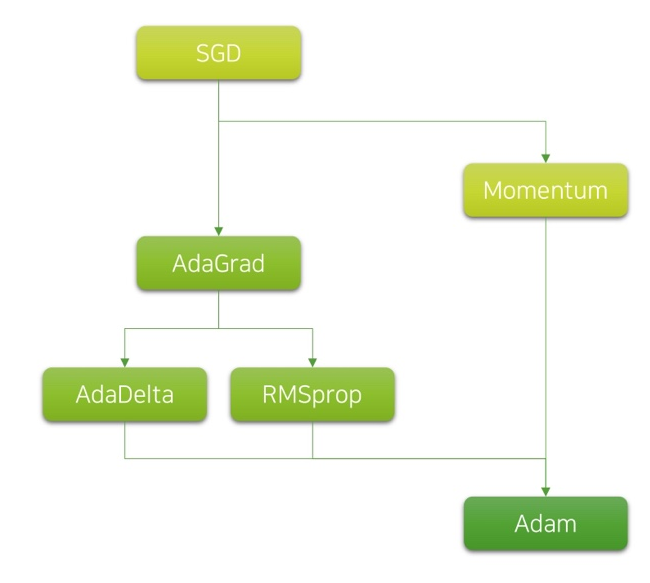

# Ch 10. 딥러닝 학습을 쉽게 하는 방법

### Part.6 Wrap-up

#### Hyper-parameters

* Hyper-parameter는 데이터로부터 자동으로 학습할 수는 없지만, 모델의 성능에 영행을 끼치는 파라미터를 가리킨다.
  * 따라서 **수동으로 튜닝**하거나, **다양한 실험을 통해** 최적값을 찾아야함
    * ex) Grid-search, Bayesian Optimization 등
  * 많은 실무 경험을 통해, 경험적으로 최적 값과 비슷한 값을 찾을수도 있음
    * 특히 데이터셋과 모델이 큰 경우, 많은 튜닝이 어려움.

* 일부 파라미터는 문제 해결 여부가 달려 있을 수도 있음
  * 하지만 대개 많은 파라미터들은 대개 약간의 성능 변화만 야기하기도 함
  * 따라서 critical한 파라미터를 인지하고 주로 튜닝 하는 것이 중요

* 많은 실험이 필요한 민큼, 많고 다양한 실험 결과를 잘 정리하는 요령이 필요! 

#### Adaptive LR

* Weight param 별로 LR을 따로 갖게 됨
  * 파라미터 업데이트가 될 수록 LR이 각자 작아짐

* SGD에 비해 수렴이 빠르고 편리함
  * 때론 복잡한 구조의 모델에서는 잘 동작하지 않기도 함

* Weight처럼 Optimizer가 저장되어야함

  * 학습이 중간에 재개될경우, 이전 iteration까지 값이 필요
  * 따라서 모델을 저정할때, Optimizer도 저장해줘야함

  

* Adam이 가장 널리 사용됨

