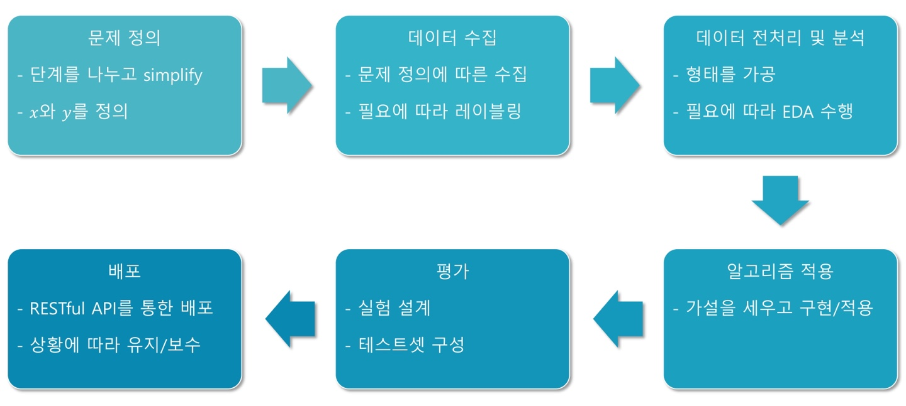

# Ch 11. 딥러닝 모델의 실험 과정

### Part.1 실험 과정 소개

#### Working Process

#### 좋은 평가란?

* 실제 서비스에서 들어올 데이터와 최대한 비슷한 데이터를 활용한 평가

* 실제 평가가 진행되는 과정의 예

  1) 모델과 테스트셋을 만듦

  2) 테스트셋을 기존의 다른 모델(feat. 경쟁사 서비스)에 넣어 결과(baseline) 얻기

  3) (+ 정성평가의 경우, blind test 진행)

  4) 나의 모델의 결과와 baseline과 비교 하기 + 보고

* 즉, 테스트 셋을 공들여 만들어야 한다.
  * 너무 쉽거나 어려우면 변별력이 떨어지게 된다.
  * 학습 데이터와 겹치면 절대 안됨

#### Extrinsic / Intrinsic Evaluation

* 정성 평가 (intrinsic) 평가
  * 테스트 셋 결과물에 대해 보통 사람이 채점을 진행
  * 평가 비용이 **비싸고 소요 시간이 큼**
  * **가장 정확한** 평가 방법 이지만 사람에 따른 편차가 있음
  * 분류 문제와 같이 명확한 답이 있는 것과 달리, 답이 모호한 경우 진행
    * ex. 번역, 이미지 생성
* 정량 (extrinsic) 평가
  * Score metric에 의해서 테스트셋 결과물의 채점을 진행
  * **대량 평가및 자동화 가능**
  * 정성 평가와 비슷한 metric일수록 좋은 정량 평가 방법
