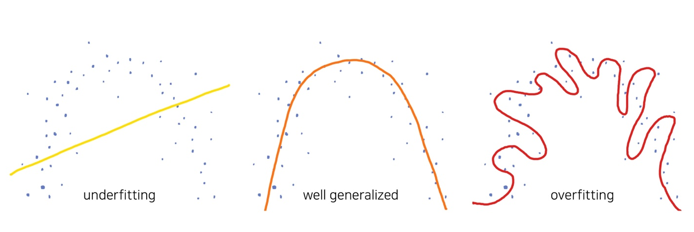
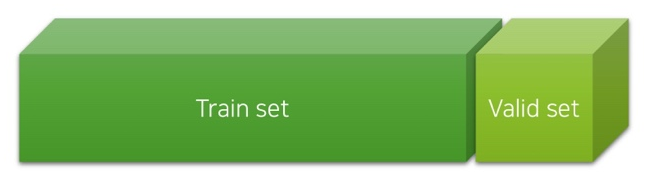
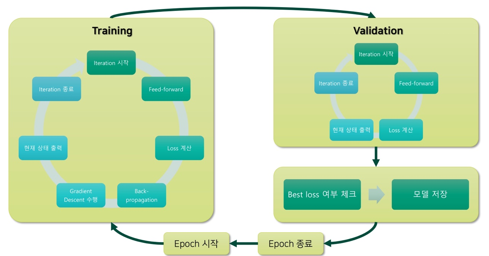
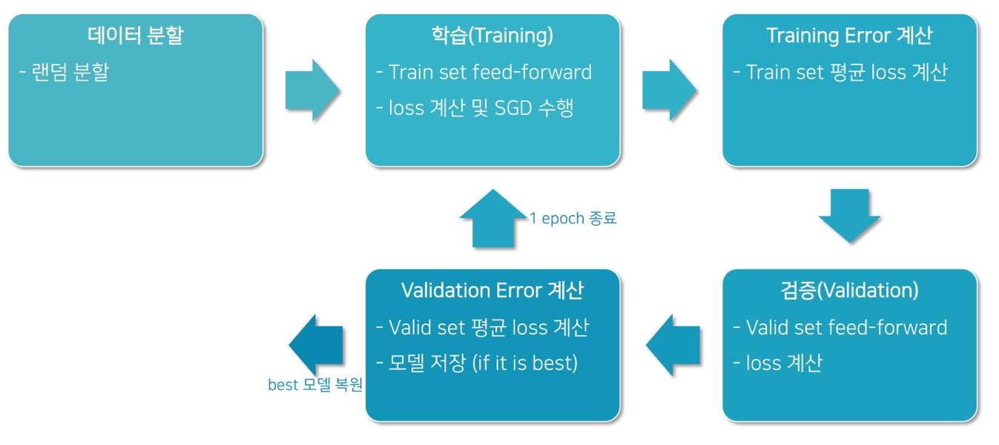
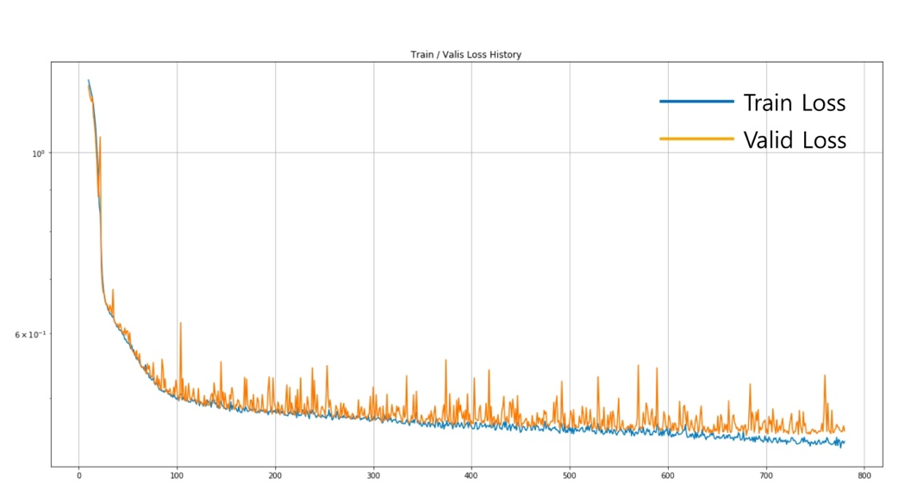
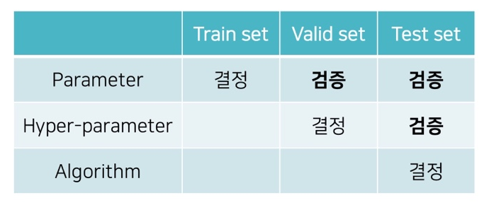
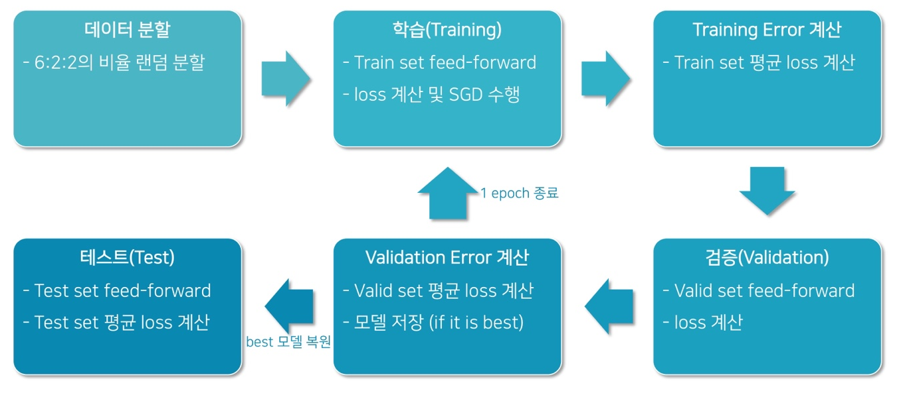

# Ch 11. 딥러닝 모델의 실험 과정

### Part.2 오버피팅이란?

#### What we did, so far?

* 학습 데이터의 loss 평균을 보고 모델의 학습 여부를 판단
  * Training Error: 학습 데이터의 loss

* 만약 학습 데이터에 편향(bias)이 있다면 어떻게 될까?
* 만약 학습 데이터에 noise이 있다면 어떻게 될까?
  * 학습 데이터를 완벽하게 학습한다면, bias + noise까지 학습하게 될 것
  * 학습 데이터는 bias + noise가 있을 가능성이 높음

* 우리의 목표는 **unseen data**에 대해 좋은 **prediction**을 하는것

#### -> Generalization

* 따라서 training error를 최소화 하는 것이 최종 목표가 아님

#### Overflitting이란?

* Training error가 **generalization error(최종목표)** 에 비해 현격히 낮아지는 현상
* 그럼 Underfitting 이란?
  * 모델의 capacity가 부족하여 **training error가 충분히 낮지 않은 현상**
* Overfitting 현상이 꼭 낮은 것은 아님
  * **모델의 capacity가 충분한지 확인**하는 한 방법 (물론 확인 후에는 overfitting을 없애야).

#### Overfitting / Underfitting

* Overfitting: 학습 데이터의 불필요한 bias, noise까지 모두 학습하는 현상

#### Validation Set

* Validation set을 활용하여 generalization error를 추측할 수 있음
  * 학습 데이터를 정해진 비율로 random split하여 train / valid set 구성

* 모델은 학습 데이터(training set) 에 대해서만 학습된 상태이므로,
  * Validation set에 대해서 좋은 예측을 한다면 generalization이 잘 된 것
  * Training error는 낮지만 validation error가 높다면, generalization을 잘하고 있지 않는 것

* 따라서 우리는 매 epoch가 끝나면 validation error를 측정하여, 모델의 generalization을 평가 (evaluation)함.

#### Our Objective

* 실재하는 알 수 없는 함수를 데이터를 통해 근사(approximate)하자.
* Validation Loss를 최소화 하는 파라미터를 찾자.

#### Typical Model Training Procedure

#### Training Procedure

#### Overfitting을 확인하는 방법

* 또는 수 많은 epoch 중에서 **best model**를 선택하는 방법
* **가장 낮은 validation loss**를 갖는 모델을 선택

#### Early Stopping

* Validation loss가 일정 기간 (patience) 동안 개선이 없을 때, 학습 종료

* 장점: 긴 학습기간을 효율적으로 단축 가능
* 단점: 하이퍼 파라미터 추가

#### Test Set

* Validation error를 최소화 하기 위해 hyper-parameter를 조절
  * Validation set에 overfitting될 가능성 (Train set만 설정하면 그렇게 된다.)
  * 또한, validation loss를 보고 모델을 선택하는것도 마찬가지.
* Test Set을 따로 두어, 최종적으로 모델의 성능을 평가

* 보통은 6:2:2의 비율로 train / validation / test set를 임의 분할
  * 가끔은 Test set이 고정되어 주어지기도 함

#### In order words

* Training set:
  * Parameter 학습을 위한 데이터
* Validation Set:
  * Parameter의 generalization 검증
  * Hyper-parameter 튜닝을 위한 데이터
* Test set:
  * Paraemeter의 generalization 검증
  * Hyper-parameter의 generalization 검증
  * 알고리즘 비교 및 결정

#### Training Procedure

