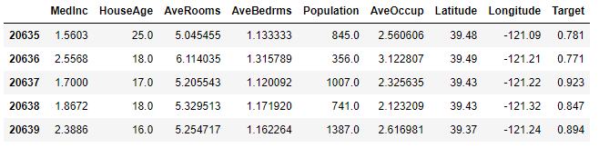
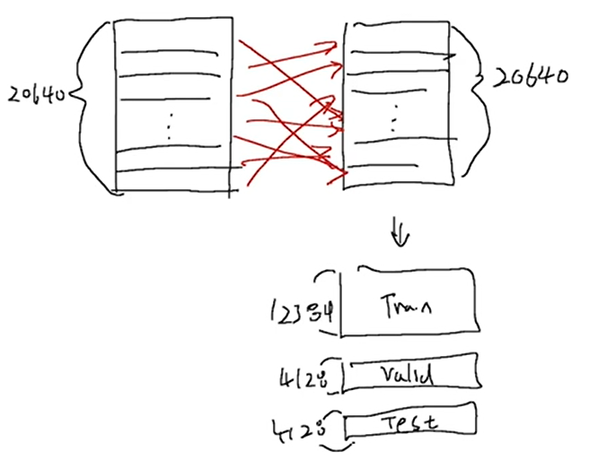
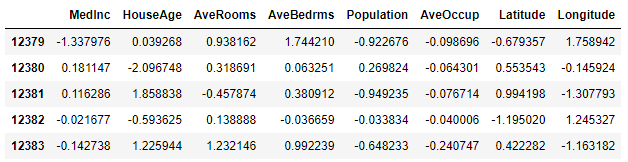
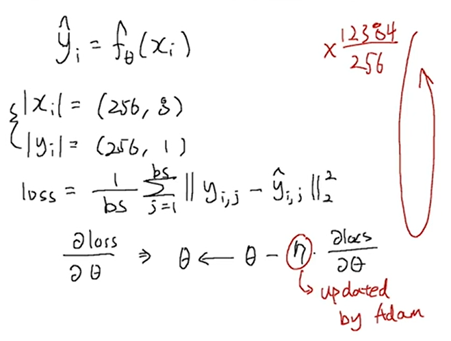
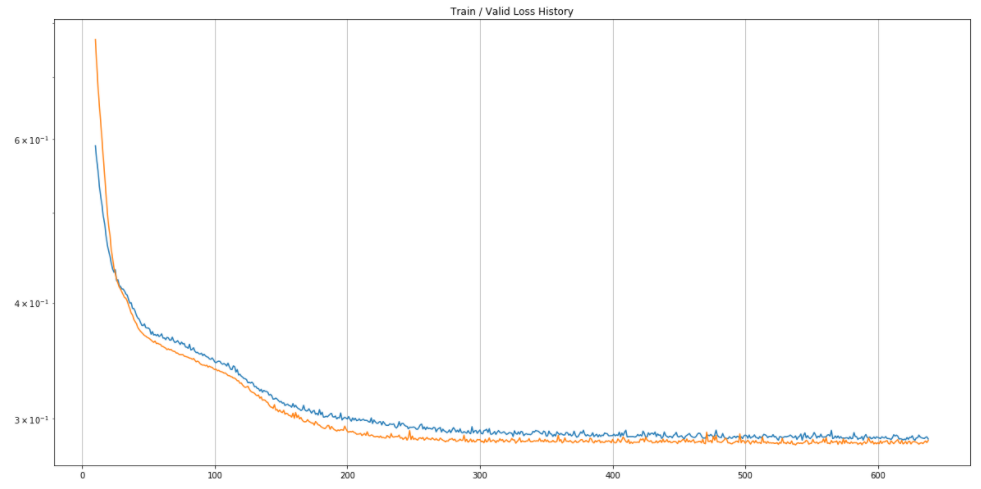
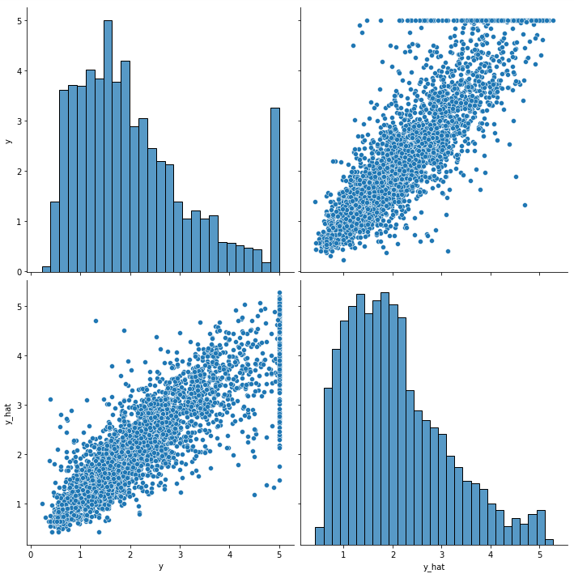

# Ch 11. 딥러닝 모델의 실험 과정

### Part.3 실습 실험 환경 구성하기

#### Split into Train / Valid / Test set

##### Load Dataset from sklearn

* In [1] :

```python
import numpy as np
import pandas as pd
import seaborn as sns
import matplotlib.pyplot as plt

from sklearn.preprocessing import StandardScaler
```


* In [2] :

```python
# 캘리포니아 주거 실태 데이터로 실습
from sklearn.datasets import fetch_california_housing
california = fetch_california_housing()
```


* In [3] :

```python
df = pd.DataFrame(california.data, columns=california.feature_names)
df["Target"] = california.target
df.tail()
```

* Out [3] :




#### Convert to PyTorch Tensor

* In [4] :

```python
import torch
import torch.nn as nn
import torch.nn.functional as F
import torch.optim as optim
```


* In [5] :

```
data = torch.from_numpy(df.values).float()

x = data[:, :-1]
y = data[:, -1:]
print(x.size(), y.size())
```

torch.Size([20640, 8]) torch.Size([20640, 1])


* In [6] :

```python
# Train / Valid / Test ratio (6:2:2의 비율로 임의분할)
ratios = [.6, .2, .2]
```


* In [7] :

```python
train_cnt = int(data.size(0) * ratios[0])
valid_cnt = int(data.size(0) * ratios[1])
test_cnt = data.size(0) - train_cnt - valid_cnt
cnts = [train_cnt, valid_cnt, test_cnt]

print("Train %d / Valid %d / Test %d samples." % (train_cnt, valid_cnt, test_cnt))
```

* 데이터 20640개를 random permtation하고 그 다음에 Index Selecting을 한다. 그 다음 List에 들어있는 Dataset으로 분류 해준다.



Train 12384 / Valid 4128 / Test 4128 samples.


* In [8] :

```python
# Shuffle before split.

indices = torch.randperm(data.size(0))
x = torch.index_select(x, dim=0, index=indices)
y = torch.index_select(y, dim=0, index=indices)

# Split train, valid and test set with each count.

x = list(x.split(cnts, dim=0))
y = y.split(cnts, dim=0)

for x_i, y_i in zip(x, y):
    print(x_i.size(), y_i.size())
```

```
torch.Size([12384, 8]) torch.Size([12384, 1])
torch.Size([4128, 8]) torch.Size([4128, 1])
torch.Size([4128, 8]) torch.Size([4128, 1])
```


#### Preprocessing

* In [9] :

```python
scaler = StandardScaler()
scaler.fit(x[0].numpy()) # fit: 데이터 각 칼럼의 분류화 (평균, 표준편차등..)
# You must fit with train data only
# (Test, Validation dataset에 fit을 먹이면 안된다. 만약 둘에 적용하면 잘못된 결과 얻을수도 있음)

x[0] = torch.from_numpy(scaler.transform(x[0].numpy())).float()
x[1] = torch.from_numpy(scaler.transform(x[1].numpy())).float()
x[2] = torch.from_numpy(scaler.transform(x[2].numpy())).float()

df = pd.DataFrame(x[0].numpy(), columns=california.feature_names)
df.tail()
```


* Out [9] :




#### Build Model & Optimizer

* In [10] : 

```python
model = nn.Sequential(
    nn.Linear(x[0].size(-1), 6),
    nn.LeakyReLU(),
    nn.Linear(6, 5),
    nn.LeakyReLU(),
    nn.Linear(5, 4),
    nn.LeakyReLU(),
    nn.Linear(4, 3),
    nn.LeakyReLU(),
    nn.Linear(3, y[0].size(-1)),
)

model
```


* Out [10] :

```
Sequential(
  (0): Linear(in_features=8, out_features=6, bias=True)
  (1): LeakyReLU(negative_slope=0.01)
  (2): Linear(in_features=6, out_features=5, bias=True)
  (3): LeakyReLU(negative_slope=0.01)
  (4): Linear(in_features=5, out_features=4, bias=True)
  (5): LeakyReLU(negative_slope=0.01)
  (6): Linear(in_features=4, out_features=3, bias=True)
  (7): LeakyReLU(negative_slope=0.01)
  (8): Linear(in_features=3, out_features=1, bias=True)
)
```


* In [11] :

```python
optimizer = optim.Adam(model.parameters())
```


#### Train

* In [12] :

```python
n_epochs = 4000
batch_size = 256
print_interval = 100
```


* In [13] :

```python
from copy import deepcopy

lowest_loss = np.inf
best_model = None

early_stop = 100
lowest_epoch = np.inf
```


* In [14] :

```python
train_history, valid_history = [], []

for i in range(n_epochs):
    # Shuffle before mini-batch split.
    indices = torch.randperm(x[0].size(0))
    x_ = torch.index_select(x[0], dim=0, index=indices)
    y_ = torch.index_select(y[0], dim=0, index=indices)
    # |x_| = (total_size, input_dim)
    # |y_| = (total_size, output_dim)
    

x_ = x_.split(batch_size, dim=0)
y_ = y_.split(batch_size, dim=0)

# |x_[i]| = (batch_size, input_dim)

# |y_[i]| = (batch_size, output_dim)

train_loss, valid_loss = 0, 0
y_hat = []

for x_i, y_i in zip(x_, y_):

    # |x_i| = |x_[i]|

    # |y_i| = |y_[i]|

​    y_hat_i = model(x_i)
​    loss = F.mse_loss(y_hat_i, y_i)

​    optimizer.zero_grad()
​    loss.backward()

​    optimizer.step()        
​    train_loss += float(loss)

train_loss = train_loss / len(x_)

# You need to declare to PYTORCH to stop build the computation graph.

with torch.no_grad():

    # You don't need to shuffle the validation set.

    # Only split is needed.

​    x_ = x[1].split(batch_size, dim=0)
​    y_ = y[1].split(batch_size, dim=0)
​    
​    valid_loss = 0
​    
​    for x_i, y_i in zip(x_, y_):
​        y_hat_i = model(x_i)
​        loss = F.mse_loss(y_hat_i, y_i)
​        
​        valid_loss += loss
​        
​        y_hat += [y_hat_i]
​        
valid_loss = valid_loss / len(x_)

# Log each loss to plot after training is done.

train_history += [train_loss]
valid_history += [valid_loss]
    
if (i + 1) % print_interval == 0:
    print('Epoch %d: train loss=%.4e  valid_loss=%.4e  lowest_loss=%.4e' % (
        i + 1,
        train_loss,
        valid_loss,
        lowest_loss,
    ))
    
if valid_loss <= lowest_loss:
    lowest_loss = valid_loss
    lowest_epoch = i
    

    # 'state_dict()' returns model weights as key-value.

    # Take a deep copy, if the valid loss is lowest ever.

​    best_model = deepcopy(model.state_dict())
else:
​    if early_stop > 0 and lowest_epoch + early_stop < i + 1:
​        print("There is no improvement during last %d epochs." % early_stop)
​        break

print("The best validation loss from epoch %d: %.4e" % (lowest_epoch + 1, lowest_loss))

# Load best epoch's model.

model.load_state_dict(best_model)
```

|xi| = |x_[i]| = (batch_size, input_dim)

|yi| = |y_[i]| = (batch_size, output_dim)

loss = loss = F.mse_loss(y_hat_i, y_i)




```
Epoch 100: train loss=3.4720e-01  valid_loss=3.3938e-01  lowest_loss=3.4056e-01
Epoch 200: train loss=3.0026e-01  valid_loss=2.9215e-01  lowest_loss=2.9067e-01
Epoch 300: train loss=2.9045e-01  valid_loss=2.8444e-01  lowest_loss=2.8279e-01
Epoch 400: train loss=2.8746e-01  valid_loss=2.8237e-01  lowest_loss=2.8207e-01
Epoch 500: train loss=2.8728e-01  valid_loss=2.8370e-01  lowest_loss=2.8160e-01
Epoch 600: train loss=2.8657e-01  valid_loss=2.8159e-01  lowest_loss=2.8090e-01
There is no improvement during last 100 epochs.
The best validation loss from epoch 539: 2.8090e-01
```

* Out [14] :

```
<All keys matched successfully>
```


#### Loss History

* In [15]:

```python
plot_from = 10

plt.figure(figsize=(20, 10))
plt.grid(True)
plt.title("Train / Valid Loss History")
plt.plot(
    range(plot_from, len(train_history)), train_history[plot_from:],
    range(plot_from, len(valid_history)), valid_history[plot_from:],
)
plt.yscale('log')
plt.show()
```





#### 결과값 보기

* In [16] : 

```
test_loss = 0
y_hat = []

with torch.no_grad():
    x_ = x[2].split(batch_size, dim=0)
    y_ = y[2].split(batch_size, dim=0)

    for x_i, y_i in zip(x_, y_):
        y_hat_i = model(x_i)
        loss = F.mse_loss(y_hat_i, y_i)
    
        test_loss += loss # Gradient is already detached.
    
        y_hat += [y_hat_i]

test_loss = test_loss / len(x_)
y_hat = torch.cat(y_hat, dim=0)

sorted_history = sorted(zip(train_history, valid_history),
                        key=lambda x: x[1])

print("Train loss: %.4e" % sorted_history[0][0])
print("Valid loss: %.4e" % sorted_history[0][1])
print("Test loss: %.4e" % test_loss)
```


```
Train loss: 2.8728e-01
Valid loss: 2.8090e-01
Test loss: 2.9679e-01
```


* In [17] : 

```python
df = pd.DataFrame(torch.cat([y[2], y_hat], dim=1).detach().numpy(),
                  columns=["y", "y_hat"])

sns.pairplot(df, height=5)
plt.show()
```




