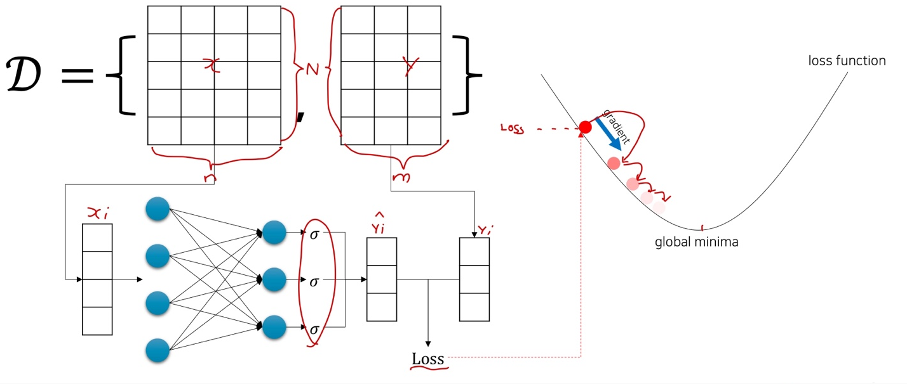
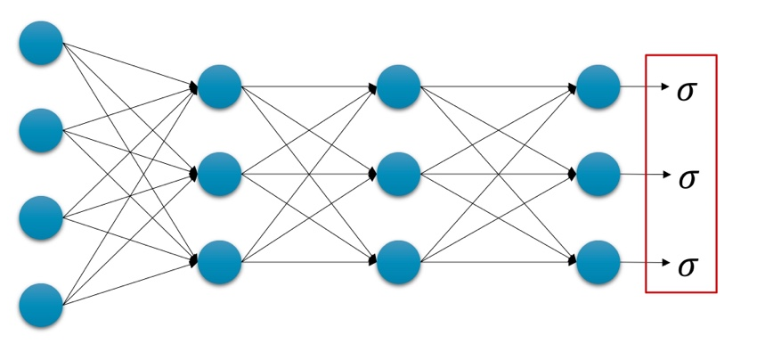
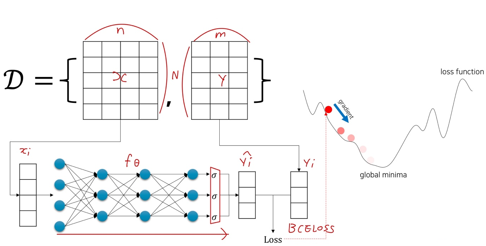
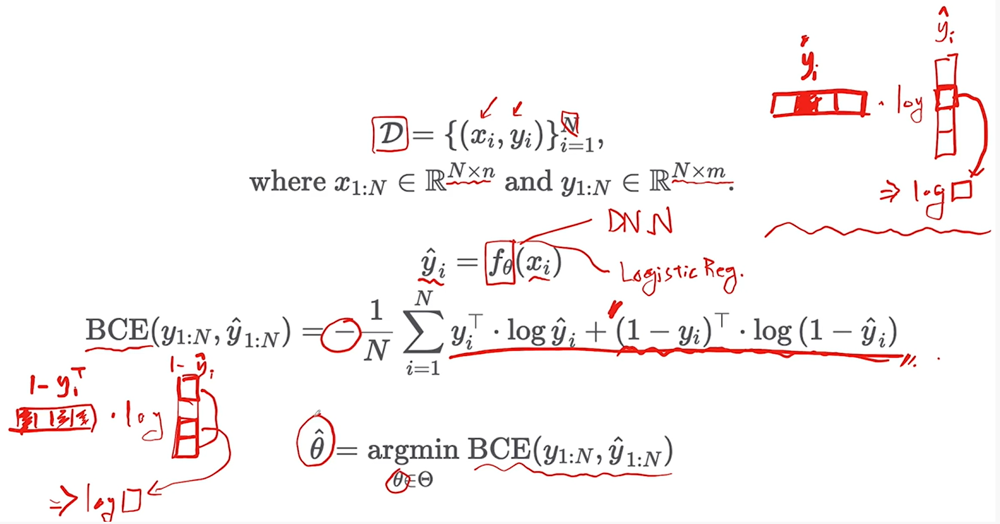

# Ch 12. 딥러닝 입문 (분류)

### Part.1 Deep Binary Classification

#### Review: Logistic Regression

* Input_size: n
* output_size: m

#### Architecture

* 레이어를 깊게 쌓은 이후에, 마지막 Linear Layer 이후, Sigmoid를 씌워줌

#### Binary Classification Overview

* 레이어가 깊어진 것 이외에는 Logistic Regression과 전부 똑같다. 
  * 앞서 코드 재활용 가능!

#### Review: Because we use Sigmoid.

* Sigmoid의 출력 값은 0에서 1
* 따라서 확률 값  으로 생각해볼 수 있음.

#### Binary Cross Entropy (BCE) Loss Function

* N개의 vector들이 주어졌을 때

 

#### Wrap-up

* Deep Regression과 마찬가지로, 모델을 DNN으로 교체 후, sigmoid를 마지막으로 넣어준다.
  * 여전히 gradient descent 방식으로 똑같이 최적화 가능

