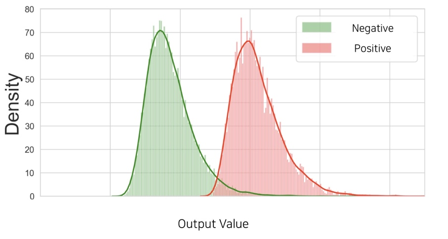
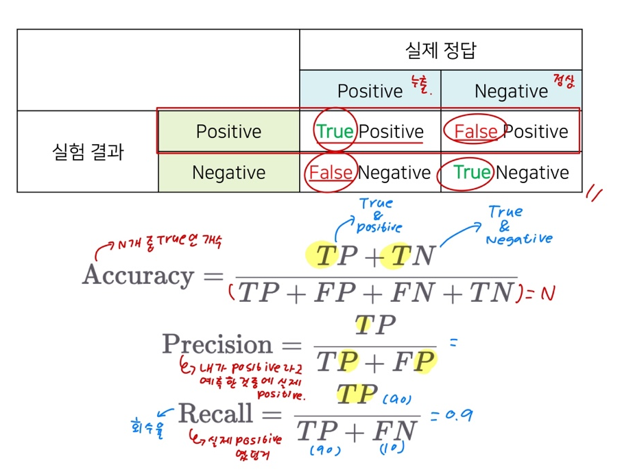
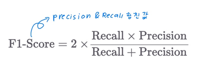
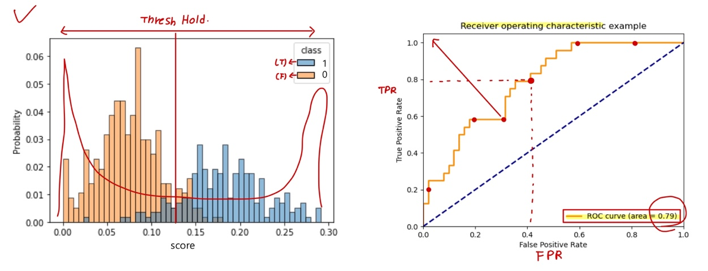

# Ch 12. 딥러닝 입문 (분류)

### Part.2 Evaluation Metrics

#### Tradeoff by Thresholding

* 0.5를 기준선으로 하지 않는 경우, Threshold에 따라서 성능의 성격이 달라진다.

  ( 0.5 이상은 True, 0.5 아래는 False )

  * 큰 Threshold를 가질 경우, 더 보수적으로 True라고 판단 할것
  * 작은 Threshold를 가질 경우, 실제 정답인 True인 case를 놓치지 않을 것

#### Thresholding, Case by Case

* 원자력 발전소의 누출 감지 프로그램 (False Alarm)이면, 어떤 지표가 중요할까?
  * True: 누출
  * False: 정상.
* 주식에 올인할 것이라면, 어떤 지표가 중요할까?
  * True: 상승 이벤트 발생
  * False: 하락 또는 변동 없음

#### Precision and Recall

* Accuracy: N개의 값중 True인 개수
* Precision: Positive라고 예측한것중에서 실제 Positive인 값
* Recall: 실제 Positive 였던 값.

#### F1 Score: Precision & Recall 을 합친 값

* 하지만 또 하나의 숫자가 필요하다.

#### AUROC

* 두 클래스의 분포간의 분리(separation) 정도를 나타낼 수 있는 metric

  * 같은 accuracy(정확도)라도 분리 정도에 따라 강인함(robustness)이 다를 수 있다.

  

#### Wrap-up

* Sigmoid를 사용하는 경우 0.5를 기준으로 삼지만, 이외의 경우도 있음.

* 이때, Threshold에 따라 binary classification의 성능이 봐꿜 수 있음.
  * Precision과 recall을 많이 고려
  * 문제의 정책(policy)에 따라 threshold를 정할 수 있음.
* AUROC들을 통해 classifier의 robustness를 평가할 수 있음.
