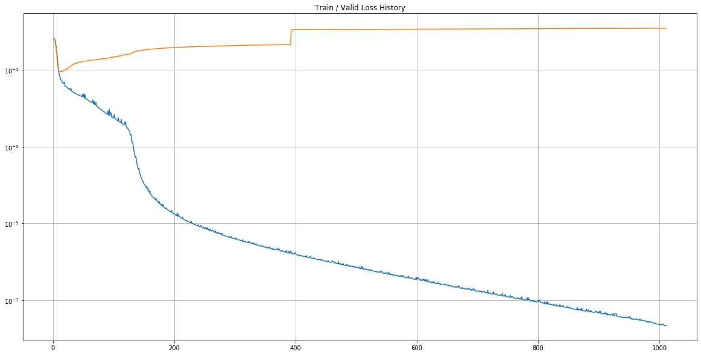
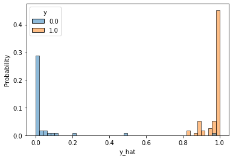

# Ch 12. 딥러닝 입문 (분류)

### Part.3 Binary Classification

##### Load Dataset from sklearn

* In [1] :

```python
import numpy as np
import pandas as pd
import seaborn as sns
import matplotlib.pyplot as plt

from sklearn.preprocessing import StandardScaler
```


* In [2] :

```python
from sklearn.datasets import load_breast_cancer
cancer = load_breast_cancer()

# 유방암 데이터 테이스
```


* In [3] :

```python
df = pd.DataFrame(cancer.data, columns=cancer.feature_names)
df['class'] = cancer.target

df.tail()
```

 

* Out [3] :

| mean radius | mean texture | mean perimeter | mean area | mean smoothness | mean compactness | mean concavity | mean concave points | mean symmetry | mean fractal dimension |     ... | worst texture | worst perimeter | worst area | worst smoothness | worst compactness | worst concavity | worst concave points | worst symmetry | worst fractal dimension |   class |      |
| ----------: | -----------: | -------------: | --------: | --------------: | ---------------: | -------------: | ------------------: | ------------: | ---------------------: | ------: | ------------: | --------------: | ---------: | ---------------: | ----------------: | --------------: | -------------------: | -------------: | ----------------------: | ------: | ---- |
|         564 |        21.56 |          22.39 |    142.00 |          1479.0 |          0.11100 |        0.11590 |             0.24390 |       0.13890 |                 0.1726 | 0.05623 |           ... |           26.40 |     166.10 |           2027.0 |           0.14100 |         0.21130 |               0.4107 |         0.2216 |                  0.2060 | 0.07115 | 0    |
|         565 |        20.13 |          28.25 |    131.20 |          1261.0 |          0.09780 |        0.10340 |             0.14400 |       0.09791 |                 0.1752 | 0.05533 |           ... |           38.25 |     155.00 |           1731.0 |           0.11660 |         0.19220 |               0.3215 |         0.1628 |                  0.2572 | 0.06637 | 0    |
|         566 |        16.60 |          28.08 |    108.30 |           858.1 |          0.08455 |        0.10230 |             0.09251 |       0.05302 |                 0.1590 | 0.05648 |           ... |           34.12 |     126.70 |           1124.0 |           0.11390 |         0.30940 |               0.3403 |         0.1418 |                  0.2218 | 0.07820 | 0    |
|         567 |        20.60 |          29.33 |    140.10 |          1265.0 |          0.11780 |        0.27700 |             0.35140 |       0.15200 |                 0.2397 | 0.07016 |           ... |           39.42 |     184.60 |           1821.0 |           0.16500 |         0.86810 |               0.9387 |         0.2650 |                  0.4087 | 0.12400 | 0    |
|         568 |         7.76 |          24.54 |     47.92 |           181.0 |          0.05263 |        0.04362 |             0.00000 |       0.00000 |                 0.1587 | 0.05884 |           ... |           30.37 |      59.16 |            268.6 |           0.08996 |         0.06444 |               0.0000 |         0.0000 |                  0.2871 | 0.07039 | 1    |

5 rows × 31 columns


* In [4] :

```python
df.describe()
```


* Out [4] :

| mean radius | mean texture | mean perimeter |  mean area | mean smoothness | mean compactness | mean concavity | mean concave points | mean symmetry | mean fractal dimension |        ... | worst texture | worst perimeter | worst area | worst smoothness | worst compactness | worst concavity | worst concave points | worst symmetry | worst fractal dimension |      class |            |
| ----------: | -----------: | -------------: | ---------: | --------------: | ---------------: | -------------: | ------------------: | ------------: | ---------------------: | ---------: | ------------: | --------------: | ---------: | ---------------: | ----------------: | --------------: | -------------------: | -------------: | ----------------------: | ---------: | ---------- |
|       count |   569.000000 |     569.000000 | 569.000000 |      569.000000 |       569.000000 |     569.000000 |          569.000000 |    569.000000 |             569.000000 | 569.000000 |           ... |      569.000000 | 569.000000 |       569.000000 |        569.000000 |      569.000000 |           569.000000 |     569.000000 |              569.000000 | 569.000000 | 569.000000 |
|        mean |    14.127292 |      19.289649 |  91.969033 |      654.889104 |         0.096360 |       0.104341 |            0.088799 |      0.048919 |               0.181162 |   0.062798 |           ... |       25.677223 | 107.261213 |       880.583128 |          0.132369 |        0.254265 |             0.272188 |       0.114606 |                0.290076 |   0.083946 | 0.627417   |
|         std |     3.524049 |       4.301036 |  24.298981 |      351.914129 |         0.014064 |       0.052813 |            0.079720 |      0.038803 |               0.027414 |   0.007060 |           ... |        6.146258 |  33.602542 |       569.356993 |          0.022832 |        0.157336 |             0.208624 |       0.065732 |                0.061867 |   0.018061 | 0.483918   |
|         min |     6.981000 |       9.710000 |  43.790000 |      143.500000 |         0.052630 |       0.019380 |            0.000000 |      0.000000 |               0.106000 |   0.049960 |           ... |       12.020000 |  50.410000 |       185.200000 |          0.071170 |        0.027290 |             0.000000 |       0.000000 |                0.156500 |   0.055040 | 0.000000   |
|         25% |    11.700000 |      16.170000 |  75.170000 |      420.300000 |         0.086370 |       0.064920 |            0.029560 |      0.020310 |               0.161900 |   0.057700 |           ... |       21.080000 |  84.110000 |       515.300000 |          0.116600 |        0.147200 |             0.114500 |       0.064930 |                0.250400 |   0.071460 | 0.000000   |
|         50% |    13.370000 |      18.840000 |  86.240000 |      551.100000 |         0.095870 |       0.092630 |            0.061540 |      0.033500 |               0.179200 |   0.061540 |           ... |       25.410000 |  97.660000 |       686.500000 |          0.131300 |        0.211900 |             0.226700 |       0.099930 |                0.282200 |   0.080040 | 1.000000   |
|         75% |    15.780000 |      21.800000 | 104.100000 |      782.700000 |         0.105300 |       0.130400 |            0.130700 |      0.074000 |               0.195700 |   0.066120 |           ... |       29.720000 | 125.400000 |      1084.000000 |          0.146000 |        0.339100 |             0.382900 |       0.161400 |                0.317900 |   0.092080 | 1.000000   |
|         max |    28.110000 |      39.280000 | 188.500000 |     2501.000000 |         0.163400 |       0.345400 |            0.426800 |      0.201200 |               0.304000 |   0.097440 |           ... |       49.540000 | 251.200000 |      4254.000000 |          0.222600 |        1.058000 |             1.252000 |       0.291000 |                0.663800 |   0.207500 | 1.000000   |


#### Convert to PyTorch Tensor

* In [5] :

```python
import torch
import torch.nn as nn
import torch.nn.functional as F
import torch.optim as optim
```


* In [6] :

```python
data = torch.from_numpy(df.values).float()

data.shape
```


* Out [6] :

torch.Size([569, 31])


* In [7] :

```
x = data[:, :-1]
y = data[:, -1:]

print(x.shape, y.shape)
```

torch.Size([569, 30]) torch.Size([569, 1])


* In [8] :

```python
Train / Valid / Test ratio

ratios = [.6, .2, .2]
```


* In [9] :

```python
train_cnt = int(data.size(0) * ratios[0])
valid_cnt = int(data.size(0) * ratios[1])
test_cnt = data.size(0) - train_cnt - valid_cnt
cnts = [train_cnt, valid_cnt, test_cnt]

print("Train %d / Valid %d / Test %d samples." % (train_cnt, valid_cnt, test_cnt))
```


```
Train 341 / Valid 113 / Test 115 samples.
```


* In [10] :

```python
indices = torch.randperm(data.size(0))

x = torch.index_select(x, dim=0, index=indices)
y = torch.index_select(y, dim=0, index=indices)

x = x.split(cnts, dim=0)
y = y.split(cnts, dim=0)

for x_i, y_i in zip(x, y):
    print(x_i.size(), y_i.size())
```


```
torch.Size([341, 30]) torch.Size([341, 1])
torch.Size([113, 30]) torch.Size([113, 1])
torch.Size([115, 30]) torch.Size([115, 1])
```


#### Preprocessing

* In [11] :

```python
scaler = StandardScaler()
scaler.fit(x[0].numpy())

x =
[torch.from_numpy(scaler.transform(x[0].numpy())).float(),    torch.from_numpy(scaler.transform(x[1].numpy())).float(),
torch.from_numpy(scaler.transform(x[2].numpy())).float()]

df = pd.DataFrame(x[0].numpy(), columns=cancer.feature_names)
df.tail()
```


* Out [11] :

| mean radius | mean texture | mean perimeter | mean area | mean smoothness | mean compactness | mean concavity | mean concave points | mean symmetry | mean fractal dimension |       ... | worst radius | worst texture | worst perimeter | worst area | worst smoothness | worst compactness | worst concavity | worst concave points | worst symmetry | worst fractal dimension |           |
| ----------: | -----------: | -------------: | --------: | --------------: | ---------------: | -------------: | ------------------: | ------------: | ---------------------: | --------: | -----------: | ------------: | --------------: | ---------: | ---------------: | ----------------: | --------------: | -------------------: | -------------: | ----------------------: | --------- |
|         336 |     2.109400 |      -0.982811 |  2.074373 |        2.141978 |         0.185909 |       0.834008 |            1.251482 |      1.990152 |               0.556192 | -0.173216 |          ... |      1.375889 |       -0.629586 |   1.369703 |         1.215443 |         -0.684062 |        0.122503 |             0.548355 |       1.215406 |               -0.293150 | 0.080699  |
|         337 |     0.301591 |      -0.605077 |  0.296273 |        0.197547 |        -0.622822 |      -0.197263 |           -0.192340 |     -0.226158 |              -0.799453 | -0.451247 |          ... |      0.330800 |       -0.888033 |   0.324745 |         0.218299 |          0.660655 |        0.418800 |             0.228829 |       0.124483 |                0.779932 | 0.641780  |
|         338 |    -1.547870 |      -0.808289 | -1.499389 |       -1.213282 |         1.248526 |      -0.454432 |           -0.611624 |     -0.789981 |              -0.602723 |  1.873202 |          ... |     -1.398695 |       -0.988181 |  -1.291901 |        -1.070585 |          1.708544 |       -0.164742 |            -0.170464 |      -0.184153 |                0.013892 | 0.866421  |
|         339 |    -1.253992 |      -0.846540 | -1.262700 |       -1.041903 |        -0.508002 |      -1.105605 |           -0.983191 |     -0.925247 |               0.942498 |  0.008845 |          ... |     -1.160364 |       -0.784654 |  -1.182241 |        -0.941166 |          0.552717 |       -1.025874 |            -1.111026 |      -1.000206 |               -0.119264 | -0.175809 |
|         340 |    -0.265338 |       0.317742 | -0.319287 |       -0.319205 |        -1.721811 |      -0.996952 |           -0.897690 |     -0.964754 |              -0.373802 | -0.589556 |          ... |     -0.363802 |        0.439739 |  -0.355996 |        -0.405396 |         -1.016868 |       -0.598023 |            -0.943469 |      -1.147496 |               -0.360512 | -0.565535 |

5 rows × 30 columns


#### Build Model & Optimizer

* In [12] :

```python
# 입력 벡터 사이즈가 30차원

model = nn.Sequential(
    nn.Linear(x[0].size(-1), 25), # 30~25차원
    nn.LeakyReLU(),
    nn.Linear(25, 20), # 25~20차원
    nn.LeakyReLU(),
    nn.Linear(20, 15), # 20~15차원
    nn.LeakyReLU(),
    nn.Linear(15, 10), # 15~10차원
    nn.LeakyReLU(),
    nn.Linear(10, 5), # 10~5차원
    nn.LeakyReLU(),
    nn.Linear(5, y[0].size(-1)),
    nn.Sigmoid(),
)

model
```


* Out [12] : 

```
Sequential(
  (0): Linear(in_features=30, out_features=25, bias=True)
  (1): LeakyReLU(negative_slope=0.01)
  (2): Linear(in_features=25, out_features=20, bias=True)
  (3): LeakyReLU(negative_slope=0.01)
  (4): Linear(in_features=20, out_features=15, bias=True)
  (5): LeakyReLU(negative_slope=0.01)
  (6): Linear(in_features=15, out_features=10, bias=True)
  (7): LeakyReLU(negative_slope=0.01)
  (8): Linear(in_features=10, out_features=5, bias=True)
  (9): LeakyReLU(negative_slope=0.01)
  (10): Linear(in_features=5, out_features=1, bias=True)
  (11): Sigmoid()
)
```


* In [13] :

```python
optimizer = optim.Adam(model.parameters())
```


#### Train

* In [14] :

```python
n_epochs = 10000
batch_size = 32
print_interval = 100
early_stop = 1000
```


* In [15] :

```python
from copy import deepcopy

lowest_loss = np.inf
best_model = None

lowest_epoch = np.inf
```


* In [16] :

```python
train_history, valid_history = [], []

for i in range(n_epochs):
    indices = torch.randperm(x[0].size(0))
    x_ = torch.index_select(x[0], dim=0, index=indices) 
    y_ = torch.index_select(y[0], dim=0, index=indices)
    

    x_ = x_.split(batch_size, dim=0) # |xi| = (32,30)
    y_ = y_.split(batch_size, dim=0) # |yi| = (32,1)
    
    train_loss, valid_loss = 0, 0
    y_hat = []
    
    for x_i, y_i in zip(x_, y_):
        y_hat_i = model(x_i)
        loss = F.binary_cross_entropy(y_hat_i, y_i)
    
        optimizer.zero_grad()
        loss.backward()
    
        optimizer.step()        
        train_loss += float(loss) # This is very important to prevent memory leak.
    
    train_loss = train_loss / len(x_)
        
    with torch.no_grad():
        x_ = x[1].split(batch_size, dim=0)
        y_ = y[1].split(batch_size, dim=0)
        
        valid_loss = 0
        
        for x_i, y_i in zip(x_, y_):
            y_hat_i = model(x_i)
            loss = F.binary_cross_entropy(y_hat_i, y_i)
            
            valid_loss += float(loss)
            
            y_hat += [y_hat_i]
            
    valid_loss = valid_loss / len(x_)
    
    train_history += [train_loss]
    valid_history += [valid_loss]
        
    if (i + 1) % print_interval == 0:
        print('Epoch %d: train loss=%.4e  valid_loss=%.4e  lowest_loss=%.4e' % (
            i + 1,
            train_loss,
            valid_loss,
            lowest_loss,
        ))
        
    if valid_loss <= lowest_loss:
        lowest_loss = valid_loss
        lowest_epoch = i
        
        best_model = deepcopy(model.state_dict())
    else:
        if early_stop > 0 and lowest_epoch + early_stop < i + 1:
            print("There is no improvement during last %d epochs." % early_stop)
            break

print("The best validation loss from epoch %d: %.4e" % (lowest_epoch + 1, lowest_loss))
model.load_state_dict(best_model)
```


```
Epoch 100: train loss=5.6986e-03  valid_loss=2.1232e-01  lowest_loss=8.8456e-02
Epoch 200: train loss=1.7982e-05  valid_loss=3.7934e-01  lowest_loss=8.8456e-02
Epoch 300: train loss=4.0965e-06  valid_loss=4.2597e-01  lowest_loss=8.8456e-02
Epoch 400: train loss=1.6596e-06  valid_loss=1.1125e+00  lowest_loss=8.8456e-02
Epoch 500: train loss=7.0210e-07  valid_loss=1.1312e+00  lowest_loss=8.8456e-02
Epoch 600: train loss=3.9337e-07  valid_loss=1.1483e+00  lowest_loss=8.8456e-02
Epoch 700: train loss=1.7483e-07  valid_loss=1.1647e+00  lowest_loss=8.8456e-02
Epoch 800: train loss=9.1729e-08  valid_loss=1.1804e+00  lowest_loss=8.8456e-02
Epoch 900: train loss=4.5905e-08  valid_loss=1.1962e+00  lowest_loss=8.8456e-02
Epoch 1000: train loss=2.3287e-08  valid_loss=1.2109e+00  lowest_loss=8.8456e-02
There is no improvement during last 1000 epochs.
The best validation loss from epoch 12: 8.8456e-02
```


* Out [16] :

```
<All keys matched successfully>
```


#### Loss History

* In [17] :

```python
plot_from = 2

plt.figure(figsize=(20, 10))
plt.grid(True)
plt.title("Train / Valid Loss History")
plt.plot(
    range(plot_from, len(train_history)), train_history[plot_from:],
    range(plot_from, len(valid_history)), valid_history[plot_from:],
)
plt.yscale('log')
plt.show()
```





#### 결과값 도출

* In [18] :

```python
test_loss = 0
y_hat = []

with torch.no_grad():
    x_ = x[2].split(batch_size, dim=0)
    y_ = y[2].split(batch_size, dim=0)

    for x_i, y_i in zip(x_, y_):
        y_hat_i = model(x_i)
        loss = F.binary_cross_entropy(y_hat_i, y_i)
    
        test_loss += loss # Gradient is already detached.
    
        y_hat += [y_hat_i]

test_loss = test_loss / len(x_)
y_hat = torch.cat(y_hat, dim=0)

print("Test loss: %.4e" % test_loss)
```


```
Test loss: 7.3890e-02
```


* In [19] :

```python
correct_cnt = (y[2] == (y_hat > .5)).sum()
total_cnt = float(y[2].size(0))

print('Test Accuracy: %.4f' % (correct_cnt / total_cnt))
```


```
Test Accuracy: 0.9913
```


* In [20] :

```python
df = pd.DataFrame(torch.cat([y[2], y_hat], dim=1).detach().numpy(),
                  columns=["y", "y_hat"])

sns.histplot(df, x='y_hat', hue='y', bins=50, stat='probability')
plt.show()
```





* In [21] : 

```python
from sklearn.metrics import roc_auc_score

roc_auc_score(df.values[:, 0], df.values[:, 1])
```


* Out [21] :

0.9951550387596899
