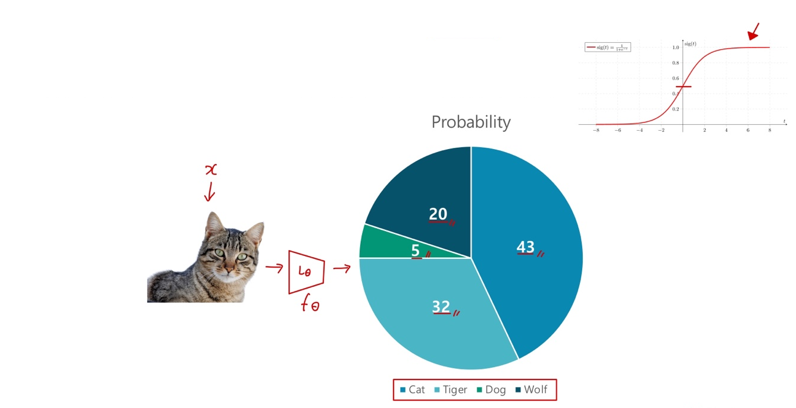
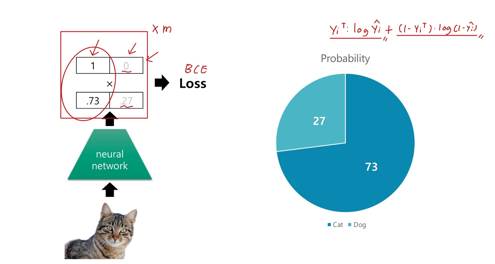
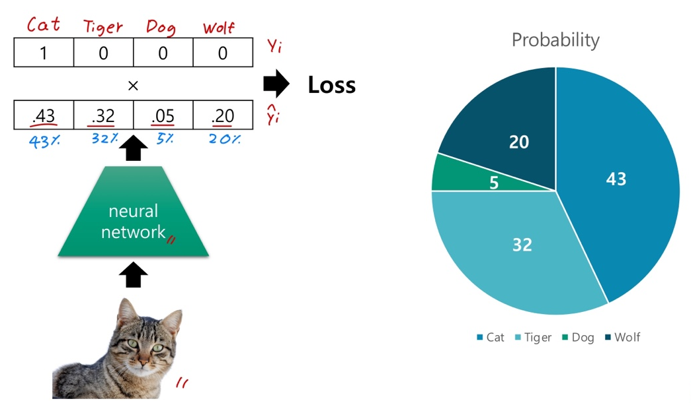
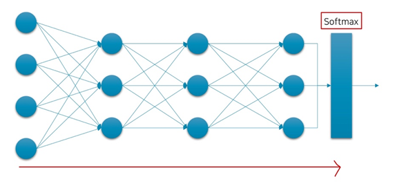

# Ch 12. 딥러닝 입문 (분류)

### Part.4 Classification

#### Regression vs Classification

##### Regression

* Target

  * real-value vector.
  * e.g. monthly income

  

##### Classification

* Target
  * Categorical value from finite set.
  * e.g. Word, Class, Symbol

#### In binary Classification

* Sigmoid의 출력 값은 0에서 1이므로, 확률  값 으로 생각해볼 수 있음.
* 마찬가지로, Classification 또한 확률 문제로 치활할 수 있음.

#### In Binary Classification

* 신경망은 **True 클래스의 확률값**을 뱉어낸다.

#### If we extend this,

* 신경망은 각 클래스 별 확률 값을 뱉어낸다.
  * 클래스 별 확률 값들을 전부 더하면 1.

#### Architecture

* 레이어를 깊게 쌓은 이후에, 마지막 Linear Layer 이후, Softmax 함수를 통과. (Sigmoid X)

#### So far, we talked about

##### Regression

* Target
  * real-value vector.
  * ex. monthly income
* MSE Loss
* Linear layer in the last
  * It returns real-value vector.

##### Classification

* Target
  * Categorical value from finite set.
  * ex. Word, Class, Symbol
* BCE or Cross Entropy Loss
* Sigmoid or Softmas in the last.
  * it returns probability for each class.
