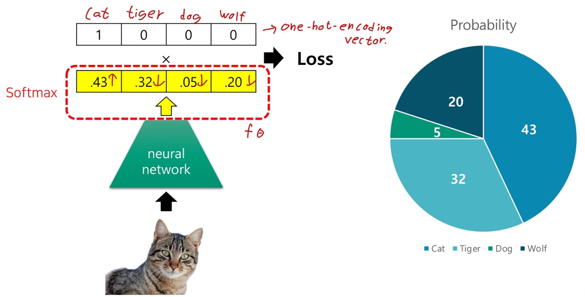
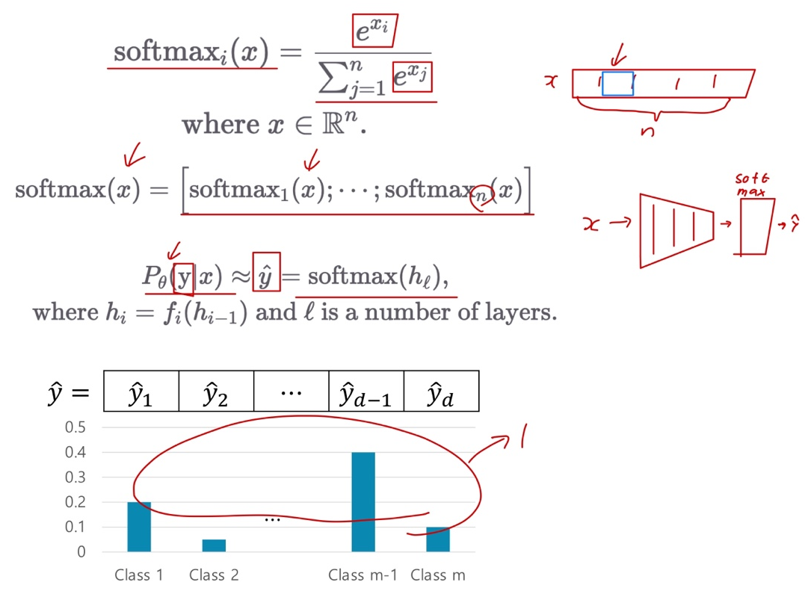
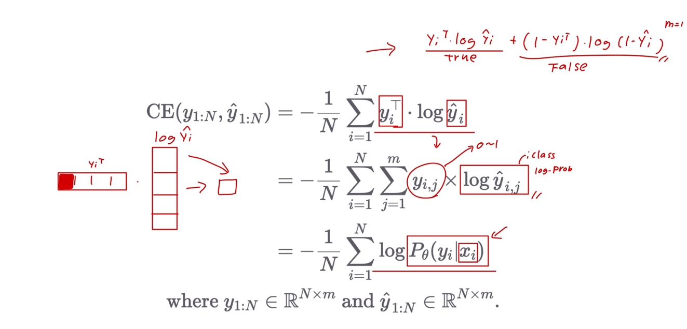
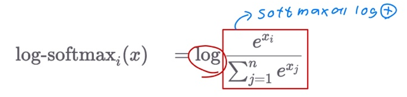
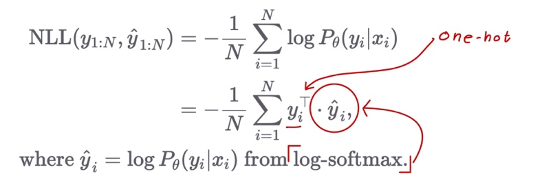
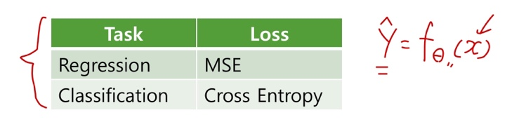
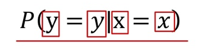

# Ch 12. 딥러닝 입문 (분류)

### Part.5 Softmax & Cross Entropy

#### Softmax

* 입력 벡터를 discrete(이산) 확률 분포 형태로 봐꿔주는 함수
  * 확률 분포이므로 각 클래스 별 확률 값들의 합은 1이 됨.

#### Cross Entropy Loss

* Binary Cross Entropy의 일반화 version

#### NLL Loss with Log-Softmax

* Log-Softmax

* Negative Log Likeihood (NLL Loss)

#### Summary

* Regression task의 MSE loss와 마찬가지로, Classification task에서 Cross Entropy loss를 최소화 하면 분류 문제를 위한 모델을 학습할 수 있다.

* 이를 위해서 신경망은 softmax 함수를 통해 각 클래스 별 확률 값을 반환한다.

 

* 우리는 학습이 완료된 신경망을 통해, 입력 x가 주어졌을때, 가장 큰 확률 값을 갖는 의 index를 알 수 있고, x의 클래스 c를 추측할 수 있다.
