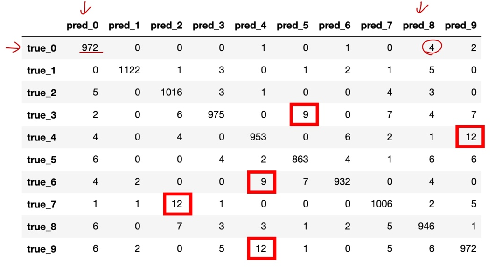

# Ch 12. 딥러닝 입문 (분류)

### Part.6 Confusion Matrix

#### Accuracy is not Enough in Multi-class Classification

* 정확도(accuracy)를 통해 모델의 성능을 순서대로 나타낼 수 있음

* 하지만 하나의 숫자로 나타낸 만큼 내부의 자세한 성능은 알 수 없다.
  * 만약 test-set의 class 분포가 불균등(imbalance) 하다면?
  * 성능을 개선(ex. 제품화 & 배포)할 때, 부족한 부분을 쉽게 파악할 수 없다. 

* 그러면 각 class별 성능을 파악할 수 있을까?

#### Confusion Matrix in MNIST Classification

* 어떤 class 사이의 추론 성능이 떨어지는지 쉽게 확인 & 대처 가능

