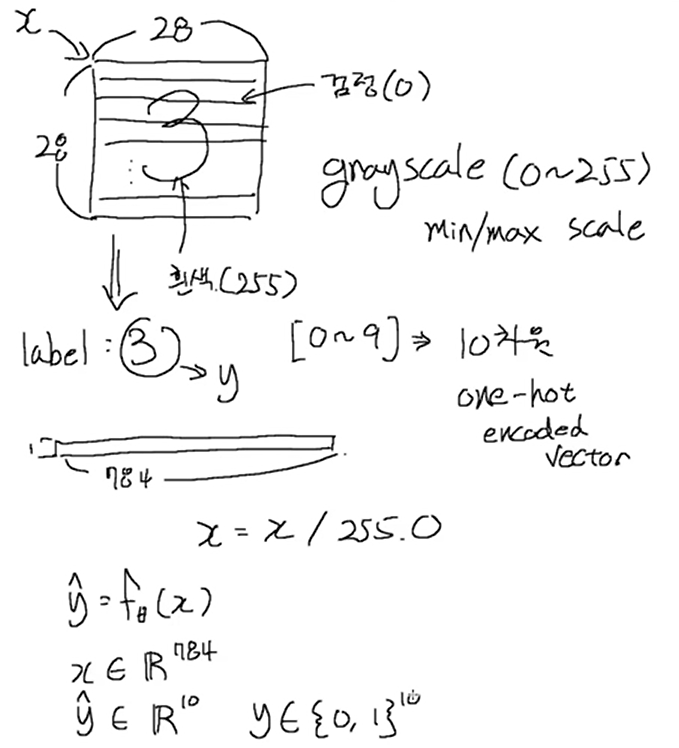
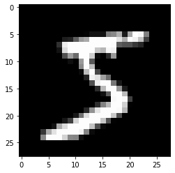
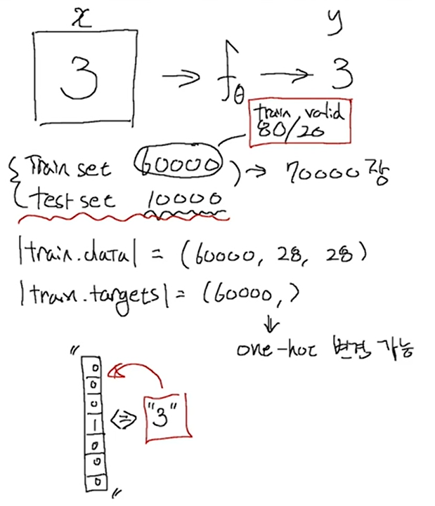
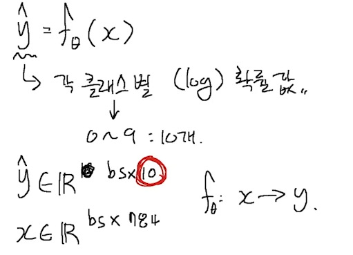
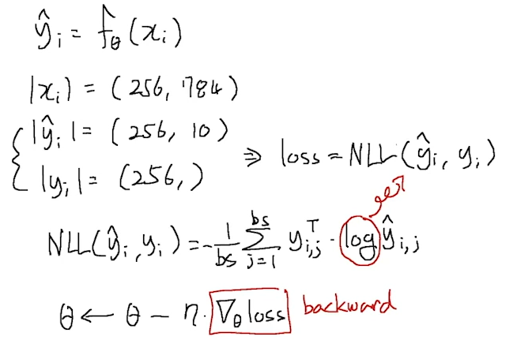
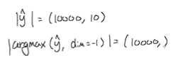

# Ch 12. 딥러닝 입문 (분류)

### Part.7 Deep Classification 실습

#### Classification with Deep Neural Networks

##### Load MNIST Dataset: 손글씨 글자 Classification

* In [1] :

```python
import numpy as np
import matplotlib.pyplot as plt

import torch
import torch.nn as nn
import torch.nn.functional as F
import torch.optim as optim
```


* In [2] :

```python
from torchvision import datasets, transforms
```


* In [3] :
  * 여기서 만약 MNIST dataset가 없으면 자동으로 다운로드 하고, MNIST dataset가있으면 그냥 있는거 쓴다.

```python
train = datasets.MNIST(
    '../data', train=True, download=True, # MNIST 없을때 자동으로 DOWNLOAD
    transform=transforms.Compose([
        transforms.ToTensor(),
    ]),
)
test = datasets.MNIST(
    '../data', train=False, # 있을경우엔 있는거 쓴다
    transform=transforms.Compose([
        transforms.ToTensor(),
    ]),
)
```


* In [4] :

```python
def plot(x):
    img = (np.array(x.detach().cpu(), dtype='float')).reshape(28,28)

plt.imshow(img, cmap='gray')
plt.show()
```


* In [5] :





* 글자는 gray scale(0~255)로 되어있다. 28x28 (size)
* 글씨를 보고 어떤 글씨인지 맞춰야 한다. 5 -> y

* 이미지를 벡터화 (784차원의 vector)
* y[0~9]: 10차원 one-hot encoded vector

```python
plot(train.data[0])
```





* In [6] :

```python
x = train.data.float() / 255.
y = train.targets

x = x.view(x.size(0), -1)
print(x.shape, y.shape)

input_size = x.size(-1)
output_size = int(max(y)) + 1

print('input_size: %d, output_size: %d' % (input_size, output_size))
```


```
torch.Size([60000, 784]) torch.Size([60000])
input_size: 784, output_size: 10
```


* In [7] :





```python
# Train / Valid ratio

ratios = [.8, .2]

train_cnt = int(x.size(0) * ratios[0])
valid_cnt = int(x.size(0) * ratios[1])
test_cnt = len(test.data)
cnts = [train_cnt, valid_cnt]

print("Train %d / Valid %d / Test %d samples." % (train_cnt, valid_cnt, test_cnt))

indices = torch.randperm(x.size(0))

x = torch.index_select(x, dim=0, index=indices)
y = torch.index_select(y, dim=0, index=indices)

x = list(x.split(cnts, dim=0))
y = list(y.split(cnts, dim=0))

x += [(test.data.float() / 255.).view(test_cnt, -1)]
y += [test.targets]

for x_i, y_i in zip(x, y):
    print(x_i.size(), y_i.size()) 
#여기서 Y는 INDEX의 벡터가 아니라 Long Tensor 이다.
```


```
Train 48000 / Valid 12000 / Test 10000 samples.
torch.Size([48000, 784]) torch.Size([48000])
torch.Size([12000, 784]) torch.Size([12000])
torch.Size([10000, 784]) torch.Size([10000])
```


#### Build Model & Optimizer

* In [8] :

```python
model = nn.Sequential(
    nn.Linear(input_size, 500),
    nn.LeakyReLU(),
    nn.Linear(500, 400),
    nn.LeakyReLU(),
    nn.Linear(400, 300),
    nn.LeakyReLU(),
    nn.Linear(300, 200),
    nn.LeakyReLU(),
    nn.Linear(200, 100),
    nn.LeakyReLU(),
    nn.Linear(100, 50),
    nn.LeakyReLU(),
    nn.Linear(50, output_size),
    nn.LogSoftmax(dim=-1),
)

model
```


* Out [8] :




```
Sequential(
  (0): Linear(in_features=784, out_features=500, bias=True)
  (1): LeakyReLU(negative_slope=0.01)
  (2): Linear(in_features=500, out_features=400, bias=True)
  (3): LeakyReLU(negative_slope=0.01)
  (4): Linear(in_features=400, out_features=300, bias=True)
  (5): LeakyReLU(negative_slope=0.01)
  (6): Linear(in_features=300, out_features=200, bias=True)
  (7): LeakyReLU(negative_slope=0.01)
  (8): Linear(in_features=200, out_features=100, bias=True)
  (9): LeakyReLU(negative_slope=0.01)
  (10): Linear(in_features=100, out_features=50, bias=True)
  (11): LeakyReLU(negative_slope=0.01)
  (12): Linear(in_features=50, out_features=10, bias=True)
  (13): LogSoftmax(dim=-1)
)
```


* In [9] :

```python
crit = nn.NLLLoss()
```


* In [10] :

```python
optimizer = optim.Adam(model.parameters())
```


#### Move to GPU if it is available

* In [11] :

```python
device = torch.device('cpu')
if torch.cuda.is_available():
    device = torch.device('cuda')
```


* In [12] :

```python
model = model.to(device)

x = [x_i.to(device) for x_i in x]
y = [y_i.to(device) for y_i in y]
```


#### Train

* In [13] :

```python
n_epochs = 1000
batch_size = 256
print_interval = 10
```


* In [14] :

```python
from copy import deepcopy

lowest_loss = np.inf
best_model = None

early_stop = 50
lowest_epoch = np.inf
```


* In [15] :




```python
rain_history, valid_history = [], []

for i in range(n_epochs):
    indices = torch.randperm(x[0].size(0)).to(device)
    x_ = torch.index_select(x[0], dim=0, index=indices)
    y_ = torch.index_select(y[0], dim=0, index=indices)
    

    x_ = x_.split(batch_size, dim=0)
    y_ = y_.split(batch_size, dim=0)
    
    train_loss, valid_loss = 0, 0
    y_hat = []
    
    for x_i, y_i in zip(x_, y_):
        y_hat_i = model(x_i)
        loss = crit(y_hat_i, y_i.squeeze())
    
        optimizer.zero_grad()
        loss.backward()
    
        optimizer.step()        
        train_loss += float(loss) # This is very important to prevent memory leak.
    
    train_loss = train_loss / len(x_)
        
    with torch.no_grad():
        x_ = x[1].split(batch_size, dim=0)
        y_ = y[1].split(batch_size, dim=0)
        
        valid_loss = 0
        
        for x_i, y_i in zip(x_, y_):
            y_hat_i = model(x_i)
            loss = crit(y_hat_i, y_i.squeeze())
            
            valid_loss += float(loss)
            
            y_hat += [y_hat_i]
            
    valid_loss = valid_loss / len(x_)
    
    train_history += [train_loss]
    valid_history += [valid_loss]
        
    if (i + 1) % print_interval == 0:
        print('Epoch %d: train loss=%.4e  valid_loss=%.4e  lowest_loss=%.4e' % (
            i + 1,
            train_loss,
            valid_loss,
            lowest_loss,
        ))
        
    if valid_loss <= lowest_loss:
        lowest_loss = valid_loss
        lowest_epoch = i
        
        best_model = deepcopy(model.state_dict())
    else:
        if early_stop > 0 and lowest_epoch + early_stop < i + 1:
            print("There is no improvement during last %d epochs." % early_stop)
            break

print("The best validation loss from epoch %d: %.4e" % (lowest_epoch + 1, lowest_loss))
model.load_state_dict(best_model)
```


```
Epoch 10: train loss=2.2119e-02  valid_loss=1.1302e-01  lowest_loss=9.5662e-02
Epoch 20: train loss=1.1494e-02  valid_loss=1.1124e-01  lowest_loss=9.5662e-02
Epoch 30: train loss=7.9660e-03  valid_loss=1.1719e-01  lowest_loss=9.5662e-02
Epoch 40: train loss=4.3731e-03  valid_loss=1.2816e-01  lowest_loss=9.5662e-02
Epoch 50: train loss=4.4661e-03  valid_loss=1.3524e-01  lowest_loss=9.5662e-02
There is no improvement during last 50 epochs.
The best validation loss from epoch 8: 9.5662e-02
```


* Out [15] :

<All keys matched successfully>


#### Loss History


* In [16] :

```python
plot_from = 0

plt.figure(figsize=(20, 10))
plt.grid(True)
plt.title("Train / Valid Loss History")
plt.plot(
    range(plot_from, len(train_history)), train_history[plot_from:],
    range(plot_from, len(valid_history)), valid_history[plot_from:],
)
plt.yscale('log')
plt.show()
```


.png)


#### 결과값 도출

* In [17] :

```python
test_loss = 0
y_hat = []

with torch.no_grad():
    x_ = x[-1].split(batch_size, dim=0)
    y_ = y[-1].split(batch_size, dim=0)

    for x_i, y_i in zip(x_, y_):
        y_hat_i = model(x_i)
        loss = crit(y_hat_i, y_i.squeeze())
    
        test_loss += loss # Gradient is already detached.
    
        y_hat += [y_hat_i]

test_loss = test_loss / len(x_)
y_hat = torch.cat(y_hat, dim=0)

print("Validation loss: %.4e" % test_loss)
```


```
Validation loss: 8.9894e-02
```


* In [18] :



```python
correct_cnt = (y[-1].squeeze() == torch.argmax(y_hat, dim=-1)).sum()
total_cnt = float(y[-1].size(0))

print('Accuracy: %.4f' % (correct_cnt / total_cnt))
```

Accuracy: 0.9757


* In [19] :

```python
import pandas as pd
from sklearn.metrics import confusion_matrix
```


* In [20] :

```python
pd.DataFrame(confusion_matrix(y[-1], torch.argmax(y_hat, dim=-1)),
             index=['true_%d' % i for i in range(10)],
             columns=['pred_%d' % i for i in range(10)])
```


* Out [20] :

| pred_0 | pred_1 | pred_2 | pred_3 | pred_4 | pred_5 | pred_6 | pred_7 | pred_8 | pred_9 |      |
| -----: | -----: | -----: | -----: | -----: | -----: | -----: | -----: | -----: | -----: | ---- |
| true_0 |    971 |      0 |      0 |      1 |      0 |      1 |      3 |      0 |      3 | 1    |
| true_1 |      0 |   1123 |      2 |      2 |      1 |      1 |      1 |      0 |      5 | 0    |
| true_2 |     11 |      1 |    980 |      6 |      2 |      0 |      3 |     10 |     18 | 1    |
| true_3 |      0 |      0 |      2 |    986 |      0 |      3 |      0 |      6 |      3 | 10   |
| true_4 |      1 |      0 |      1 |      0 |    967 |      0 |      5 |      1 |      1 | 6    |
| true_5 |      1 |      0 |      0 |     15 |      0 |    866 |      2 |      1 |      3 | 4    |
| true_6 |      2 |      3 |      0 |      0 |      2 |      4 |    942 |      0 |      5 | 0    |
| true_7 |      2 |      2 |      6 |      0 |      0 |      0 |      0 |    996 |      3 | 19   |
| true_8 |      4 |      0 |      1 |      3 |      2 |      7 |      0 |      3 |    949 | 5    |
| true_9 |      3 |      2 |      0 |      2 |     18 |      1 |      0 |      3 |      3 | 977  |
