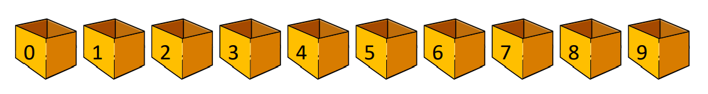
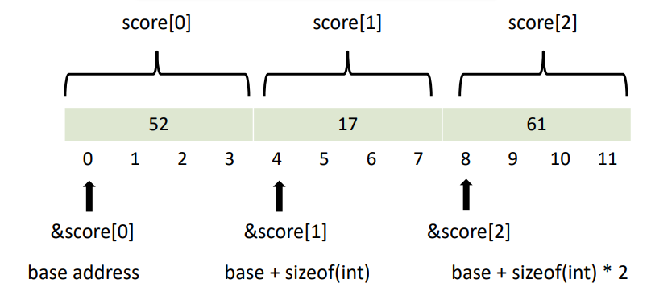
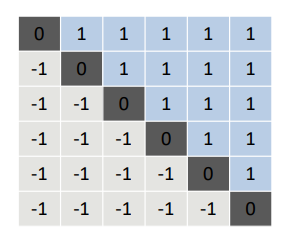

# 01. Array (배열)

### Defination - 정의

- 동일한 데이터 요소(종류)의 집합이다.
- 메모리 안에서 각 요소는 순차적이다. (순서대로)

```c++
int score[10];
```



* int : Data Type (데이터 타입)
* score: Array name (배열 이름)
* [10] : Array Size (배열 크기)

* Array Index: 배열 안에 각 Element (요소) 의 위치를 가리키는 숫자를 Index 라고 한다. 

#### Example

- 편의상 index 주소가 0부터 시작한다고 가정한다.
  - 모든 변수 선언시 초기화 해주는것을 추천한다. ex) int score[3] = 0;
  - 초기화를 안해주면 쓰레기 값이 들어갈 수도 있기 때문.

```c++
int score[3] = {52, 17, 61};
```



* int data type 개수만큼 data의 개수가 증가한다.

  * 순서대로 data type을 나열해보면

    * score[0] = 52 (base address)

    * score[1] = 17 (base address + sizeof(int))

    * score[0] = 61 (base address + sizeof(int)*2)

      

  * 데이터 type은 정수형(int) 이므로 데이터 크기는 4byte이다.  


#### Example: Using Array

```c++
#include <stdio.h>
#define ARRAY_SIZE 5

int main()
{
    int numbers[ARRAY_SIZE], i;
    
    printf("input five numbers\n");
    
    for(i=0; i<ARRAY_SIZE; i++)
        scanf("%d",&numbers[i]);
        
    for(i=ARRAY_SIZE-1; i >=0; i--)
        printf("%d ", numbers[i]);
        
    return 0;
}
```

* 이 프로그램은 사용자에게 5개의 정수를 for 루프 안에 scanf로 입력 받고, 입력 받은 값을 배열로 저장한다. 그런 다음 for 루프를 사용하여 배열 요소를 역순으로 출력한다.


#### Function call with arrays

```c++
#include <stdio.h>
#define ARRAY_SIZE	5

void inputNumbers(int num[], int len);
double computeAverage(int num[], int len);

int main()
{
	int numbers[ARRAY_SIZE];
	

	inputNumbers(numbers, ARRAY_SIZE);
	printf("average: %.3lf", computeAverage(numbers, ARRAY_SIZE));
	
	return 0;

}
```

* 이것은 ARRAY_SIZE (크기는 5)로 정의된 정수 숫자 배열을 선언하는 프로그램 이다. 그런 다음 inputNumbers와 computeAverage라는 두 가지 함수를 호출합니다.

  * inputNumbers 함수는 int num 와 int len 이라는 두 가지 인수를 사용한다. 사용자에게 int len의 값을 입력하라는 메시지가 표시되며, 이 정수는 ARRAY_SIZE 에 저장됩니다.

  * computeAverage 함수는 nt num 와 int len의 두 가지 인수도 사용한다. ARRAY_SIZE 에 있는 숫자의 평균을 계산하고 이를 반환한다.

  * 마지막으로 inputNumbers 함수를 호출하여 값을 채운 다음 computeAverage 함수를 호출하여 배열에 있는 숫자의 평균을 계산. 결과는 printf를 사용하여 소숫점 3자리 까지 출력시킨다.


#### Function call with arrays

```c++
void inputNumbers(int num[], int len)
{
	int i;
	for (i = 0; i < len; i++)
		scanf("%d", &num[i]);
}

double computeAverage(int num[], int len)
{
	int total = 0, i;
	for (i = 0; i < len; i++)
		total = total + num[i];
	return total / (double)len;
}

```

* 주어진 코드는 inputNumbers()와 computeAverage()라는 두 가지 함수를 정의한다.

  * inputNumbers() 함수는 int num,  int len을 매개 변수로 사용한다. scanf() 함수를 사용하여 사용자로부터 len의 값을 입력 받고 배열 에 저장한다.

  * computeAverage() 함수는 입력 매개 변수와 동일한 배열 번호 및 길이 렌을 사용한다. 배열 내의 모든 정수를 합산하고 결과를 len 으로 나누어 배열 내 len의 평균을 계산한다. 그런 다음 계산된 평균이 이중 값으로 반환한다.

  * computeAverage() 함수는 유형 캐스팅을 사용하여 분할이 정수 나눗셈 대신 부동 소수점 나눗셈으로 수행되고 결과가 정수로 나온다.

  * 프로그램에서 이러한 함수를 사용하려면 먼저 정수 배열을 선언하고 inputNumbers()를 호출하여 배열을 값으로 채운다. 그런 다음 computeAverage()를 호출하여 배열 값의 평균을 계산할 수 있다.


#### Two-Dimensional Arrays

```c++
int row, col, matrix[6][6];

for (row = 0; row < 6; row++) 
{
	for (col = 0; col < 6; col++)
	{
		if (row < col)
			matrix[row][col] = 1;
		else if (row == col)
			matrix[row][col] = 0;
		else
			matrix[row][col] = -1;
	}
}
```



* 위의 코드는 "matrix"라는 이름의 6x6 matrix를 내포된 루프의 조건에 기초한 값으로 초기화한다.

  * 외부 루프는 행렬의 행에 반복되고 내부 루프는 열에 반복됩니다. 

  * 현재 행이 현재 열(즉, 위치가 행렬의 위쪽 삼각형에 있음)보다 작으면 해당 위치의 값이 1로 설정된다.
  * 현재 행이 현재 열과 같으면(즉, 위치가 행렬의 대각선에 있으면) 해당 위치의 값은 0으로 설정된다.
  * 현재 행이 현재 열보다 크면(즉, 위치가 행렬의 아래 삼각형에 있는 경우) 해당 위치의 값은 -1로 설정된다.
  * 행렬은 대각에 0이 있고 다른 행렬은 -1과 1이 있는 대칭 행렬이다. 행렬의 위쪽 삼각형에는 1s가 포함되고 아래쪽 삼각형에는 -1s가 포함된다. 이러한 유형의 행렬을 "삼각행렬"이라고 한다.